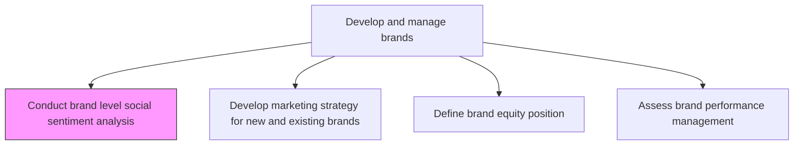
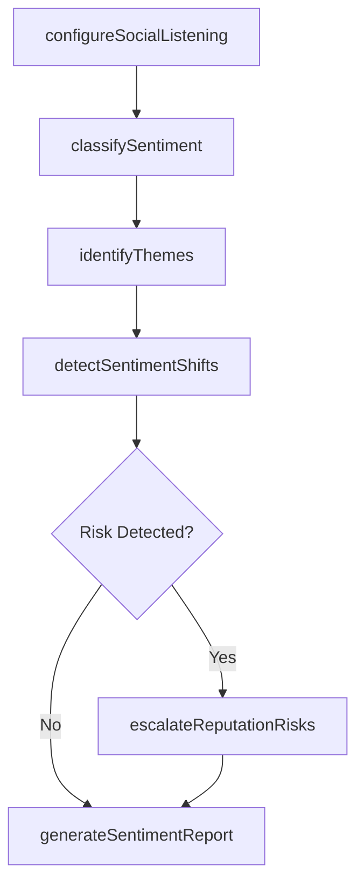

# Conduct brand level social sentiment analysis

> Business-as-Code definition for social sentiment analysis at the brand level. Models the monitoring, classification, and reporting of public brand perception across social media and review platforms.

## Overview

Monitoring and analyzing social media conversations, reviews, and online mentions to gauge public sentiment toward the organization's brands. Classifying sentiment as positive, negative, or neutral using natural language processing and manual review. Identifying emerging themes, brand perception shifts, and reputational risks to inform brand strategy and crisis response.

## Process Hierarchy



## GraphDL

```yaml
conduct:
  object: Brand Level Social Sentiment Analysis
  actor: SocialMediaAnalyst
  result: SentimentAnalysisReport
```

## Actions

| Action | Description |
|--------|-------------|
| configureSocialListening | Set up monitoring for brand mentions across social platforms and review sites |
| classifySentiment | Apply NLP models and manual review to classify mentions as positive, negative, or neutral |
| identifyThemes | Extract recurring topics and themes from brand conversations |
| detectSentimentShifts | Identify statistically significant changes in sentiment trajectory |
| generateSentimentReport | Produce summary reports with sentiment scores, trends, and recommendations |
| escalateReputationRisks | Flag negative sentiment spikes to brand management and PR for rapid response |

## Events

| Event | Description |
|-------|-------------|
| socialListeningConfigured | Brand monitoring setup completed across designated channels |
| sentimentClassified | Batch of brand mentions classified and scored |
| themesIdentified | Recurring conversation themes extracted and documented |
| sentimentShiftDetected | Significant change in brand sentiment trajectory flagged |
| sentimentReportGenerated | Periodic sentiment analysis report published |
| reputationRiskEscalated | Negative sentiment spike reported to crisis team |

## Searches

| Search | Description |
|--------|-------------|
| getSentimentScores | Retrieve brand sentiment scores by platform, period, or geography |
| findSentimentThemes | Query identified conversation themes by brand or topic |
| getSentimentTrends | Look up sentiment trajectory over time for a specific brand |
| getReputationAlerts | Retrieve active reputation risk alerts by severity |

## Process Flow



## RACI Matrix

| Activity | Responsible | Accountable | Consulted | Informed |
|----------|-------------|-------------|-----------|----------|
| configureSocialListening | SocialMediaAnalyst | DigitalMarketingManager | IT | BrandManager |
| classifySentiment | SocialMediaAnalyst | DigitalMarketingManager | DataScience | Marketing |
| detectSentimentShifts | SocialMediaAnalyst | BrandManager | PR | ExecutiveTeam |
| escalateReputationRisks | BrandManager | CMO | Legal | CorporateCommunications |

## Related Processes

| Process | Relationship |
|---------|-------------|
| 3.2.3.3 Define brand equity position | Downstream - sentiment data informs equity assessment |
| 3.2.3.4 Assess brand performance management | Downstream - sentiment is a key performance indicator |
| 3.3.6 Develop and execute crisis communication plans | Consumer - negative sentiment triggers crisis response |

## Related Departments

| Department | Role |
|-----------|------|
| Digital Marketing | Operates social listening tools and monitoring |
| Brand Management | Consumes sentiment insights for strategic decisions |
| Public Relations | Responds to reputational risks and negative trends |
| Data Science | Builds and refines NLP sentiment classification models |

## Related Occupations

| Occupation | Involvement |
|-----------|-------------|
| Social Media Analyst | Monitors channels and classifies brand sentiment |
| Data Scientist | Develops sentiment classification models |
| PR Specialist | Responds to escalated reputational concerns |

## KPIs

| KPI | Description | Unit |
|-----|-------------|------|
| Net Sentiment Score | Balance of positive versus negative brand mentions | Score (-1 to 1) |
| Mention Volume | Total brand mentions tracked across monitored channels | Count |
| Sentiment Response Time | Average time to detect and report sentiment shifts | Hours |
| Risk Escalation Rate | Percentage of sentiment spikes requiring crisis escalation | % |

## Usage

```typescript
import { conductBrandLevelSocialSentimentAnalysis } from '@headlessly/conduct-brand-level-social-sentiment-analysis'

const sentiment = conductBrandLevelSocialSentimentAnalysis()

// Configure social listening for a brand
const listening = await sentiment.configureSocialListening({
  brand: 'Enterprise Platform',
  platforms: ['twitter', 'linkedin', 'reddit', 'g2'],
  keywords: ['enterprise platform', 'brand-name']
})

// Generate sentiment report for the last quarter
const report = await sentiment.generateSentimentReport({
  brand: 'Enterprise Platform',
  period: 'Q4-2024',
  breakdownBy: ['platform', 'theme', 'geography']
})
```
