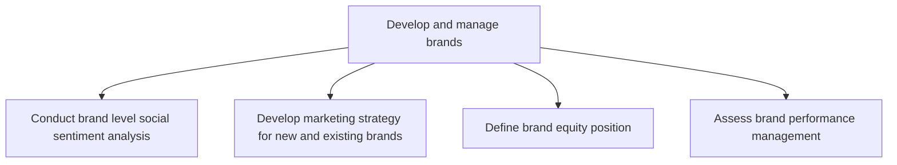
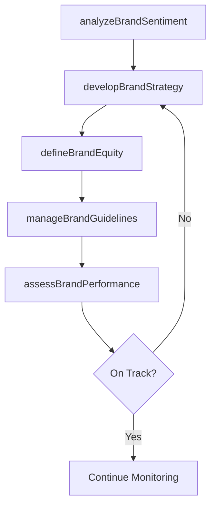

# Develop and manage brands

> Business-as-Code definition for brand development and management. Models the lifecycle of brand strategy, from sentiment analysis and positioning through equity measurement and performance optimization.

## Overview

Building, maintaining, and optimizing brand assets across the organization's portfolio. Analyzing social sentiment to understand brand perception, developing marketing strategies for new and existing brands, defining brand equity positions, and continuously assessing brand performance against market objectives.

## Process Hierarchy



## GraphDL

```yaml
develop:
  object: And Manage Brands
  actor: BrandManager
  result: BrandStrategyPlan
```

## Actions

| Action | Description |
|--------|-------------|
| analyzeBrandSentiment | Monitor social media and market perception of brand health |
| developBrandStrategy | Create strategic marketing plans for new and existing brands |
| defineBrandEquity | Establish brand equity positioning through awareness, perception, and loyalty metrics |
| assessBrandPerformance | Measure brand performance against equity and revenue targets |
| manageBrandGuidelines | Maintain and enforce brand identity standards and usage rules |

## Events

| Event | Description |
|-------|-------------|
| brandSentimentAnalyzed | Social sentiment analysis completed for brand portfolio |
| brandStrategyDeveloped | Brand marketing strategy approved |
| brandEquityDefined | Brand equity position benchmarked and documented |
| brandPerformanceAssessed | Brand performance review completed |
| brandGuidelinesUpdated | Brand guidelines revised and published |

## Searches

| Search | Description |
|--------|-------------|
| getBrandHealth | Retrieve brand health metrics including awareness and sentiment |
| getBrandEquityScores | Query brand equity scores by brand and market |
| getBrandGuidelines | Access current brand identity guidelines and assets |

## Process Flow



## RACI Matrix

| Activity | Responsible | Accountable | Consulted | Informed |
|----------|-------------|-------------|-----------|----------|
| analyzeBrandSentiment | BrandAnalyst | BrandManager | Marketing | PR |
| developBrandStrategy | BrandManager | CMO | ProductMarketing | Creative |
| defineBrandEquity | BrandManager | CMO | Finance | ExecutiveTeam |
| assessBrandPerformance | BrandAnalyst | CMO | Sales | Marketing |

## Sub-Processes

| ID | Name | Description |
|----|------|-------------|
| 3.2.3.1 | Conduct brand level social sentiment analysis | Monitoring and analyzing social media conversations, reviews, and mentions to gauge public perception |
| 3.2.3.2 | Develop marketing strategy for new and existing brands | Creating strategic marketing plans that define positioning, messaging, and go-to-market approaches fo |
| 3.2.3.3 | Define brand equity position | Establishing the brand's value through awareness, perceived quality, loyalty, and association metrics |
| 3.2.3.4 | Assess brand performance management | Measuring and evaluating brand performance against equity targets, revenue goals, and market share ob |

## Related Processes

| Process | Relationship |
|---------|-------------|
| 3.2.1 Define offering and customer value proposition | Upstream - value proposition drives brand positioning |
| 3.2.6 Develop marketing communication strategy | Downstream - brand strategy shapes communications |
| 3.3.3 Design and execute brand and product marketing programs | Consumer - brand strategy guides campaign execution |

## Related Departments

| Department | Role |
|-----------|------|
| Brand Management | Leads brand strategy, equity measurement, and guidelines |
| Creative Services | Produces brand assets and visual identity |
| Marketing Communications | Executes brand messaging across channels |
| Legal | Protects trademarks and brand intellectual property |

## Related Occupations

| Occupation | Involvement |
|-----------|-------------|
| Brand Manager | Owns brand strategy and equity management |
| Creative Director | Designs brand visual identity and assets |
| Social Media Analyst | Monitors brand sentiment across digital channels |

## KPIs

| KPI | Description | Unit |
|-----|-------------|------|
| Brand Awareness | Percentage of target market with unaided brand recall | % |
| Brand Equity Score | Composite brand value score across dimensions | Score (1-100) |
| Net Sentiment | Social sentiment score across all monitored channels | Score (-1 to 1) |
| Brand Consistency | Adherence to brand guidelines across touchpoints | % |

## Usage

```typescript
import { developAndManageBrands } from '@headlessly/develop-and-manage-brands'

const brand = developAndManageBrands()

// Analyze social sentiment for a brand
const sentiment = await brand.analyzeBrandSentiment({
  brand: 'Enterprise Platform',
  channels: ['twitter', 'linkedin', 'g2', 'gartner'],
  period: 'last-90-days'
})

// Assess brand performance against targets
const performance = await brand.assessBrandPerformance({
  brand: 'Enterprise Platform',
  metrics: ['awareness', 'consideration', 'preference', 'loyalty']
})
```
