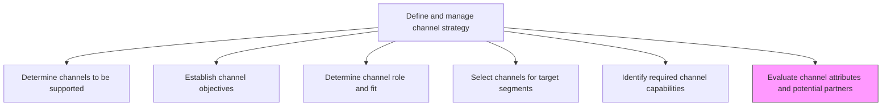
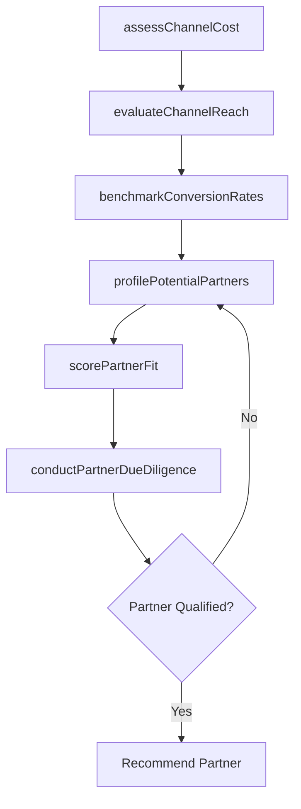

# Evaluate channel attributes and potential partners

> Business-as-Code definition for channel and partner evaluation. Models the assessment of marketing channel characteristics and the due diligence of potential channel partners.

## Overview

Assessing the attributes of all marketing channels, and evaluating the key partners in those channels. Closely examine the various characteristics of all available marketing channels such as the cost of using them, durability of impact, applicability to the organization's products/services, turn-around time, involvement of middlemen, and conversion rate. Analyze key partners in the marketing channels including those who have been associated with the organization; evaluate their capabilities, the scale and scope of their operations, quality of support provided, etc.

## Process Hierarchy



## GraphDL

```yaml
evaluate:
  object: Channel Attributes And Potential Partners
  actor: ChannelManager
  result: ChannelPartnerAssessment
```

## Actions

| Action | Description |
|--------|-------------|
| assessChannelCost | Analyze the total cost of using each channel including fees, margins, and operational overhead |
| evaluateChannelReach | Measure the audience size, geographic coverage, and segment penetration of each channel |
| profilePotentialPartners | Create capability profiles for prospective channel partners |
| scorePartnerFit | Rate partner alignment with brand, product, and segment requirements |
| benchmarkConversionRates | Compare conversion performance across channels and partners |
| conductPartnerDueDiligence | Verify partner financial stability, reputation, and operational capacity |

## Events

| Event | Description |
|-------|-------------|
| channelCostAssessed | Channel cost-benefit analysis completed |
| channelReachEvaluated | Channel audience and coverage assessment finalized |
| potentialPartnersProfiled | Partner capability profiles created and documented |
| partnerFitScored | Partner alignment scoring completed |
| conversionRatesBenchmarked | Channel conversion performance comparison delivered |
| partnerDueDiligenceConducted | Partner due diligence review completed |

## Searches

| Search | Description |
|--------|-------------|
| getChannelProfiles | Retrieve channel attribute profiles by type, cost, or reach |
| findPotentialPartners | Query prospective channel partners by capability, geography, or segment |
| getPartnerScorecards | Look up partner fit scores and evaluation results |
| getConversionBenchmarks | Retrieve channel conversion rate data by period and segment |

## Process Flow



## RACI Matrix

| Activity | Responsible | Accountable | Consulted | Informed |
|----------|-------------|-------------|-----------|----------|
| assessChannelCost | ChannelAnalyst | ChannelManager | Finance | Marketing |
| profilePotentialPartners | ChannelManager | VP Sales | BusinessDevelopment | Legal |
| scorePartnerFit | ChannelAnalyst | ChannelManager | ProductManagement | Sales |
| conductPartnerDueDiligence | ChannelManager | VP Sales | Legal | Finance |

## Related Processes

| Process | Relationship |
|---------|-------------|
| 3.2.4.4 Select channels for target segments | Downstream - evaluation feeds channel selection decisions |
| 3.2.4.5 Identify required channel capabilities | Upstream - capability requirements guide partner evaluation |
| 3.2.4.3 Determine channel role and fit with target segments | Upstream - channel fit analysis frames evaluation criteria |

## Related Departments

| Department | Role |
|-----------|------|
| Channel Management | Leads channel assessment and partner evaluation |
| Business Development | Identifies and engages potential channel partners |
| Finance | Validates channel cost models and partner economics |
| Legal | Conducts due diligence and reviews partner agreements |

## Related Occupations

| Occupation | Involvement |
|-----------|-------------|
| Channel Manager | Leads partner evaluation and channel assessment |
| Business Development Manager | Sources and vets potential channel partners |
| Financial Analyst | Analyzes channel economics and partner profitability |

## KPIs

| KPI | Description | Unit |
|-----|-------------|------|
| Partner Qualification Rate | Percentage of evaluated partners passing due diligence | % |
| Channel Cost Efficiency | Revenue generated per dollar of channel cost | Ratio |
| Evaluation Cycle Time | Average days to complete a full channel or partner evaluation | Days |
| Partner Coverage Score | Percentage of target segments covered by qualified partners | % |

## Usage

```typescript
import { evaluateChannelAttributesAndPotentialPartners } from '@headlessly/evaluate-channel-attributes-and-potential-partners'

const evaluation = evaluateChannelAttributesAndPotentialPartners()

// Assess cost structure of a channel
const costs = await evaluation.assessChannelCost({
  channel: 'reseller-network',
  includeMargins: true,
  includeOperational: true
})

// Score partner fit for a specific segment
const score = await evaluation.scorePartnerFit({
  partnerId: 'PARTNER-001',
  targetSegments: ['mid-market', 'enterprise'],
  dimensions: ['reach', 'capability', 'brand-alignment']
})
```
