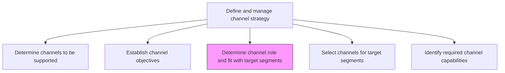
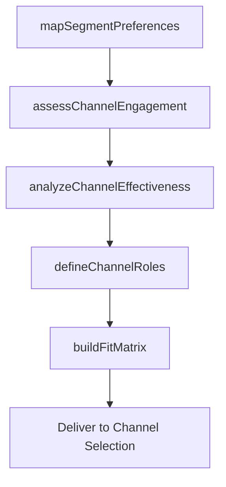

# Determine channel role and fit with target segments

> Business-as-Code definition for channel-segment fit analysis. Models the evaluation of how each marketing and distribution channel aligns with the needs, behaviors, and preferences of target customer segments.

## Overview

Analyze the various channels for their relevance to the targeted segments. Identify the channel that can effectively market to the targeted customers in regard to the drives, desires, and characteristics of these populations, their uptake, extent of engagement, frequency of use, and effectiveness in communicating.

## Process Hierarchy



## GraphDL

```yaml
determine:
  object: Channel Role And Fit With Target Segments
  actor: ChannelStrategist
  result: ChannelSegmentFitMatrix
```

## Actions

| Action | Description |
|--------|-------------|
| mapSegmentPreferences | Document how each target segment discovers, evaluates, and purchases products |
| assessChannelEngagement | Measure customer engagement levels for each channel by segment |
| analyzeChannelEffectiveness | Evaluate communication effectiveness and conversion by channel-segment pair |
| defineChannelRoles | Assign primary roles to each channel such as awareness, consideration, or purchase |
| buildFitMatrix | Create a matrix mapping channel suitability scores to each target segment |

## Events

| Event | Description |
|-------|-------------|
| segmentPreferencesMapped | Customer channel preferences documented for all target segments |
| channelEngagementAssessed | Engagement metrics analyzed across channel-segment pairs |
| channelEffectivenessAnalyzed | Communication and conversion effectiveness evaluated |
| channelRolesDefined | Primary roles assigned to each channel in the customer journey |
| fitMatrixBuilt | Channel-segment fit matrix completed and distributed |

## Searches

| Search | Description |
|--------|-------------|
| getChannelFitMatrix | Retrieve the channel-segment fit matrix with suitability scores |
| getSegmentChannelPreferences | Query channel preferences for a specific customer segment |
| getChannelEngagementData | Look up engagement metrics by channel and segment |

## Process Flow



## RACI Matrix

| Activity | Responsible | Accountable | Consulted | Informed |
|----------|-------------|-------------|-----------|----------|
| mapSegmentPreferences | MarketingAnalyst | ChannelManager | CustomerInsights | Sales |
| assessChannelEngagement | ChannelAnalyst | ChannelManager | DigitalMarketing | Marketing |
| analyzeChannelEffectiveness | ChannelAnalyst | VP Marketing | Sales | Finance |
| buildFitMatrix | ChannelStrategist | ChannelManager | ProductManagement | ExecutiveTeam |

## Related Processes

| Process | Relationship |
|---------|-------------|
| 3.2.4.1 Determine channels to be supported | Upstream - supported channels provide the evaluation scope |
| 3.2.4.4 Select channels for target segments | Downstream - fit analysis drives channel selection |
| 3.1.1.4 Identify market segments | Upstream - segment definitions feed fit analysis |

## Related Departments

| Department | Role |
|-----------|------|
| Channel Management | Leads channel-segment fit analysis |
| Marketing Analytics | Provides engagement and effectiveness data |
| Customer Insights | Supplies segment preference research |
| Sales | Validates channel fit based on field experience |

## Related Occupations

| Occupation | Involvement |
|-----------|-------------|
| Channel Strategist | Leads fit analysis and role definition |
| Marketing Analyst | Provides segment and engagement data |
| Sales Manager | Validates channel alignment with customer behavior |

## KPIs

| KPI | Description | Unit |
|-----|-------------|------|
| Channel-Segment Fit Score | Average suitability score across channel-segment pairs | Score (0-100) |
| Segment Coverage | Percentage of target segments with at least one high-fit channel | % |
| Channel Engagement Rate | Average customer engagement rate by channel | % |
| Fit Analysis Freshness | Age of the most recent channel-segment fit assessment | Days |

## Usage

```typescript
import { determineChannelRoleAndFitWithTargetSegments } from '@headlessly/determine-channel-role-and-fit-with-target-segments'

const channelFit = determineChannelRoleAndFitWithTargetSegments()

// Map segment preferences for channel discovery
const preferences = await channelFit.mapSegmentPreferences({
  segments: ['SMB', 'mid-market', 'enterprise'],
  journeyStages: ['awareness', 'consideration', 'purchase']
})

// Build fit matrix for channel-segment pairs
const matrix = await channelFit.buildFitMatrix({
  channels: ['direct-sales', 'partner-reseller', 'digital', 'marketplace'],
  segments: ['SMB', 'mid-market', 'enterprise']
})
```
