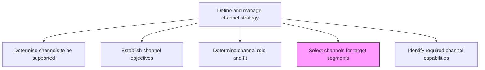
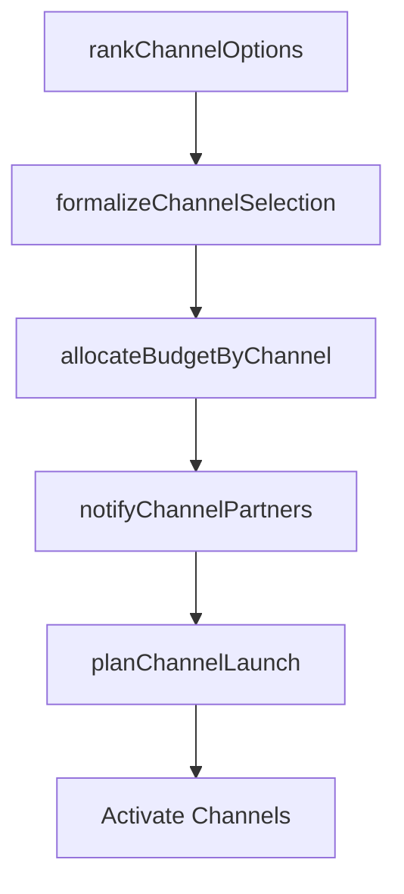

# Select channels for target segments

> Business-as-Code definition for channel selection per target segment. Models the decision process for choosing optimal marketing and distribution channels based on segment fit analysis.

## Overview

Choose the most pertinent marketing channel for the targeted segments (based on Determine channel fit with target segments [10127]).

## Process Hierarchy



## GraphDL

```yaml
select:
  object: Channels For Target Segments
  actor: ChannelManager
  result: ChannelSelectionPlan
```

## Actions

| Action | Description |
|--------|-------------|
| rankChannelOptions | Score and rank available channels by fit, cost, and reach for each segment |
| allocateBudgetByChannel | Distribute marketing budget across selected channels per segment |
| formalizeChannelSelection | Document and approve the final channel mix for each target segment |
| notifyChannelPartners | Inform selected channel partners of their role and expected contribution |
| planChannelLaunch | Create the activation timeline for each selected channel |

## Events

| Event | Description |
|-------|-------------|
| channelOptionsRanked | Channel ranking by segment completed |
| budgetAllocatedByChannel | Channel budget allocation approved |
| channelSelectionFormalized | Channel mix documented and signed off |
| channelPartnersNotified | Selected partners informed of roles and expectations |
| channelLaunchPlanned | Channel activation timeline published |

## Searches

| Search | Description |
|--------|-------------|
| getChannelSelections | Retrieve selected channels by segment, region, or product line |
| getChannelBudgetAllocations | Query budget distribution across channels and segments |
| getChannelRankings | Look up channel ranking scores by segment |

## Process Flow



## RACI Matrix

| Activity | Responsible | Accountable | Consulted | Informed |
|----------|-------------|-------------|-----------|----------|
| rankChannelOptions | ChannelAnalyst | ChannelManager | Marketing | Sales |
| allocateBudgetByChannel | ChannelManager | VP Marketing | Finance | Sales |
| formalizeChannelSelection | ChannelManager | CMO | ProductManagement | ExecutiveTeam |

## Related Processes

| Process | Relationship |
|---------|-------------|
| 3.2.4.3 Determine channel role and fit with target segments | Upstream - fit analysis drives selection |
| 3.2.4.6 Evaluate channel attributes and potential partners | Upstream - partner evaluation informs selection |
| 3.3.1 Develop and manage advertising | Downstream - selected channels shape advertising plans |

## Related Departments

| Department | Role |
|-----------|------|
| Channel Management | Makes final channel selection decisions |
| Marketing | Provides campaign requirements for channel selection |
| Finance | Approves channel budget allocations |
| Sales | Validates channel alignment with selling motions |

## Related Occupations

| Occupation | Involvement |
|-----------|-------------|
| Channel Manager | Leads selection and formalization process |
| Marketing Strategist | Provides segment and campaign inputs |
| Financial Analyst | Models channel investment returns |

## KPIs

| KPI | Description | Unit |
|-----|-------------|------|
| Channel Mix Optimization Score | Degree to which selected channels maximize segment reach at minimum cost | Score (0-100) |
| Budget Utilization Rate | Percentage of allocated channel budget actually deployed | % |
| Channel Activation Speed | Average days from selection to channel go-live | Days |
| Segment-Channel Alignment | Percentage of segments with top-ranked channels selected | % |

## Usage

```typescript
import { selectChannelsForTargetSegments } from '@headlessly/select-channels-for-target-segments'

const selection = selectChannelsForTargetSegments()

// Rank channel options for a segment
const rankings = await selection.rankChannelOptions({
  segment: 'mid-market',
  criteria: ['fit-score', 'cost-efficiency', 'reach'],
  availableChannels: ['direct-sales', 'partner-reseller', 'digital', 'marketplace']
})

// Formalize channel selection and notify partners
const plan = await selection.formalizeChannelSelection({
  segment: 'mid-market',
  selectedChannels: ['direct-sales', 'digital'],
  effectiveDate: '2024-Q3'
})
```
