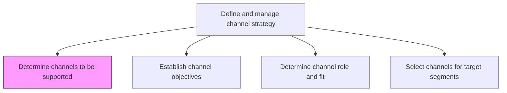
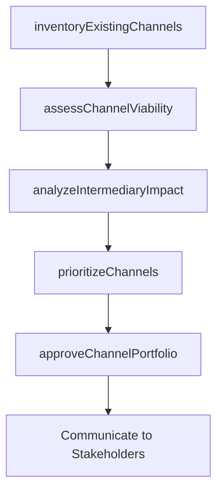

# Determine channels to be supported

> Business-as-Code definition for channel support determination. Models the decision process for identifying which distribution and marketing channels the organization will invest in and maintain.

## Overview

Deciding which distributors, wholesalers and retailers the company will use to promote its offerings and to distribute its products and services to the target market. Narrowing down which intermediaries the company will use will affect retail prices of individual products, and should therefore be included in the pricing analysis.

## Process Hierarchy



## GraphDL

```yaml
determine:
  object: Channels To Be Supported
  actor: ChannelStrategist
  result: SupportedChannelList
```

## Actions

| Action | Description |
|--------|-------------|
| inventoryExistingChannels | Catalog all current distribution and marketing channels with their performance data |
| assessChannelViability | Evaluate each channel's market coverage, cost structure, and scalability |
| analyzeIntermediaryImpact | Model the effect of channel intermediaries on retail pricing and margins |
| prioritizeChannels | Rank channels by strategic fit, ROI potential, and segment coverage |
| approveChannelPortfolio | Finalize the set of channels the organization will actively support |

## Events

| Event | Description |
|-------|-------------|
| existingChannelsInventoried | Current channel catalog with performance data completed |
| channelViabilityAssessed | Viability analysis for all candidate channels finalized |
| intermediaryImpactAnalyzed | Pricing impact of channel intermediaries modeled |
| channelsPrioritized | Channel ranking by strategic value completed |
| channelPortfolioApproved | Supported channel portfolio formally approved |

## Searches

| Search | Description |
|--------|-------------|
| getSupportedChannels | Retrieve the current list of approved supported channels |
| getChannelViabilityScores | Query viability assessment scores by channel type |
| getIntermediaryAnalysis | Look up pricing impact data for channel intermediaries |

## Process Flow



## RACI Matrix

| Activity | Responsible | Accountable | Consulted | Informed |
|----------|-------------|-------------|-----------|----------|
| inventoryExistingChannels | ChannelAnalyst | ChannelManager | Sales | Marketing |
| assessChannelViability | ChannelManager | VP Marketing | Finance | ProductManagement |
| analyzeIntermediaryImpact | PricingAnalyst | ChannelManager | Finance | Sales |
| approveChannelPortfolio | ChannelManager | CMO | VP Sales | ExecutiveTeam |

## Related Processes

| Process | Relationship |
|---------|-------------|
| 3.2.4.2 Establish channel objectives | Downstream - supported channels need defined objectives |
| 3.2.4.3 Determine channel role and fit with target segments | Downstream - supported channels evaluated for segment fit |
| 3.2.2.1 Conduct pricing analysis | Consumer - intermediary costs feed pricing analysis |

## Related Departments

| Department | Role |
|-----------|------|
| Channel Management | Leads channel evaluation and portfolio decisions |
| Sales | Provides field perspective on channel effectiveness |
| Finance | Models channel economics and intermediary cost impact |
| Supply Chain | Assesses distribution channel logistics feasibility |

## Related Occupations

| Occupation | Involvement |
|-----------|-------------|
| Channel Strategist | Leads channel evaluation and prioritization |
| Sales Director | Validates channel effectiveness from field perspective |
| Supply Chain Analyst | Assesses logistics feasibility of distribution channels |

## KPIs

| KPI | Description | Unit |
|-----|-------------|------|
| Channel Portfolio Coverage | Percentage of target markets reachable through supported channels | % |
| Channel Viability Score | Average viability rating across supported channels | Score (0-100) |
| Intermediary Cost Ratio | Channel intermediary costs as percentage of product retail price | % |
| Channel Review Frequency | How often the supported channel portfolio is reassessed | Per Year |

## Usage

```typescript
import { determineChannelsToBeSupported } from '@headlessly/determine-channels-to-be-supported'

const channels = determineChannelsToBeSupported()

// Inventory existing channels with performance data
const inventory = await channels.inventoryExistingChannels({
  includePerformance: true,
  period: 'FY2024'
})

// Prioritize channels for strategic investment
const rankings = await channels.prioritizeChannels({
  criteria: ['roi', 'coverage', 'scalability'],
  segments: ['SMB', 'enterprise']
})
```
