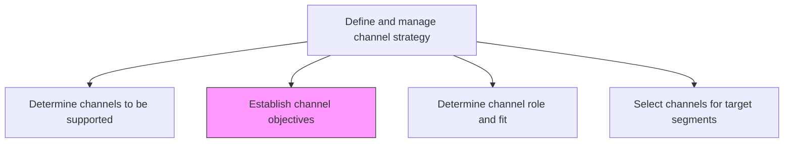
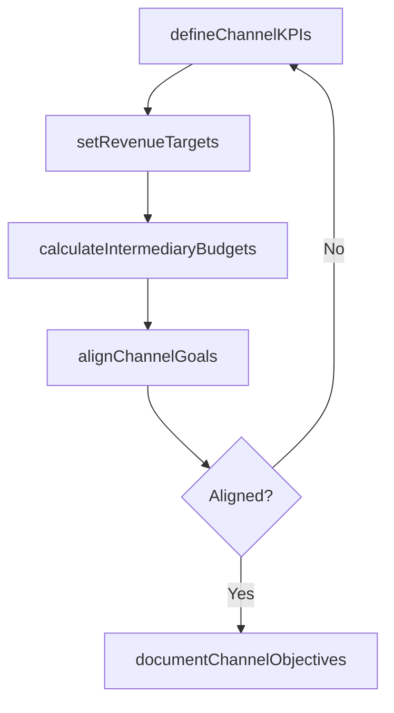

# Establish channel objectives

> Business-as-Code definition for channel objective setting. Models the establishment of performance targets and strategic roles for each marketing and distribution channel.

## Overview

Identifying the role that each chosen marketing channels plays in the larger distribution network with respect to the organizational marketing strategy. Determine intermediary costs for shipping, handling, transporting, warehousing, insurance and marketing that incur and accumulate in the distribution channel.

## Process Hierarchy



## GraphDL

```yaml
establish:
  object: Channel Objectives
  actor: ChannelManager
  result: ChannelObjectivesPlan
```

## Actions

| Action | Description |
|--------|-------------|
| defineChannelKPIs | Establish measurable key performance indicators for each channel |
| setRevenueTargets | Assign revenue contribution targets to each channel by segment |
| calculateIntermediaryBudgets | Determine shipping, handling, warehousing, and marketing cost budgets per channel |
| alignChannelGoals | Ensure channel objectives support overarching marketing and distribution strategy |
| documentChannelObjectives | Formalize channel objectives into a trackable plan with milestones |

## Events

| Event | Description |
|-------|-------------|
| channelKPIsDefined | Channel-specific KPIs established and approved |
| revenueTargetsSet | Revenue contribution targets assigned to each channel |
| intermediaryBudgetsCalculated | Channel intermediary cost budgets finalized |
| channelGoalsAligned | Channel objectives confirmed as aligned with marketing strategy |
| channelObjectivesDocumented | Channel objectives plan published and distributed |

## Searches

| Search | Description |
|--------|-------------|
| getChannelObjectives | Retrieve channel objectives by channel type, period, or segment |
| getChannelRevenueTargets | Query revenue targets assigned to specific channels |
| getIntermediaryBudgets | Look up intermediary cost budgets by channel |

## Process Flow



## RACI Matrix

| Activity | Responsible | Accountable | Consulted | Informed |
|----------|-------------|-------------|-----------|----------|
| defineChannelKPIs | ChannelManager | VP Marketing | Sales | Finance |
| setRevenueTargets | ChannelManager | CMO | Finance | SalesOperations |
| calculateIntermediaryBudgets | FinancialAnalyst | ChannelManager | SupplyChain | Procurement |
| documentChannelObjectives | ChannelAnalyst | ChannelManager | Marketing | ExecutiveTeam |

## Related Processes

| Process | Relationship |
|---------|-------------|
| 3.2.4.1 Determine channels to be supported | Upstream - supported channels require defined objectives |
| 3.2.4.3 Determine channel role and fit with target segments | Downstream - objectives guide channel role analysis |
| 3.4.1 Develop sales forecast | Consumer - channel revenue targets feed sales forecasting |

## Related Departments

| Department | Role |
|-----------|------|
| Channel Management | Leads objective setting and target assignment |
| Finance | Calculates intermediary costs and validates budgets |
| Sales | Provides input on achievable revenue targets by channel |
| Supply Chain | Contributes distribution cost estimates |

## Related Occupations

| Occupation | Involvement |
|-----------|-------------|
| Channel Manager | Defines objectives and assigns targets to channels |
| Financial Analyst | Models channel economics and intermediary costs |
| Sales Operations Analyst | Validates revenue target feasibility |

## KPIs

| KPI | Description | Unit |
|-----|-------------|------|
| Objective Achievement Rate | Percentage of channel objectives met within the target period | % |
| Channel Revenue Attainment | Actual versus target revenue contribution by channel | % |
| Intermediary Cost Variance | Actual versus budgeted intermediary costs | % |
| Objective Refresh Cadence | Frequency of channel objective review and update | Per Quarter |

## Usage

```typescript
import { establishChannelObjectives } from '@headlessly/establish-channel-objectives'

const objectives = establishChannelObjectives()

// Define KPIs for a channel
const kpis = await objectives.defineChannelKPIs({
  channel: 'partner-reseller',
  metrics: ['revenue', 'leadGeneration', 'customerSatisfaction'],
  period: 'FY2025'
})

// Calculate intermediary cost budgets
const budgets = await objectives.calculateIntermediaryBudgets({
  channel: 'partner-reseller',
  costCategories: ['shipping', 'handling', 'warehousing', 'marketing'],
  period: 'FY2025'
})
```
