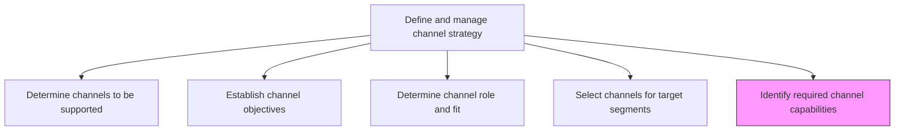
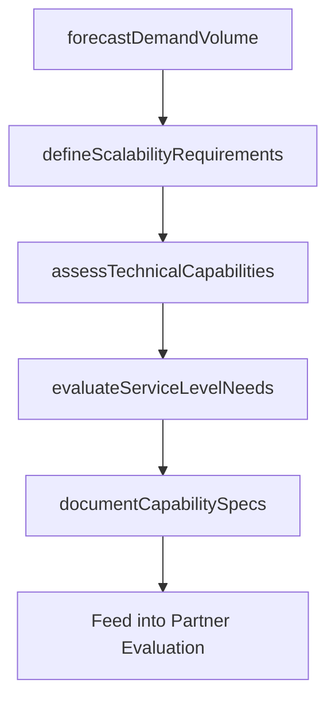

# Identify required channel capabilities

> Business-as-Code definition for channel capability requirements identification. Models the analysis of throughput, scalability, and operational capabilities needed from distribution and marketing channels.

## Overview

Determining the maximum output rate required from a distribution channel to optimally market and deliver the products and services the company offers or would like to offer. Ideally, a channel should be able to adapt to a certain degree of variability in the demand for the offerings, and able scale up if needed.

## Process Hierarchy



## GraphDL

```yaml
identify:
  object: Required Channel Capabilities
  actor: ChannelAnalyst
  result: ChannelCapabilityRequirements
```

## Actions

| Action | Description |
|--------|-------------|
| forecastDemandVolume | Project expected demand volume each channel must handle across product lines |
| defineScalabilityRequirements | Specify the elasticity needed for each channel to handle demand fluctuations |
| assessTechnicalCapabilities | Document technology, logistics, and operational capabilities required per channel |
| evaluateServiceLevelNeeds | Define delivery speed, customer support, and quality standards for each channel |
| documentCapabilitySpecs | Create formal capability requirement specifications for channel evaluation |

## Events

| Event | Description |
|-------|-------------|
| demandVolumeForecast | Channel demand volume projections completed |
| scalabilityRequirementsDefined | Channel elasticity requirements documented |
| technicalCapabilitiesAssessed | Technology and operational capability needs specified |
| serviceLevelNeedsEvaluated | Service quality and delivery standards established |
| capabilitySpecsDocumented | Channel capability requirement specifications published |

## Searches

| Search | Description |
|--------|-------------|
| getCapabilityRequirements | Retrieve capability requirements by channel type or product line |
| getDemandForecasts | Query demand volume projections by channel |
| getServiceLevelSpecs | Look up service level requirements for specific channels |

## Process Flow



## RACI Matrix

| Activity | Responsible | Accountable | Consulted | Informed |
|----------|-------------|-------------|-----------|----------|
| forecastDemandVolume | DemandPlanner | ChannelManager | Sales | SupplyChain |
| defineScalabilityRequirements | ChannelAnalyst | ChannelManager | Operations | IT |
| assessTechnicalCapabilities | ChannelAnalyst | VP Marketing | IT | ProductManagement |
| documentCapabilitySpecs | ChannelAnalyst | ChannelManager | Finance | PartnerManagement |

## Related Processes

| Process | Relationship |
|---------|-------------|
| 3.2.4.6 Evaluate channel attributes and potential partners | Downstream - capability specs guide partner evaluation |
| 3.2.4.2 Establish channel objectives | Upstream - objectives define performance expectations |
| 3.2.4.1 Determine channels to be supported | Upstream - supported channels require capability analysis |

## Related Departments

| Department | Role |
|-----------|------|
| Channel Management | Leads capability requirement definition |
| Operations | Provides logistics and throughput feasibility input |
| Information Technology | Assesses technical integration requirements |
| Demand Planning | Forecasts volume each channel must support |

## Related Occupations

| Occupation | Involvement |
|-----------|-------------|
| Channel Analyst | Defines capability specifications and scalability needs |
| Demand Planner | Forecasts channel volume requirements |
| Operations Manager | Validates logistical feasibility of capability targets |

## KPIs

| KPI | Description | Unit |
|-----|-------------|------|
| Capability Gap Rate | Percentage of channels failing to meet defined capability thresholds | % |
| Forecast Accuracy | Accuracy of demand volume projections versus actuals | % |
| Scalability Index | Degree to which channels can scale with demand variability | Score (0-100) |
| Specification Completeness | Percentage of channels with fully documented capability requirements | % |

## Usage

```typescript
import { identifyRequiredChannelCapabilities } from '@headlessly/identify-required-channel-capabilities'

const capabilities = identifyRequiredChannelCapabilities()

// Forecast demand volume for a channel
const forecast = await capabilities.forecastDemandVolume({
  channel: 'partner-reseller',
  productLines: ['SaaS Platform', 'Analytics Suite'],
  period: 'FY2025',
  scenarios: ['base', 'optimistic', 'pessimistic']
})

// Document capability specifications
const specs = await capabilities.documentCapabilitySpecs({
  channel: 'partner-reseller',
  capabilities: ['throughput', 'technical-integration', 'support-quality'],
  scalabilityTarget: 1.5
})
```
