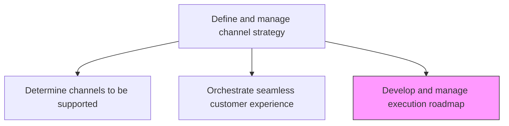
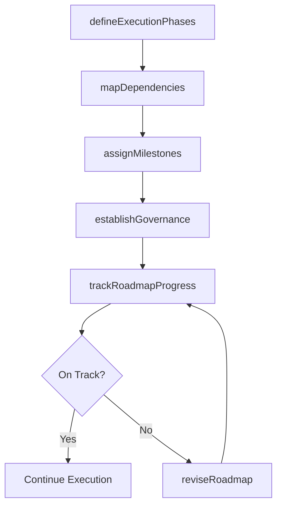

# Develop and manage execution roadmap

> Business-as-Code definition for multichannel execution roadmap development. Models the planning, sequencing, and governance of cross-channel marketing initiatives.

## Overview

Determining the actions that need to be taken for successful multichannel marketing, the ordering, timing and dependencies of the steps, and the governance mechanism for reviewing and changing the protocol, if needed.

## Process Hierarchy



## GraphDL

```yaml
develop:
  object: And Manage Execution Roadmap
  actor: ChannelProgramManager
  result: ChannelExecutionRoadmap
```

## Actions

| Action | Description |
|--------|-------------|
| defineExecutionPhases | Break the multichannel initiative into sequenced implementation phases |
| mapDependencies | Identify timing dependencies and prerequisites between channel activities |
| assignMilestones | Set key milestones and deliverable deadlines for each phase |
| establishGovernance | Create the review cadence and change management protocol for the roadmap |
| trackRoadmapProgress | Monitor execution against milestones and flag deviations |
| reviseRoadmap | Update the roadmap based on governance reviews and performance data |

## Events

| Event | Description |
|-------|-------------|
| executionPhasesDefined | Roadmap phases sequenced and approved |
| dependenciesMapped | Cross-channel activity dependencies documented |
| milestonesAssigned | Key milestones and deadlines published |
| governanceEstablished | Roadmap review cadence and change protocols ratified |
| roadmapProgressTracked | Execution progress report against milestones delivered |
| roadmapRevised | Roadmap updated based on governance review decisions |

## Searches

| Search | Description |
|--------|-------------|
| getRoadmapPhases | Retrieve execution phases by channel, status, or timeline |
| getMilestoneStatus | Query milestone completion status and upcoming deadlines |
| getDependencyMap | Look up activity dependencies across channels |
| getGovernanceLog | Retrieve roadmap governance review decisions and change history |

## Process Flow



## RACI Matrix

| Activity | Responsible | Accountable | Consulted | Informed |
|----------|-------------|-------------|-----------|----------|
| defineExecutionPhases | ChannelProgramManager | VP Marketing | ChannelManager | Sales |
| mapDependencies | ProjectManager | ChannelProgramManager | IT | Operations |
| assignMilestones | ChannelProgramManager | CMO | Finance | ExecutiveTeam |
| trackRoadmapProgress | ProjectManager | ChannelProgramManager | ChannelAnalyst | Marketing |

## Related Processes

| Process | Relationship |
|---------|-------------|
| 3.2.4.7 Orchestrate seamless customer experience across supported channels | Upstream - omni-channel design feeds execution planning |
| 3.2.5 Analyze and manage channel performance | Downstream - roadmap outcomes measured by channel performance |
| 3.3.1 Develop and manage advertising | Consumer - advertising campaigns align with roadmap phases |

## Related Departments

| Department | Role |
|-----------|------|
| Channel Management | Owns roadmap development and governance |
| Project Management Office | Supports dependency mapping and milestone tracking |
| Marketing Operations | Executes roadmap activities across channels |
| IT | Enables technical integrations required by roadmap phases |

## Related Occupations

| Occupation | Involvement |
|-----------|-------------|
| Channel Program Manager | Leads roadmap development and governance |
| Project Manager | Tracks milestones and manages dependencies |
| Marketing Operations Manager | Executes roadmap activities |

## KPIs

| KPI | Description | Unit |
|-----|-------------|------|
| Milestone On-Time Rate | Percentage of milestones completed by target date | % |
| Phase Completion Rate | Percentage of execution phases completed per planning period | % |
| Roadmap Revision Frequency | Number of governance-driven roadmap revisions per quarter | Count |
| Dependency Resolution Time | Average days to resolve identified dependency blockers | Days |

## Usage

```typescript
import { developAndManageExecutionRoadmap } from '@headlessly/develop-and-manage-execution-roadmap'

const roadmap = developAndManageExecutionRoadmap()

// Define execution phases for multichannel rollout
const phases = await roadmap.defineExecutionPhases({
  initiative: 'Q3 Digital Channel Expansion',
  channels: ['web', 'mobile-app', 'marketplace'],
  timeline: { start: '2024-07-01', end: '2024-12-31' }
})

// Track roadmap progress against milestones
const progress = await roadmap.trackRoadmapProgress({
  roadmapId: phases.id,
  asOfDate: '2024-09-15'
})
```
