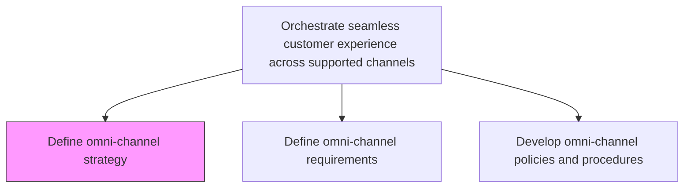
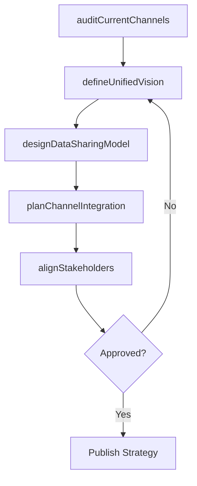

# Define omni-channel strategy

> Business-as-Code definition for omni-channel strategy formulation. Models the design of a unified cross-channel approach that enables seamless customer interactions across all supported touchpoints.

## Overview

Devising a strategy to market company's products or services seamlessly through all or most channels that are in widespread use among the target market. This may mean cross-channel access to customer preferences and purchasing history to accept returned merchandise, provide refunds, resolve payment issues or to provide technical support.

## Process Hierarchy



## GraphDL

```yaml
define:
  object: Omni-channel Strategy
  actor: OmniChannelStrategist
  result: OmniChannelStrategyDocument
```

## Actions

| Action | Description |
|--------|-------------|
| auditCurrentChannels | Assess the current state of each active channel and cross-channel integration points |
| defineUnifiedVision | Establish the target state vision for seamless cross-channel customer experience |
| designDataSharingModel | Architect how customer data flows between channels for consistent personalization |
| planChannelIntegration | Define the technical and process integrations needed between channels |
| alignStakeholders | Secure buy-in from channel owners, IT, and executive sponsors |

## Events

| Event | Description |
|-------|-------------|
| currentChannelsAudited | Channel maturity and integration state assessment completed |
| unifiedVisionDefined | Target omni-channel experience vision approved |
| dataSharingModelDesigned | Cross-channel data architecture documented |
| channelIntegrationPlanned | Integration roadmap and specifications published |
| stakeholdersAligned | Cross-functional alignment on omni-channel strategy confirmed |

## Searches

| Search | Description |
|--------|-------------|
| getOmniChannelStrategy | Retrieve the current omni-channel strategy document |
| getChannelIntegrationStatus | Query integration maturity for each channel pair |
| getDataSharingArchitecture | Look up cross-channel data sharing model and specifications |

## Process Flow



## RACI Matrix

| Activity | Responsible | Accountable | Consulted | Informed |
|----------|-------------|-------------|-----------|----------|
| auditCurrentChannels | ChannelAnalyst | OmniChannelManager | IT | Marketing |
| defineUnifiedVision | OmniChannelStrategist | CMO | CXDesigner | ExecutiveTeam |
| designDataSharingModel | DataArchitect | CTO | OmniChannelManager | Sales |
| alignStakeholders | OmniChannelManager | CMO | VP Sales | ChannelPartners |

## Related Processes

| Process | Relationship |
|---------|-------------|
| 3.2.4.7.2 Define omni-channel requirements | Downstream - strategy sets the scope for requirement definition |
| 3.2.4.7.3 Develop omni-channel policies and procedures | Downstream - strategy governs policy design |
| 3.2.4.4 Select channels for target segments | Upstream - selected channels form the strategy scope |

## Related Departments

| Department | Role |
|-----------|------|
| Customer Experience | Leads cross-channel experience vision |
| Information Technology | Architects data sharing and integration infrastructure |
| Marketing | Defines channel-specific marketing execution |
| Sales | Provides customer interaction context across channels |

## Related Occupations

| Occupation | Involvement |
|-----------|-------------|
| Omni-Channel Strategist | Designs the unified cross-channel strategy |
| Data Architect | Plans cross-channel data integration |
| Customer Experience Designer | Maps desired cross-channel journeys |

## KPIs

| KPI | Description | Unit |
|-----|-------------|------|
| Channel Integration Maturity | Percentage of channel pairs with full data integration | % |
| Strategy Adoption Rate | Percentage of channels operating under the omni-channel strategy | % |
| Cross-Channel Data Latency | Average time for customer data to propagate across channels | Seconds |
| Stakeholder Alignment Score | Level of executive and cross-functional buy-in for the strategy | Score (1-10) |

## Usage

```typescript
import { defineOmniChannelStrategy } from '@headlessly/define-omni-channel-strategy'

const strategy = defineOmniChannelStrategy()

// Audit current channel integration state
const audit = await strategy.auditCurrentChannels({
  channels: ['web', 'mobile', 'in-store', 'call-center'],
  dimensions: ['data-sharing', 'branding', 'service-level']
})

// Design cross-channel data sharing model
const dataModel = await strategy.designDataSharingModel({
  customerDataTypes: ['preferences', 'purchase-history', 'support-tickets'],
  targetLatency: 'real-time'
})
```
