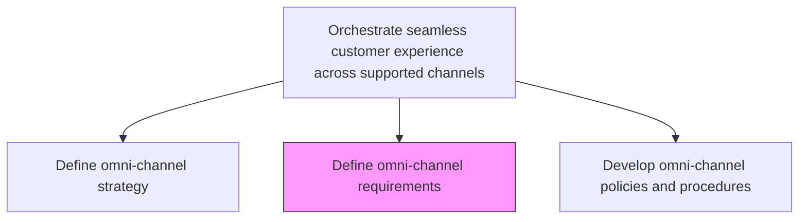
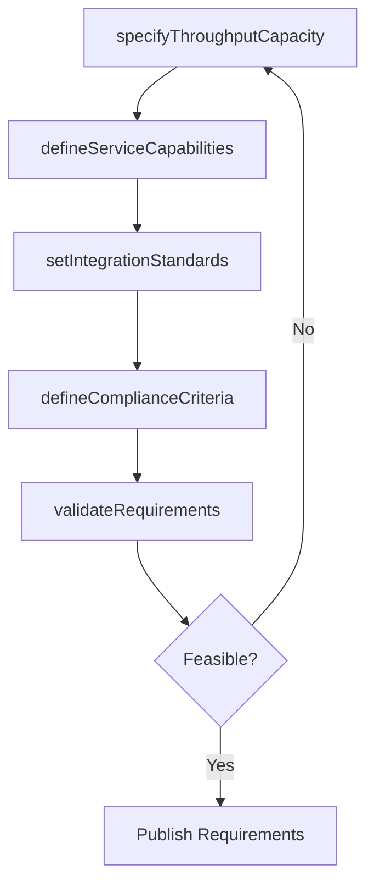

# Define omni-channel requirements

> Business-as-Code definition for omni-channel requirement specification. Models the identification and documentation of preconditions channels must meet for inclusion in the omni-channel network.

## Overview

Identifying necessary preconditions that a channel should fulfill in order to be included as one of the adopted channels, such as required throughput capacities, service capabilities, competitive pricing, and alignment with organizational marketing strategies.

## Process Hierarchy



## GraphDL

```yaml
define:
  object: Omni-channel Requirements
  actor: ChannelOperationsLead
  result: OmniChannelRequirementsSpec
```

## Actions

| Action | Description |
|--------|-------------|
| specifyThroughputCapacity | Define minimum transaction volume and peak load handling for each channel |
| defineServiceCapabilities | Document customer service functions each channel must support |
| setIntegrationStandards | Establish data exchange formats and real-time sync requirements |
| defineComplianceCriteria | Specify regulatory, branding, and pricing compliance thresholds |
| validateRequirements | Review requirements with channel owners and stakeholders for feasibility |

## Events

| Event | Description |
|-------|-------------|
| throughputCapacitySpecified | Channel throughput requirements documented |
| serviceCapabilitiesDefined | Required service capabilities established per channel |
| integrationStandardsSet | Data exchange and sync standards published |
| complianceCriteriaDefined | Compliance and branding requirements finalized |
| requirementsValidated | Requirements reviewed and approved by stakeholders |

## Searches

| Search | Description |
|--------|-------------|
| getChannelRequirements | Retrieve omni-channel requirements by channel or category |
| getIntegrationStandards | Look up data exchange and synchronization standards |
| getComplianceCriteria | Query compliance thresholds for specific channels |

## Process Flow



## RACI Matrix

| Activity | Responsible | Accountable | Consulted | Informed |
|----------|-------------|-------------|-----------|----------|
| specifyThroughputCapacity | ChannelAnalyst | OmniChannelManager | IT | Operations |
| defineServiceCapabilities | ChannelOperationsLead | OmniChannelManager | CustomerService | Sales |
| setIntegrationStandards | IntegrationArchitect | CTO | OmniChannelManager | IT |
| validateRequirements | OmniChannelManager | CMO | ChannelPartners | Finance |

## Related Processes

| Process | Relationship |
|---------|-------------|
| 3.2.4.7.1 Define omni-channel strategy | Upstream - strategy sets scope for requirements |
| 3.2.4.7.3 Develop omni-channel policies and procedures | Downstream - requirements guide policy creation |
| 3.2.4.5 Identify required channel capabilities | Parallel - channel capability needs inform requirement specs |

## Related Departments

| Department | Role |
|-----------|------|
| Channel Operations | Leads requirement specification and validation |
| Information Technology | Defines integration and data exchange standards |
| Customer Service | Specifies service capability requirements |
| Marketing | Ensures brand and pricing compliance criteria |

## Related Occupations

| Occupation | Involvement |
|-----------|-------------|
| Channel Operations Lead | Drives requirement definition and stakeholder validation |
| Integration Architect | Specifies technical integration standards |
| Customer Service Manager | Defines service capability requirements |

## KPIs

| KPI | Description | Unit |
|-----|-------------|------|
| Requirement Coverage | Percentage of channels with fully documented requirements | % |
| Requirement Compliance Rate | Percentage of channels meeting all specified requirements | % |
| Integration Readiness | Percentage of channels meeting integration standards | % |
| Validation Cycle Time | Average days to validate requirements with all stakeholders | Days |

## Usage

```typescript
import { defineOmniChannelRequirements } from '@headlessly/define-omni-channel-requirements'

const requirements = defineOmniChannelRequirements()

// Specify throughput capacity for a channel
const throughput = await requirements.specifyThroughputCapacity({
  channel: 'mobile-app',
  minTransactionsPerSecond: 500,
  peakLoadMultiplier: 3.0
})

// Set integration standards for cross-channel data flow
const standards = await requirements.setIntegrationStandards({
  dataFormat: 'JSON',
  syncMode: 'real-time',
  maxLatencyMs: 200
})
```
