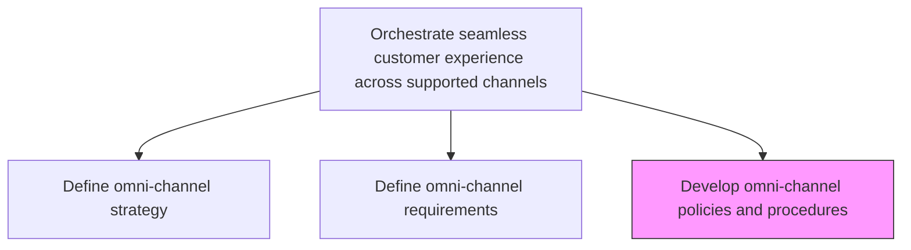
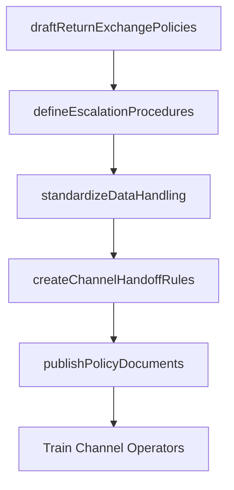

# Develop omni-channel policies and procedures

> Business-as-Code definition for omni-channel policy and procedure development. Models the creation of operational rules governing how channels interact to deliver a seamless, unified customer experience.

## Overview

Determining the detailed policies and procedures that each of the channels needs to follow in order to conform to the organizational marketing strategy and to provide seamless customer service experience.

## Process Hierarchy



## GraphDL

```yaml
develop:
  object: Omni-channel Policies And Procedures
  actor: ChannelPolicyManager
  result: OmniChannelPolicyDocument
```

## Actions

| Action | Description |
|--------|-------------|
| draftReturnExchangePolicies | Create cross-channel return and exchange policies ensuring customers can start and finish in any channel |
| defineEscalationProcedures | Establish how service issues are escalated across channel boundaries |
| standardizeDataHandling | Define how customer data is captured, stored, and shared across channels per privacy regulations |
| createChannelHandoffRules | Document procedures for seamless handoffs when customers transition between channels |
| publishPolicyDocuments | Formalize and distribute policy documents to all channel operators |

## Events

| Event | Description |
|-------|-------------|
| returnExchangePoliciesDrafted | Cross-channel return and exchange policies completed |
| escalationProceduresDefined | Cross-channel escalation paths documented |
| dataHandlingStandardized | Customer data handling procedures aligned across channels |
| channelHandoffRulesCreated | Channel transition procedures published |
| policyDocumentsPublished | All omni-channel policies ratified and distributed |

## Searches

| Search | Description |
|--------|-------------|
| getChannelPolicies | Retrieve current omni-channel policies by type or channel |
| getEscalationProcedures | Look up escalation paths for a specific channel or issue type |
| getHandoffRules | Query channel handoff procedures for specific transition scenarios |

## Process Flow



## RACI Matrix

| Activity | Responsible | Accountable | Consulted | Informed |
|----------|-------------|-------------|-----------|----------|
| draftReturnExchangePolicies | ChannelPolicyManager | OmniChannelManager | CustomerService | Legal |
| defineEscalationProcedures | ChannelPolicyManager | OmniChannelManager | Sales | IT |
| standardizeDataHandling | DataPrivacyOfficer | CTO | Legal | Marketing |
| publishPolicyDocuments | ChannelPolicyManager | CMO | ChannelPartners | ExecutiveTeam |

## Related Processes

| Process | Relationship |
|---------|-------------|
| 3.2.4.7.1 Define omni-channel strategy | Upstream - strategy governs policy direction |
| 3.2.4.7.2 Define omni-channel requirements | Upstream - requirements constrain policy design |
| 3.5.3 Manage customer service requests | Consumer - policies guide how service requests are handled across channels |

## Related Departments

| Department | Role |
|-----------|------|
| Channel Operations | Leads policy development and enforcement |
| Legal | Reviews policies for regulatory compliance |
| Customer Service | Implements cross-channel service procedures |
| Data Privacy | Ensures data handling meets privacy regulations |

## Related Occupations

| Occupation | Involvement |
|-----------|-------------|
| Channel Policy Manager | Drafts and maintains omni-channel policies |
| Data Privacy Officer | Ensures data handling compliance across channels |
| Customer Service Manager | Implements and trains on cross-channel procedures |

## KPIs

| KPI | Description | Unit |
|-----|-------------|------|
| Policy Coverage | Percentage of channel interactions governed by documented policies | % |
| Policy Compliance Rate | Percentage of channel operators adhering to published policies | % |
| Handoff Success Rate | Percentage of cross-channel handoffs completed per procedures | % |
| Policy Update Frequency | How often omni-channel policies are reviewed and updated | Per Year |

## Usage

```typescript
import { developOmniChannelPoliciesAndProcedures } from '@headlessly/develop-omni-channel-policies-and-procedures'

const policies = developOmniChannelPoliciesAndProcedures()

// Draft cross-channel return and exchange policies
const returnPolicy = await policies.draftReturnExchangePolicies({
  channels: ['web', 'mobile-app', 'in-store'],
  returnWindow: 30,
  crossChannelReturns: true
})

// Create handoff rules for channel transitions
const handoffs = await policies.createChannelHandoffRules({
  transitionPairs: [['web', 'call-center'], ['mobile-app', 'in-store']],
  dataToTransfer: ['cart', 'preferences', 'support-history']
})
```
