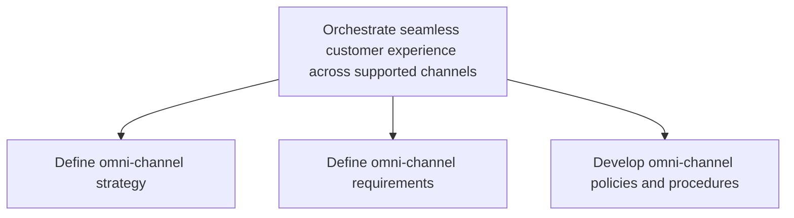
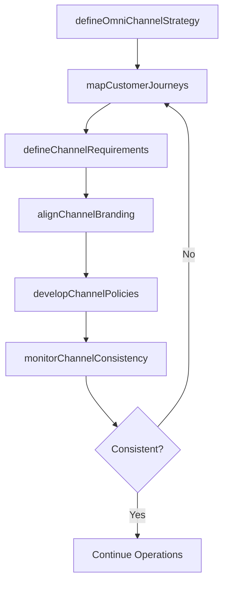

# Orchestrate seamless customer experience across supported channels

> Business-as-Code definition for omni-channel customer experience orchestration. Models the alignment of marketing, sales, and service channels to deliver a unified brand experience across digital, physical, and partner touchpoints.

## Overview

Coordinating marketing and distribution efforts across different channels that integrate well with each other, are in conformance with company values, visual identity and branding, and offer uniform customer service experience that drives customer loyalty and repeat business.

## Process Hierarchy



## GraphDL

```yaml
orchestrate:
  object: Seamless Customer Experience Across Supported Channels
  actor: OmniChannelManager
  result: UnifiedChannelExperience
```

## Actions

| Action | Description |
|--------|-------------|
| defineOmniChannelStrategy | Formulate a unified strategy for consistent customer experience across all channels |
| mapCustomerJourneys | Chart cross-channel customer journeys to identify friction points and handoff gaps |
| alignChannelBranding | Ensure visual identity, messaging, and service standards are consistent across touchpoints |
| defineChannelRequirements | Specify technical and operational prerequisites for each channel in the omni-channel network |
| developChannelPolicies | Create policies and procedures governing cross-channel interactions and data sharing |
| monitorChannelConsistency | Track adherence to omni-channel standards and identify experience drift |

## Events

| Event | Description |
|-------|-------------|
| omniChannelStrategyDefined | Unified omni-channel strategy approved and published |
| customerJourneysMapped | Cross-channel journey maps completed and validated |
| channelBrandingAligned | Brand consistency audit completed across all active channels |
| channelRequirementsDefined | Technical and operational channel requirements documented |
| channelPoliciesDeveloped | Cross-channel policies and procedures ratified |
| channelConsistencyMonitored | Omni-channel experience consistency report delivered |

## Searches

| Search | Description |
|--------|-------------|
| getJourneyMaps | Retrieve cross-channel customer journey maps by segment or persona |
| getChannelConsistencyScores | Query brand and experience consistency scores across channels |
| getChannelPolicies | Access current omni-channel policies and procedures |
| getChannelGaps | Identify gaps and friction points in cross-channel handoffs |

## Process Flow



## RACI Matrix

| Activity | Responsible | Accountable | Consulted | Informed |
|----------|-------------|-------------|-----------|----------|
| defineOmniChannelStrategy | OmniChannelManager | CMO | Sales | ExecutiveTeam |
| mapCustomerJourneys | CXDesigner | OmniChannelManager | Marketing | Digital |
| alignChannelBranding | BrandManager | CMO | Creative | ChannelPartners |
| developChannelPolicies | ChannelOperationsLead | OmniChannelManager | Legal | Sales |

## Sub-Processes

| ID | Name | Description |
|----|------|-------------|
| 3.2.4.7.1 | Define omni-channel strategy | Devising a strategy to market company's products or services seamlessly through all or most channels |
| 3.2.4.7.2 | Define omni-channel requirements | Identifying necessary preconditions that a channel should fulfill in order to be included as one of  |
| 3.2.4.7.3 | Develop omni-channel policies and procedures | Determining the detailed policies and procedures that each of the channels needs to follow in order  |

## Related Processes

| Process | Relationship |
|---------|-------------|
| 3.2.4.4 Select channels for target segments | Upstream - selected channels form the foundation for orchestration |
| 3.2.4.8 Develop and manage execution roadmap | Downstream - omni-channel design feeds execution planning |
| 3.2.5 Analyze and manage channel performance | Parallel - performance data drives consistency improvements |

## Related Departments

| Department | Role |
|-----------|------|
| Customer Experience | Leads journey mapping and experience design across channels |
| Digital Marketing | Manages online and mobile channel touchpoints |
| Brand Management | Ensures brand consistency across all channels |
| Channel Operations | Implements operational policies and procedures per channel |
| IT | Provides integration infrastructure for cross-channel data flow |

## Related Occupations

| Occupation | Involvement |
|-----------|-------------|
| Omni-Channel Manager | Orchestrates unified channel strategy and experience |
| Customer Experience Designer | Maps cross-channel journeys and identifies improvement areas |
| Digital Marketing Manager | Manages digital channel consistency and optimization |

## KPIs

| KPI | Description | Unit |
|-----|-------------|------|
| Channel Consistency Score | Degree of brand and experience uniformity across channels | Score (1-100) |
| Cross-Channel Conversion Rate | Percentage of customers completing purchases across multiple channels | % |
| Journey Completion Rate | Percentage of mapped customer journeys completed without friction | % |
| Channel Handoff Success | Percentage of cross-channel transitions completed without data loss | % |

## Usage

```typescript
import { orchestrateSeamlessCustomerExperienceAcrossSupportedChannels } from '@headlessly/orchestrate-seamless-customer-experience-across-supported-channels'

const omniChannel = orchestrateSeamlessCustomerExperienceAcrossSupportedChannels()

// Map customer journeys across channels
const journeys = await omniChannel.mapCustomerJourneys({
  segment: 'Premium',
  channels: ['web', 'mobile', 'in-store', 'call-center'],
  includeHandoffs: true
})

// Monitor consistency across all active channels
const consistency = await omniChannel.monitorChannelConsistency({
  dimensions: ['branding', 'pricing', 'service-levels'],
  period: 'last-30-days'
})
```
