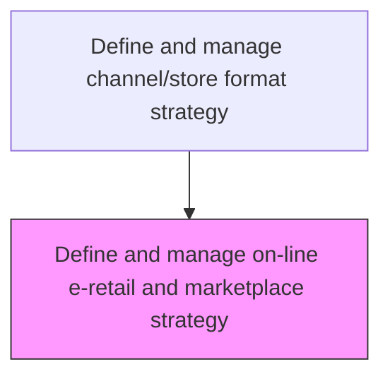
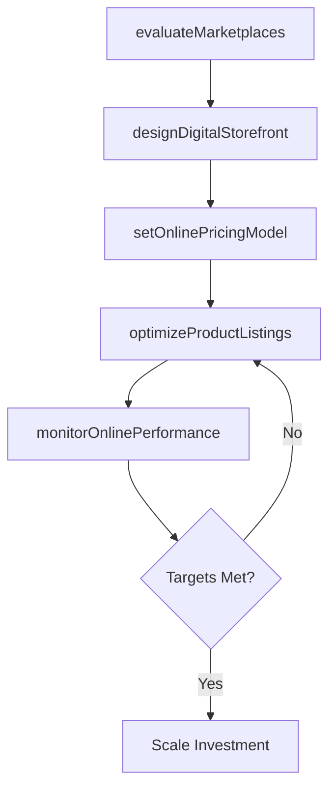

# Define and manage on-line e-retail and marketplace strategy

> Business-as-Code definition for e-retail and marketplace strategy management. Models the planning and governance of online selling channels including owned e-commerce, third-party marketplaces, and digital retail partnerships.

## Overview

Formulating and managing the strategy for selling products and services through online channels. Selecting and optimizing marketplace platforms, managing digital storefront experiences, setting e-commerce pricing and fulfillment models, and aligning online retail operations with the broader channel strategy. Ensuring online channels deliver a consistent brand experience and contribute to revenue targets.

## Process Hierarchy



## GraphDL

```yaml
define:
  object: And Manage On-line E-retail And Marketplace Strategy
  actor: EcommerceManager
  result: ERetailStrategyDocument
```

## Actions

| Action | Description |
|--------|-------------|
| evaluateMarketplaces | Assess third-party marketplace platforms for reach, fees, and brand fit |
| designDigitalStorefront | Plan the owned e-commerce experience including navigation, merchandising, and checkout |
| setOnlinePricingModel | Establish pricing, promotions, and fulfillment cost structures for online channels |
| optimizeProductListings | Refine product descriptions, images, and SEO for marketplace and e-retail visibility |
| monitorOnlinePerformance | Track conversion rates, revenue, and customer satisfaction across digital channels |

## Events

| Event | Description |
|-------|-------------|
| marketplacesEvaluated | Third-party marketplace assessment completed |
| digitalStorefrontDesigned | Owned e-commerce experience design approved |
| onlinePricingModelSet | Online pricing and fulfillment cost model published |
| productListingsOptimized | Product catalog optimized for search and conversion |
| onlinePerformanceMonitored | Digital channel performance report delivered |

## Searches

| Search | Description |
|--------|-------------|
| getMarketplaceProfiles | Retrieve marketplace evaluations by platform, category, or region |
| getOnlineSalesData | Query e-retail revenue and conversion data by channel or period |
| getListingPerformance | Look up product listing performance metrics by marketplace |

## Process Flow



## RACI Matrix

| Activity | Responsible | Accountable | Consulted | Informed |
|----------|-------------|-------------|-----------|----------|
| evaluateMarketplaces | EcommerceManager | VP DigitalCommerce | Finance | ChannelManager |
| designDigitalStorefront | UXDesigner | EcommerceManager | IT | BrandManagement |
| setOnlinePricingModel | PricingAnalyst | EcommerceManager | Finance | Sales |
| monitorOnlinePerformance | DigitalAnalyst | EcommerceManager | Marketing | ExecutiveTeam |

## Related Processes

| Process | Relationship |
|---------|-------------|
| 3.2.4.7 Orchestrate seamless customer experience across supported channels | Upstream - online channels are part of omni-channel orchestration |
| 3.2.5 Analyze and manage channel performance | Downstream - online performance feeds channel analysis |
| 3.3.3 Design and execute brand and product marketing programs | Consumer - e-retail strategy guides digital marketing execution |

## Related Departments

| Department | Role |
|-----------|------|
| E-Commerce | Owns online channel strategy and operations |
| Digital Marketing | Drives traffic to online storefronts and marketplaces |
| IT | Builds and maintains e-commerce platform infrastructure |
| Supply Chain | Manages fulfillment for online orders |

## Related Occupations

| Occupation | Involvement |
|-----------|-------------|
| E-Commerce Manager | Leads online channel strategy and optimization |
| Digital Marketing Specialist | Drives online traffic and conversion |
| UX Designer | Designs digital storefront experience |

## KPIs

| KPI | Description | Unit |
|-----|-------------|------|
| Online Conversion Rate | Percentage of website or marketplace visitors who complete a purchase | % |
| Marketplace Revenue Share | Percentage of total online revenue from third-party marketplaces | % |
| Digital Customer Acquisition Cost | Average cost to acquire a customer through online channels | Currency |
| Online Channel Growth Rate | Year-over-year growth of e-retail revenue | % |

## Usage

```typescript
import { defineAndManageOnLineERetailAndMarketplaceStrategy } from '@headlessly/define-and-manage-on-line-e-retail-and-marketplace-strategy'

const eretail = defineAndManageOnLineERetailAndMarketplaceStrategy()

// Evaluate marketplace platforms
const marketplaces = await eretail.evaluateMarketplaces({
  platforms: ['Amazon', 'Shopify', 'Custom'],
  criteria: ['fees', 'reach', 'brand-control', 'fulfillment']
})

// Monitor online channel performance
const performance = await eretail.monitorOnlinePerformance({
  channels: ['owned-store', 'amazon', 'partner-marketplace'],
  metrics: ['conversion', 'revenue', 'aov', 'cac'],
  period: 'last-90-days'
})
```
