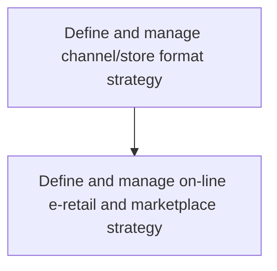
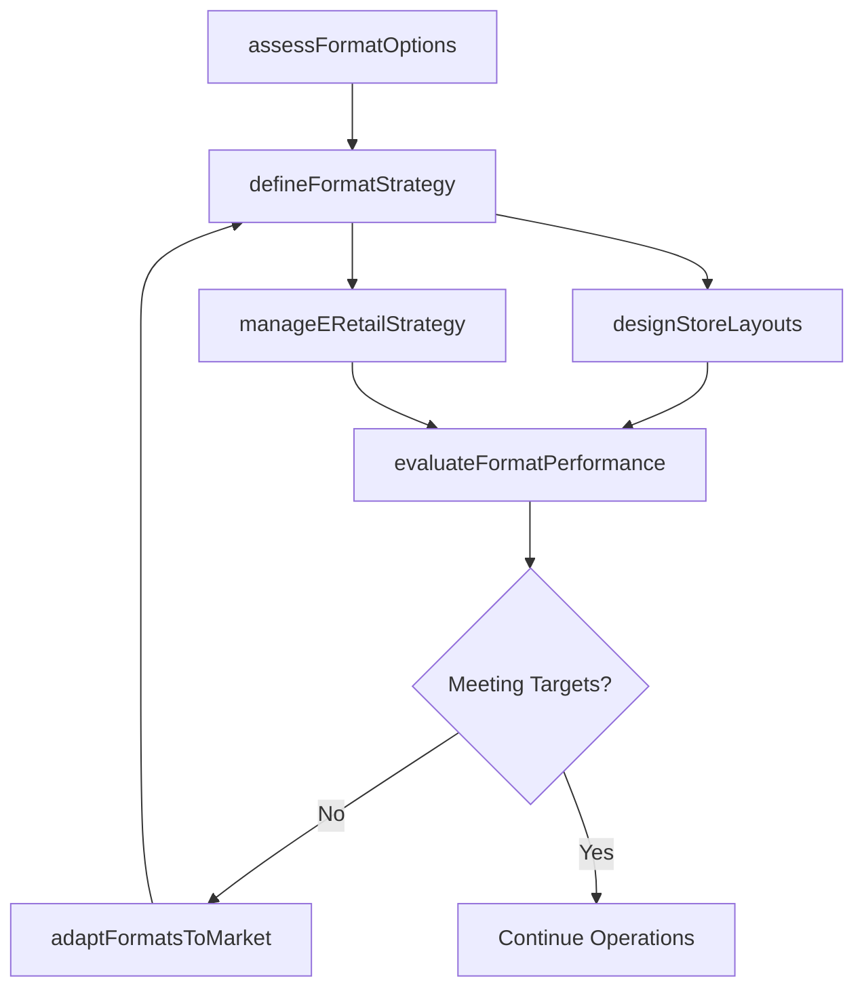

# Define and manage channel/store format strategy

> Business-as-Code definition for channel and store format strategy management. Models the design, evaluation, and optimization of physical and digital retail formats including e-retail, marketplace, and brick-and-mortar store configurations.

## Overview

Establishing the strategic framework for retail channel and store format decisions. Determine the optimal mix of physical store formats, e-commerce storefronts, and marketplace presences. Evaluate format performance, adapt layouts and assortments to local market conditions, and manage transitions between formats as customer preferences evolve.

## Process Hierarchy



## GraphDL

```yaml
define:
  object: And Manage Channel/store Format Strategy
  actor: RetailStrategyManager
  result: ChannelFormatPlan
```

## Actions

| Action | Description |
|--------|-------------|
| assessFormatOptions | Evaluate physical, digital, and hybrid store format alternatives |
| defineFormatStrategy | Establish the strategic format mix for each market and segment |
| designStoreLayouts | Specify merchandising layouts and planograms for each format |
| manageERetailStrategy | Define and optimize online e-retail and marketplace presence |
| evaluateFormatPerformance | Measure revenue, traffic, and conversion by store format |
| adaptFormatsToMarket | Adjust format strategies based on local market conditions and customer data |

## Events

| Event | Description |
|-------|-------------|
| formatOptionsAssessed | Store format feasibility analysis completed |
| formatStrategyDefined | Channel and store format strategy approved |
| storeLayoutsDesigned | Format-specific layouts and planograms finalized |
| eRetailStrategyManaged | Online and marketplace strategy updated |
| formatPerformanceEvaluated | Format performance review completed with recommendations |
| formatsAdaptedToMarket | Format adjustments deployed for specific markets |

## Searches

| Search | Description |
|--------|-------------|
| getFormatPerformance | Retrieve revenue and conversion metrics by store format |
| getFormatStrategy | Access current format strategy by market or region |
| getStoreLayouts | Query planogram and layout specifications by format type |
| getMarketplaceMetrics | Retrieve e-retail and marketplace performance data |

## Process Flow



## RACI Matrix

| Activity | Responsible | Accountable | Consulted | Informed |
|----------|-------------|-------------|-----------|----------|
| assessFormatOptions | RetailStrategyManager | VP Retail | Finance | Marketing |
| defineFormatStrategy | RetailStrategyManager | CMO | Sales | Operations |
| designStoreLayouts | MerchandisingManager | RetailStrategyManager | Visual Merchandising | StoreOps |
| manageERetailStrategy | ECommerceManager | CMO | Digital | IT |

## Sub-Processes

| ID | Name | Description |
|----|------|-------------|
| 3.2.4.9.1 | Define and manage on-line e-retail and marketplace strategy | Establishing strategies for online storefronts, e-retail platforms, and third-party marketplace pres |

## Related Processes

| Process | Relationship |
|---------|-------------|
| 3.2.4.7 Orchestrate seamless customer experience across supported channels | Upstream - omni-channel strategy governs format integration |
| 3.2.5 Analyze and manage channel performance | Downstream - format strategy sets targets for channel performance |
| 3.3.9 Develop and manage packaging strategy | Parallel - packaging adapts to channel and store format requirements |

## Related Departments

| Department | Role |
|-----------|------|
| Retail Strategy | Leads format planning and physical store design |
| E-Commerce | Manages online and marketplace format strategies |
| Merchandising | Designs store layouts and product assortment by format |
| Operations | Ensures supply chain and fulfillment capacity per format |

## Related Occupations

| Occupation | Involvement |
|-----------|-------------|
| Retail Strategy Manager | Designs format mix and leads format transitions |
| E-Commerce Manager | Manages online storefront and marketplace strategies |
| Visual Merchandiser | Creates format-specific layouts and planograms |

## KPIs

| KPI | Description | Unit |
|-----|-------------|------|
| Revenue per Format | Average revenue generated per store or channel format | Currency |
| Format Conversion Rate | Percentage of visitors who complete purchases by format type | % |
| Format Profitability | Gross margin achieved per channel or store format | % |
| Online-to-Offline Ratio | Revenue split between digital and physical formats | Ratio |

## Usage

```typescript
import { defineAndManageChannelStoreFormatStrategy } from '@headlessly/define-and-manage-channel-store-format-strategy'

const formats = defineAndManageChannelStoreFormatStrategy()

// Assess format options for a new market
const options = await formats.assessFormatOptions({
  market: 'Southeast Asia',
  candidates: ['flagship-store', 'pop-up', 'marketplace', 'direct-ecommerce'],
  evaluationCriteria: ['roi', 'reach', 'brand-alignment']
})

// Evaluate format performance across regions
const performance = await formats.evaluateFormatPerformance({
  formats: ['brick-and-mortar', 'ecommerce', 'marketplace'],
  metrics: ['revenue', 'conversion', 'traffic'],
  period: 'last-quarter'
})
```
