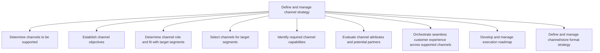
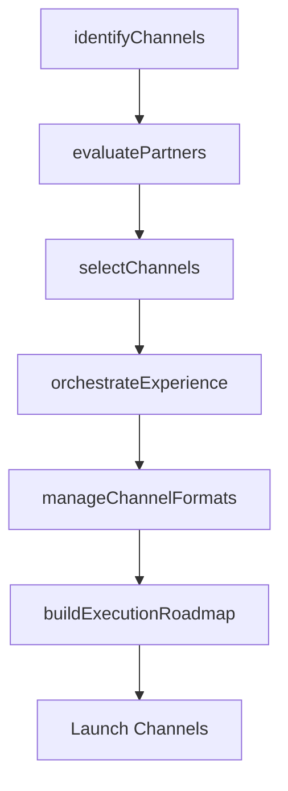

# Define and manage channel strategy

> Business-as-Code definition for go-to-market channel strategy. Models the identification, evaluation, selection, and orchestration of distribution and marketing channels to reach target customer segments effectively.

## Overview

Establishing all the activities needed to identify the appropriate channels to market to different customer segments as defined in Determine target segments [10117]. This involves finding channel partners, ensuring that the channels align with organizational strategy for each segment, and the final channel selection process.

## Process Hierarchy



## GraphDL

```yaml
define:
  object: And Manage Channel Strategy
  actor: ChannelStrategyManager
  result: ChannelStrategyPlan
```

## Actions

| Action | Description |
|--------|-------------|
| identifyChannels | Determine which channels should be supported for target segments |
| evaluatePartners | Assess channel partner capabilities and strategic fit |
| selectChannels | Choose optimal channels for each target segment |
| orchestrateExperience | Coordinate seamless customer experience across all channels |
| buildExecutionRoadmap | Create phased implementation plan for channel strategy |
| manageChannelFormats | Define and optimize channel and store format strategies |

## Events

| Event | Description |
|-------|-------------|
| channelsIdentified | Candidate channels evaluated and shortlisted |
| partnersEvaluated | Channel partner assessments completed |
| channelsSelected | Final channel selections approved for target segments |
| experienceOrchestrated | Omni-channel experience design finalized |
| executionRoadmapBuilt | Channel execution roadmap published |
| channelFormatsManaged | Channel format strategy updated |

## Searches

| Search | Description |
|--------|-------------|
| getChannelStrategy | Retrieve channel strategy by segment or geography |
| getPartnerProfiles | Query channel partner profiles and performance data |
| getChannelCoverage | Retrieve segment reach data across active channels |

## Process Flow



## RACI Matrix

| Activity | Responsible | Accountable | Consulted | Informed |
|----------|-------------|-------------|-----------|----------|
| identifyChannels | ChannelStrategyManager | CMO | Sales | ProductManagement |
| evaluatePartners | ChannelManager | VP Sales | Legal | Finance |
| selectChannels | ChannelStrategyManager | CMO | Sales | Operations |
| orchestrateExperience | CXManager | CMO | Digital | Sales |
| buildExecutionRoadmap | ChannelStrategyManager | CMO | Operations | ExecutiveTeam |

## Sub-Processes

| ID | Name | Description |
|----|------|-------------|
| 3.2.4.1 | Determine channels to be supported | Deciding which distributors, wholesalers and retailers the company will use to promote its offerings |
| 3.2.4.2 | Establish channel objectives | Identifying the role that each chosen marketing channels plays in the larger distribution network wi |
| 3.2.4.3 | Determine channel role and fit with target segments | Analyze the various channels for their relevance to the targeted segments. Identify the channel that |
| 3.2.4.4 | Select channels for target segments | Choose the most pertinent marketing channel for the targeted segments (based on Determine channel fi |
| 3.2.4.5 | Identify required channel capabilities | Determining the maximum output rate required from a distribution channel to optimally market and del |
| 3.2.4.6 | Evaluate channel attributes and potential partners | Assessing the attributes of all marketing channels, and evaluating the key partners in those channel |
| 3.2.4.7 | Orchestrate seamless customer experience across supported channels | Coordinating marketing and distribution efforts across different channels that integrate well with e |
| 3.2.4.8 | Develop and manage execution roadmap | Determining the actions that need to be taken for successful multichannel marketing, the ordering, t |
| 3.2.4.9 | Define and manage channel/store format strategy | Establishing the strategic framework for retail channel and store format decisions including physical |

## Related Processes

| Process | Relationship |
|---------|-------------|
| 3.1.2.2 Determine target segments | Upstream - segments define channel requirements |
| 3.2.5 Analyze and manage channel performance | Downstream - strategy sets targets for performance management |
| 3.4.2 Develop sales partner/alliance relationships | Parallel - channel and partner strategies must align |

## Related Departments

| Department | Role |
|-----------|------|
| Channel Management | Leads channel strategy design and partner evaluation |
| Sales | Provides input on channel effectiveness and partner relationships |
| Digital Marketing | Manages online and digital channel strategies |
| Operations | Ensures operational capacity across selected channels |

## Related Occupations

| Occupation | Involvement |
|-----------|-------------|
| Channel Strategy Manager | Designs multi-channel go-to-market strategies |
| Partner Manager | Evaluates and manages channel partner relationships |
| E-Commerce Manager | Manages digital and online channel strategies |

## KPIs

| KPI | Description | Unit |
|-----|-------------|------|
| Channel Reach | Percentage of target market accessible through active channels | % |
| Partner Coverage | Number of active channel partners per territory | Count |
| Channel Revenue Mix | Revenue distribution across direct, partner, and digital channels | % |
| Omni-channel Satisfaction | Customer satisfaction with cross-channel experience | Score (1-10) |

## Usage

```typescript
import { defineAndManageChannelStrategy } from '@headlessly/define-and-manage-channel-strategy'

const channels = defineAndManageChannelStrategy()

// Evaluate potential channel partners
const partners = await channels.evaluatePartners({
  region: 'Europe',
  partnerTypes: ['reseller', 'distributor', 'marketplace'],
  minCapabilityScore: 7
})

// Orchestrate omni-channel customer experience
const experience = await channels.orchestrateExperience({
  channels: ['direct-sales', 'partner', 'ecommerce', 'marketplace'],
  targetSegment: 'Mid-Market'
})
```
