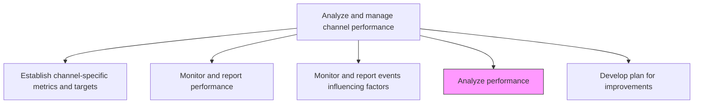
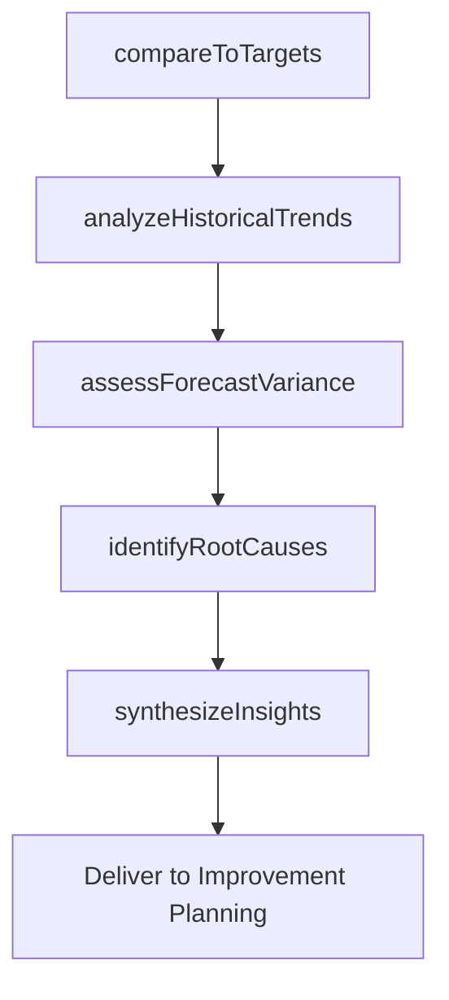

# Analyze performance

> Business-as-Code definition for channel performance analysis. Models the in-depth review of channel results against established metrics, historical baselines, and forecast targets.

## Overview

Conducting an analysis to review channel performance with respect to chosen metrics, benchmarks and performance targets [16573]. Compare to past performance and forecasts for the channel.

## Process Hierarchy



## GraphDL

```yaml
analyze:
  object: Performance
  actor: ChannelPerformanceAnalyst
  result: PerformanceAnalysisReport
```

## Actions

| Action | Description |
|--------|-------------|
| compareToTargets | Evaluate current channel results against established performance targets |
| analyzeHistoricalTrends | Compare current period performance with historical baselines |
| assessForecastVariance | Calculate deviation between actual results and forecasted channel performance |
| identifyRootCauses | Determine the underlying drivers of performance gaps or outperformance |
| synthesizeInsights | Produce actionable insights from the performance analysis for decision makers |

## Events

| Event | Description |
|-------|-------------|
| targetsCompared | Channel results compared against performance targets |
| historicalTrendsAnalyzed | Historical performance trend analysis completed |
| forecastVarianceAssessed | Forecast-to-actual variance calculated for all channels |
| rootCausesIdentified | Root cause analysis of performance gaps completed |
| insightsSynthesized | Actionable performance insights delivered to stakeholders |

## Searches

| Search | Description |
|--------|-------------|
| getPerformanceAnalyses | Retrieve performance analysis reports by channel or period |
| getRootCauseFindings | Query root cause analyses for specific performance gaps |
| getForecastVarianceData | Look up forecast-to-actual variance data by channel |

## Process Flow



## RACI Matrix

| Activity | Responsible | Accountable | Consulted | Informed |
|----------|-------------|-------------|-----------|----------|
| compareToTargets | ChannelAnalyst | ChannelPerformanceManager | Marketing | Finance |
| identifyRootCauses | DataAnalyst | ChannelPerformanceManager | ChannelManager | Sales |
| synthesizeInsights | ChannelPerformanceManager | VP Marketing | Strategy | ExecutiveTeam |

## Related Processes

| Process | Relationship |
|---------|-------------|
| 3.2.5.1 Establish channel-specific metrics and targets | Upstream - targets define the basis for analysis |
| 3.2.5.2 Monitor and report performance | Upstream - monitoring data feeds analysis |
| 3.2.5.5 Develop plan for improvements | Downstream - analysis insights drive improvement planning |

## Related Departments

| Department | Role |
|-----------|------|
| Marketing Analytics | Conducts performance analysis and root cause investigation |
| Channel Management | Provides channel context and acts on insights |
| Finance | Validates revenue and cost performance data |
| Strategy | Contextualizes performance within broader market conditions |

## Related Occupations

| Occupation | Involvement |
|-----------|-------------|
| Channel Performance Analyst | Executes detailed performance analysis |
| Data Analyst | Builds root cause and variance analysis models |
| Marketing Strategist | Translates analysis into strategic recommendations |

## KPIs

| KPI | Description | Unit |
|-----|-------------|------|
| Analysis Depth | Number of root causes identified per performance gap | Count |
| Insight Actionability | Percentage of analysis insights resulting in improvement actions | % |
| Forecast Accuracy | Average variance between forecasted and actual channel performance | % |
| Analysis Turnaround | Days from analysis initiation to insight delivery | Days |

## Usage

```typescript
import { analyzePerformance } from '@headlessly/analyze-performance'

const analysis = analyzePerformance()

// Compare current results against targets
const comparison = await analysis.compareToTargets({
  channels: ['paid-search', 'social', 'email'],
  period: 'Q4-2024',
  metrics: ['revenue', 'conversion-rate', 'cac']
})

// Identify root causes for underperformance
const rootCauses = await analysis.identifyRootCauses({
  channel: 'paid-search',
  metric: 'conversion-rate',
  analysisDepth: 'comprehensive'
})
```
