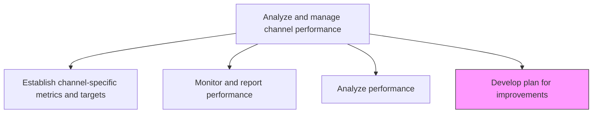
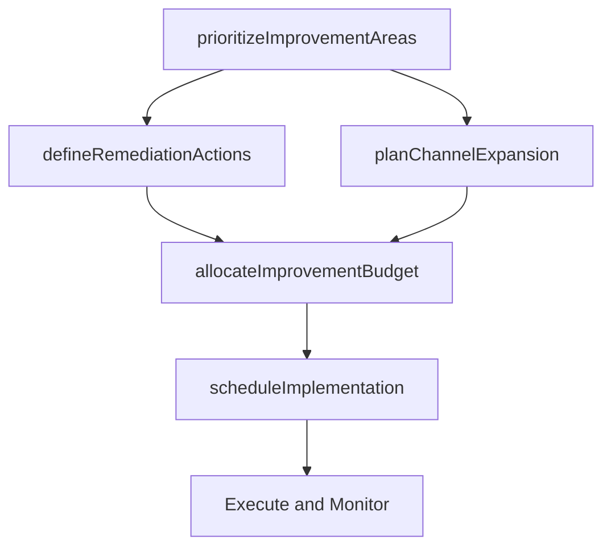

# Develop plan for improvements

> Business-as-Code definition for channel improvement planning. Models the creation of action plans to remediate underperforming channels and expand high-performing ones.

## Overview

Devising a course of action to be taken to improve under-performing channels and to promote or expand channels that surpass expectations.

## Process Hierarchy



## GraphDL

```yaml
develop:
  object: Plan For Improvements
  actor: ChannelManager
  result: ChannelImprovementPlan
```

## Actions

| Action | Description |
|--------|-------------|
| prioritizeImprovementAreas | Rank underperforming channels and metrics by business impact and feasibility |
| defineRemediationActions | Specify corrective actions for each underperforming channel |
| planChannelExpansion | Design scale-up initiatives for channels exceeding performance expectations |
| allocateImprovementBudget | Assign resources and budget to remediation and expansion initiatives |
| scheduleImplementation | Create the timeline with milestones for improvement execution |

## Events

| Event | Description |
|-------|-------------|
| improvementAreasPrioritized | Underperforming channels ranked by impact and urgency |
| remediationActionsDefined | Corrective actions documented for each flagged channel |
| channelExpansionPlanned | Scale-up plan for outperforming channels completed |
| improvementBudgetAllocated | Resources and budget assigned to improvement initiatives |
| implementationScheduled | Improvement timeline with milestones published |

## Searches

| Search | Description |
|--------|-------------|
| getImprovementPlans | Retrieve channel improvement plans by channel, status, or priority |
| getRemediationActions | Query corrective actions defined for underperforming channels |
| getExpansionInitiatives | Look up planned expansion efforts for high-performing channels |

## Process Flow



## RACI Matrix

| Activity | Responsible | Accountable | Consulted | Informed |
|----------|-------------|-------------|-----------|----------|
| prioritizeImprovementAreas | ChannelPerformanceManager | VP Marketing | Finance | Sales |
| defineRemediationActions | ChannelManager | ChannelPerformanceManager | Marketing | IT |
| allocateImprovementBudget | ChannelPerformanceManager | CMO | Finance | ExecutiveTeam |

## Related Processes

| Process | Relationship |
|---------|-------------|
| 3.2.5.4 Analyze performance | Upstream - performance analysis identifies improvement areas |
| 3.2.4.8 Develop and manage execution roadmap | Consumer - improvement plans may update the execution roadmap |
| 3.2.4.1 Determine channels to be supported | Consumer - expansion plans may add new supported channels |

## Related Departments

| Department | Role |
|-----------|------|
| Channel Management | Leads improvement planning and execution |
| Marketing Operations | Implements channel remediation actions |
| Finance | Approves improvement budgets and tracks ROI |
| IT | Supports technical improvements to channel infrastructure |

## Related Occupations

| Occupation | Involvement |
|-----------|-------------|
| Channel Manager | Designs and executes improvement plans |
| Marketing Operations Manager | Implements remediation actions |
| Financial Analyst | Models improvement initiative ROI |

## KPIs

| KPI | Description | Unit |
|-----|-------------|------|
| Improvement Plan Execution Rate | Percentage of planned improvement actions completed on time | % |
| Channel Recovery Rate | Percentage of underperforming channels that return to target after remediation | % |
| Expansion ROI | Return on investment for channel expansion initiatives | Ratio |
| Time to Impact | Average days from improvement plan approval to measurable performance change | Days |

## Usage

```typescript
import { developPlanForImprovements } from '@headlessly/develop-plan-for-improvements'

const improvement = developPlanForImprovements()

// Prioritize channels needing improvement
const priorities = await improvement.prioritizeImprovementAreas({
  underperformingChannels: ['paid-search', 'partner-reseller'],
  criteria: ['revenue-impact', 'feasibility', 'urgency']
})

// Plan expansion for a high-performing channel
const expansion = await improvement.planChannelExpansion({
  channel: 'social-commerce',
  currentPerformance: { revenue: 500000, growth: 0.45 },
  expansionTarget: { revenue: 1000000 }
})
```
