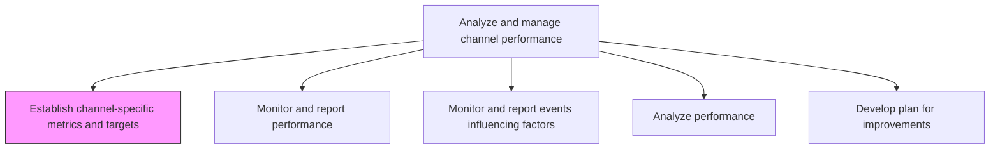
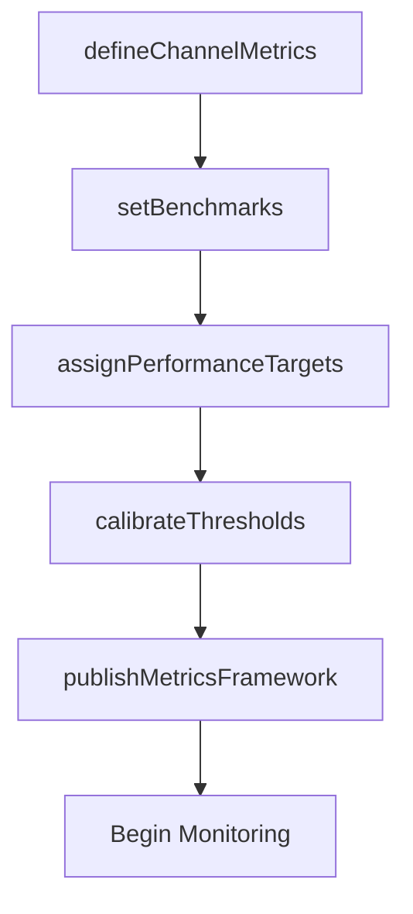

# Establish channel-specific metrics and targets

> Business-as-Code definition for channel metrics and target establishment. Models the definition of performance benchmarks, KPIs, and goal-setting for individual marketing channels.

## Overview

Determining measurable parameters to be used for comparing the performance of different marketing channels. Decide on benchmarks and values for optimum or desired performance.

## Process Hierarchy



## GraphDL

```yaml
establish:
  object: Channel-specific Metrics And Targets
  actor: ChannelPerformanceManager
  result: ChannelMetricsFramework
```

## Actions

| Action | Description |
|--------|-------------|
| defineChannelMetrics | Select the KPIs and measurable parameters relevant to each channel |
| setBenchmarks | Establish industry or historical benchmarks for each metric |
| assignPerformanceTargets | Set quantitative targets for each channel-metric combination |
| calibrateThresholds | Define warning and critical thresholds that trigger alerts |
| publishMetricsFramework | Document and distribute the metrics framework to channel owners |

## Events

| Event | Description |
|-------|-------------|
| channelMetricsDefined | Channel-specific KPIs selected and documented |
| benchmarksSet | Performance benchmarks established for all channel metrics |
| performanceTargetsAssigned | Quantitative targets set for each channel |
| thresholdsCalibrated | Alert thresholds configured for each metric |
| metricsFrameworkPublished | Complete metrics framework distributed to stakeholders |

## Searches

| Search | Description |
|--------|-------------|
| getChannelMetrics | Retrieve defined metrics and targets by channel or category |
| getBenchmarks | Look up industry or historical benchmarks for specific metrics |
| getAlertThresholds | Query alert thresholds for channel performance metrics |

## Process Flow



## RACI Matrix

| Activity | Responsible | Accountable | Consulted | Informed |
|----------|-------------|-------------|-----------|----------|
| defineChannelMetrics | ChannelAnalyst | ChannelPerformanceManager | Marketing | Sales |
| setBenchmarks | MarketingAnalyst | ChannelPerformanceManager | Finance | ExecutiveTeam |
| assignPerformanceTargets | ChannelPerformanceManager | VP Marketing | ChannelManager | Finance |

## Related Processes

| Process | Relationship |
|---------|-------------|
| 3.2.5.2 Monitor and report performance | Downstream - metrics framework enables performance monitoring |
| 3.2.5.4 Analyze performance | Downstream - targets provide the basis for analysis |
| 3.2.4.2 Establish channel objectives | Upstream - channel objectives inform metric selection |

## Related Departments

| Department | Role |
|-----------|------|
| Channel Management | Leads metric definition and target setting |
| Marketing Analytics | Provides benchmarking data and reporting infrastructure |
| Finance | Validates financial metric targets |
| Sales | Provides input on revenue-related channel targets |

## Related Occupations

| Occupation | Involvement |
|-----------|-------------|
| Channel Performance Manager | Leads metric framework development |
| Marketing Analyst | Provides benchmarking data and calibration |
| Channel Manager | Validates targets for assigned channels |

## KPIs

| KPI | Description | Unit |
|-----|-------------|------|
| Metric Coverage | Percentage of active channels with defined metrics and targets | % |
| Target Refresh Cadence | How frequently performance targets are reviewed and updated | Per Quarter |
| Benchmark Currency | Age of the most recent benchmark data used | Months |
| Threshold Effectiveness | Percentage of performance issues detected by calibrated thresholds | % |

## Usage

```typescript
import { establishChannelSpecificMetricsAndTargets } from '@headlessly/establish-channel-specific-metrics-and-targets'

const metrics = establishChannelSpecificMetricsAndTargets()

// Define metrics for a channel
const channelMetrics = await metrics.defineChannelMetrics({
  channel: 'paid-search',
  metrics: ['cpc', 'ctr', 'conversion-rate', 'roas']
})

// Assign performance targets
const targets = await metrics.assignPerformanceTargets({
  channel: 'paid-search',
  targets: { cpc: 2.50, ctr: 0.03, conversionRate: 0.05, roas: 4.0 }
})
```
