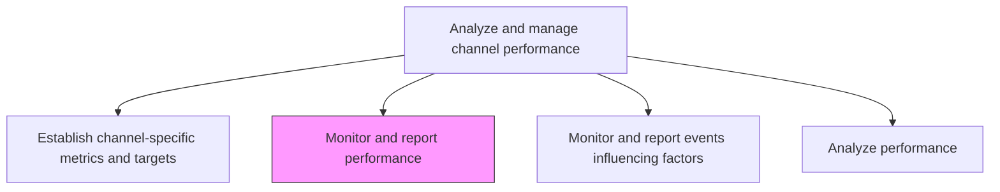
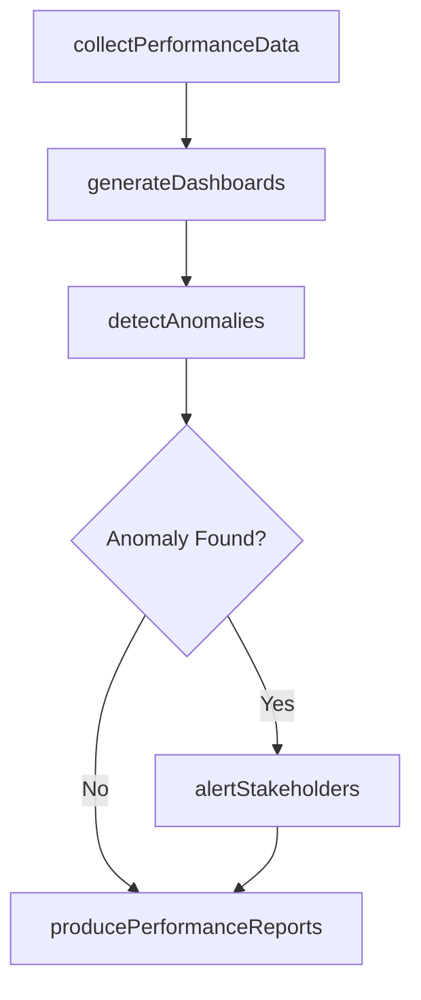

# Monitor and report performance

> Business-as-Code definition for channel performance monitoring and reporting. Models the ongoing tracking, dashboarding, and stakeholder alerting of marketing channel performance.

## Overview

Tracking trends and changes in performance inside individual marketing channels and in channels collectively. Summarize and document results. Alert relevant parties about significant or unexpected deviations from expected behaviors.

## Process Hierarchy



## GraphDL

```yaml
monitor:
  object: And Report Performance
  actor: ChannelAnalyst
  result: ChannelPerformanceReport
```

## Actions

| Action | Description |
|--------|-------------|
| collectPerformanceData | Aggregate channel performance data from analytics platforms and partners |
| generateDashboards | Build real-time dashboards showing channel KPIs against targets |
| detectAnomalies | Identify statistically significant deviations from expected performance |
| alertStakeholders | Notify channel owners and leadership of material performance changes |
| producePerformanceReports | Create periodic summary reports documenting channel results and trends |

## Events

| Event | Description |
|-------|-------------|
| performanceDataCollected | Channel data aggregation cycle completed |
| dashboardsGenerated | Performance dashboards updated with latest data |
| anomalyDetected | Material deviation from expected channel performance identified |
| stakeholdersAlerted | Performance alert distributed to relevant parties |
| performanceReportProduced | Periodic channel performance report published |

## Searches

| Search | Description |
|--------|-------------|
| getPerformanceReports | Retrieve channel performance reports by period or channel |
| getAnomalyAlerts | Query active and historical performance anomaly alerts |
| getDashboardData | Look up real-time dashboard metrics for specific channels |

## Process Flow



## RACI Matrix

| Activity | Responsible | Accountable | Consulted | Informed |
|----------|-------------|-------------|-----------|----------|
| collectPerformanceData | ChannelAnalyst | ChannelPerformanceManager | IT | Marketing |
| detectAnomalies | DataAnalyst | ChannelPerformanceManager | DataScience | ChannelManager |
| alertStakeholders | ChannelPerformanceManager | VP Marketing | Sales | ExecutiveTeam |
| producePerformanceReports | ChannelAnalyst | ChannelPerformanceManager | Finance | Marketing |

## Related Processes

| Process | Relationship |
|---------|-------------|
| 3.2.5.1 Establish channel-specific metrics and targets | Upstream - metrics framework defines what to monitor |
| 3.2.5.3 Monitor and report events influencing factors | Parallel - external factors contextualize performance data |
| 3.2.5.4 Analyze performance | Downstream - monitoring data feeds deeper analysis |

## Related Departments

| Department | Role |
|-----------|------|
| Marketing Analytics | Operates dashboards and collects performance data |
| Channel Management | Receives reports and acts on anomaly alerts |
| Data Engineering | Maintains data pipelines for performance collection |
| Finance | Reviews revenue performance metrics |

## Related Occupations

| Occupation | Involvement |
|-----------|-------------|
| Channel Analyst | Collects data and produces performance reports |
| Data Analyst | Builds anomaly detection and dashboarding tools |
| Marketing Operations Manager | Ensures reporting cadence and distribution |

## KPIs

| KPI | Description | Unit |
|-----|-------------|------|
| Report Timeliness | Percentage of performance reports delivered on schedule | % |
| Anomaly Detection Rate | Percentage of material deviations caught by monitoring | % |
| Data Freshness | Maximum age of data displayed in performance dashboards | Hours |
| Stakeholder Alert Response Time | Average time from alert to acknowledgment | Hours |

## Usage

```typescript
import { monitorAndReportPerformance } from '@headlessly/monitor-and-report-performance'

const monitoring = monitorAndReportPerformance()

// Collect performance data across channels
const data = await monitoring.collectPerformanceData({
  channels: ['paid-search', 'social', 'email', 'partner-reseller'],
  period: 'last-30-days'
})

// Detect anomalies against established targets
const anomalies = await monitoring.detectAnomalies({
  channels: ['paid-search', 'social'],
  sensitivityLevel: 'medium',
  baselinePeriod: 'last-90-days'
})
```
