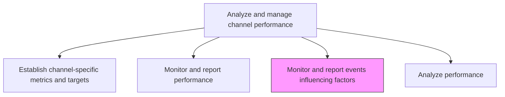
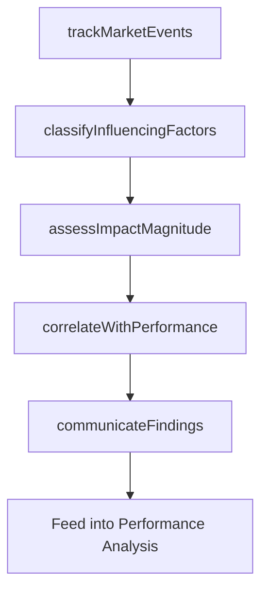

# Monitor and report events influencing factors

> Business-as-Code definition for tracking external and internal events that influence channel performance. Models the identification, classification, and communication of factors that drive performance deviations.

## Overview

Analyzing the factors and circumstances that influence desired outcomes. Communicate core findings to relevant parties.

## Process Hierarchy



## GraphDL

```yaml
monitor:
  object: And Report Events Influencing Factors
  actor: MarketIntelligenceAnalyst
  result: InfluencingFactorsReport
```

## Actions

| Action | Description |
|--------|-------------|
| trackMarketEvents | Monitor competitive actions, regulatory changes, and market disruptions affecting channels |
| classifyInfluencingFactors | Categorize events by type, severity, and channel impact |
| assessImpactMagnitude | Quantify the effect of each influencing factor on channel performance metrics |
| correlateWithPerformance | Link influencing events to observed performance deviations |
| communicateFindings | Distribute event impact analysis to channel owners and leadership |

## Events

| Event | Description |
|-------|-------------|
| marketEventTracked | Relevant market event identified and logged |
| influencingFactorsClassified | Influencing events categorized and prioritized |
| impactMagnitudeAssessed | Quantitative impact analysis of influencing factors completed |
| correlationEstablished | Influencing events linked to specific performance changes |
| findingsCommunicated | Event impact findings distributed to stakeholders |

## Searches

| Search | Description |
|--------|-------------|
| getInfluencingEvents | Retrieve tracked market events by type, channel, or period |
| getImpactAssessments | Query impact analyses for specific events or channels |
| getCorrelationReports | Look up event-performance correlation analyses |

## Process Flow



## RACI Matrix

| Activity | Responsible | Accountable | Consulted | Informed |
|----------|-------------|-------------|-----------|----------|
| trackMarketEvents | MarketIntelligenceAnalyst | ChannelPerformanceManager | CompetitiveIntelligence | Marketing |
| classifyInfluencingFactors | ChannelAnalyst | ChannelPerformanceManager | Strategy | Sales |
| correlateWithPerformance | DataAnalyst | ChannelPerformanceManager | MarketingAnalytics | ExecutiveTeam |

## Related Processes

| Process | Relationship |
|---------|-------------|
| 3.2.5.2 Monitor and report performance | Parallel - performance data is contextualized by influencing factors |
| 3.2.5.4 Analyze performance | Downstream - factor analysis enriches performance interpretation |
| 3.1.1.5 Analyze market and industry trends | Upstream - market trends feed event tracking |

## Related Departments

| Department | Role |
|-----------|------|
| Competitive Intelligence | Monitors competitor actions and market events |
| Marketing Analytics | Correlates events with performance data |
| Strategy | Provides macroeconomic and industry context |
| Channel Management | Acts on event impact findings |

## Related Occupations

| Occupation | Involvement |
|-----------|-------------|
| Market Intelligence Analyst | Tracks and classifies influencing events |
| Data Analyst | Builds event-performance correlation models |
| Channel Performance Manager | Communicates findings and drives response |

## KPIs

| KPI | Description | Unit |
|-----|-------------|------|
| Event Detection Speed | Average time from event occurrence to internal identification | Hours |
| Factor Classification Accuracy | Percentage of events correctly categorized by impact type | % |
| Correlation Coverage | Percentage of performance deviations with identified causal factors | % |
| Communication Timeliness | Average time from impact assessment to stakeholder notification | Hours |

## Usage

```typescript
import { monitorAndReportEventsInfluencingFactors } from '@headlessly/monitor-and-report-events-influencing-factors'

const factors = monitorAndReportEventsInfluencingFactors()

// Track market events affecting channels
const events = await factors.trackMarketEvents({
  channels: ['paid-search', 'social', 'partner-reseller'],
  eventTypes: ['competitor-action', 'regulatory-change', 'market-disruption'],
  period: 'last-30-days'
})

// Correlate influencing factors with performance data
const correlations = await factors.correlateWithPerformance({
  eventId: events[0].id,
  performanceMetrics: ['conversion-rate', 'cpc', 'revenue'],
  analysisWindow: 14
})
```
