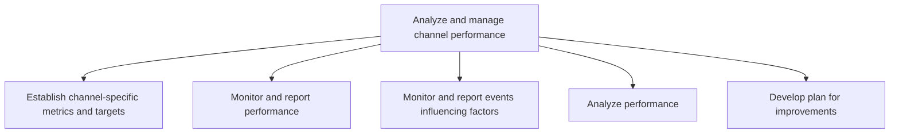
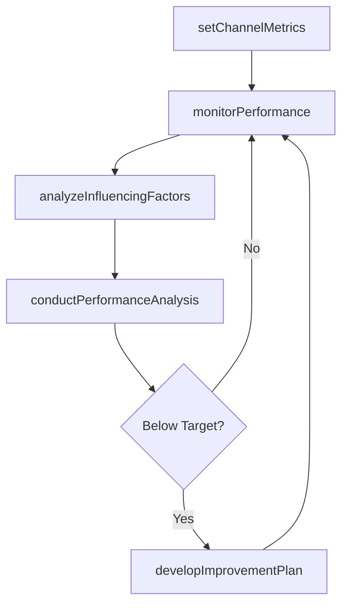

# Analyze and manage channel performance

> Business-as-Code definition for channel performance management. Models the measurement, analysis, and optimization of marketing and distribution channel effectiveness to maximize return on channel investments.

## Overview

Monitoring marketing and distribution efforts of all channels individually and as a network. Re-distribute or add resources to channels that perform better than expected. Purge or consolidate under-performing channels, and find more promising replacements.

## Process Hierarchy



## GraphDL

```yaml
analyze:
  object: And Manage Channel Performance
  actor: ChannelPerformanceAnalyst
  result: ChannelPerformanceReport
```

## Actions

| Action | Description |
|--------|-------------|
| setChannelMetrics | Define channel-specific KPIs and performance targets |
| monitorPerformance | Track real-time channel performance against established targets |
| analyzeInfluencingFactors | Identify external and internal factors impacting channel performance |
| conductPerformanceAnalysis | Deep-dive analysis of channel metrics and benchmarks |
| developImprovementPlan | Create action plans to optimize underperforming channels |

## Events

| Event | Description |
|-------|-------------|
| channelMetricsSet | Channel performance metrics and targets established |
| performanceMonitored | Channel performance data refreshed and reported |
| influencingFactorsAnalyzed | Factors affecting channel performance identified |
| performanceAnalysisConducted | Channel performance deep-dive completed |
| improvementPlanDeveloped | Channel optimization plan approved |

## Searches

| Search | Description |
|--------|-------------|
| getChannelMetrics | Retrieve performance metrics by channel and period |
| getChannelBenchmarks | Query performance benchmarks across channels |
| getImprovementPlans | Access active channel improvement plans and status |

## Process Flow



## RACI Matrix

| Activity | Responsible | Accountable | Consulted | Informed |
|----------|-------------|-------------|-----------|----------|
| setChannelMetrics | ChannelPerformanceAnalyst | VP Marketing | Finance | Sales |
| monitorPerformance | ChannelPerformanceAnalyst | ChannelManager | Sales | Marketing |
| conductPerformanceAnalysis | ChannelPerformanceAnalyst | VP Marketing | Finance | ExecutiveTeam |
| developImprovementPlan | ChannelManager | CMO | Sales | Operations |

## Sub-Processes

| ID | Name | Description |
|----|------|-------------|
| 3.2.5.1 | Establish channel-specific metrics and targets | Determining measurable parameters to be used for comparing the performance of different marketing ch |
| 3.2.5.2 | Monitor and report performance | Tracking trends and changes in performance inside individual marketing channels and in channels coll |
| 3.2.5.3 | Monitor and report events influencing factors | Analyzing the factors and circumstances that influence desired outcomes. Communicate core findings t |
| 3.2.5.4 | Analyze performance | Conducting an analysis to review channel performance with respect to chosen metrics, benchmarks and  |
| 3.2.5.5 | Develop plan for improvements | Devising a course of action to be taken to improve under-performing channels and to promote or expan |

## Related Processes

| Process | Relationship |
|---------|-------------|
| 3.2.4 Define and manage channel strategy | Upstream - strategy defines performance targets |
| 3.3.7 Track customer management measures | Parallel - customer metrics complement channel metrics |
| 3.5.5 Manage sales partners and alliances | Related - partner channel performance feeds partner management |

## Related Departments

| Department | Role |
|-----------|------|
| Channel Management | Owns channel performance monitoring and optimization |
| Marketing Analytics | Provides data analysis and reporting capabilities |
| Sales | Delivers channel revenue data and field insights |
| Finance | Reviews channel ROI and investment allocation |

## Related Occupations

| Occupation | Involvement |
|-----------|-------------|
| Channel Performance Analyst | Monitors and analyzes channel metrics |
| Marketing Analyst | Builds dashboards and performance reports |
| Channel Manager | Acts on performance insights to optimize channels |

## KPIs

| KPI | Description | Unit |
|-----|-------------|------|
| Channel Revenue | Revenue generated per channel | USD |
| Channel Cost Efficiency | Cost per acquisition by channel | USD |
| Channel Growth Rate | Period-over-period revenue growth per channel | % |
| Channel Utilization | Percentage of channel capacity being used | % |

## Usage

```typescript
import { analyzeAndManageChannelPerformance } from '@headlessly/analyze-and-manage-channel-performance'

const channelPerf = analyzeAndManageChannelPerformance()

// Monitor performance across all active channels
const metrics = await channelPerf.monitorPerformance({
  channels: ['direct', 'partner', 'digital', 'marketplace'],
  period: 'Q4-2025',
  compareWith: 'Q3-2025'
})

// Develop improvement plan for underperforming channels
const plan = await channelPerf.developImprovementPlan({
  channel: 'marketplace',
  targetImprovement: 0.15,
  timeline: '90-days'
})
```
