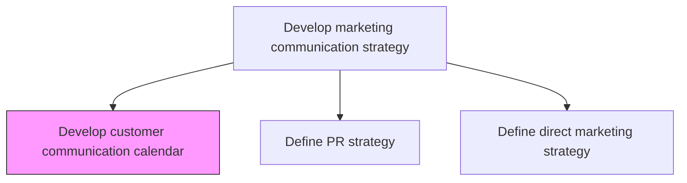
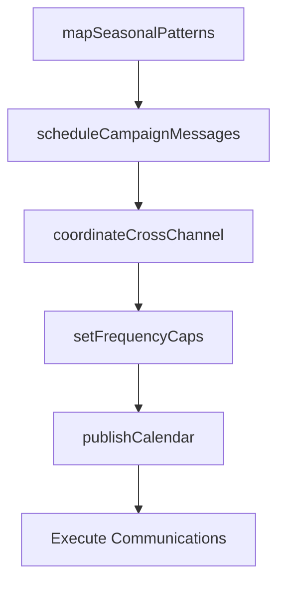

# Develop customer communication calendar

> Business-as-Code definition for customer communication calendar development. Models the planning, scheduling, and coordination of marketing messages across campaigns, channels, and seasonal cycles.

## Overview

Timing and scheduling the delivery of marketing messages to maximize their impact on customer purchasing behavior. Integrate individual messages to larger marketing campaigns and to seasonal purchasing patterns.

## Process Hierarchy



## GraphDL

```yaml
develop:
  object: Customer Communication Calendar
  actor: MarketingCommunicationsManager
  result: CommunicationCalendar
```

## Actions

| Action | Description |
|--------|-------------|
| mapSeasonalPatterns | Identify key seasonal events, holidays, and purchasing cycles for calendar planning |
| scheduleCampaignMessages | Place individual marketing messages within campaign timelines |
| coordinateCrossChannel | Align message timing across email, social, paid, and direct mail channels |
| setFrequencyCaps | Define maximum contact frequency rules to prevent message fatigue |
| publishCalendar | Finalize and distribute the communication calendar to all execution teams |

## Events

| Event | Description |
|-------|-------------|
| seasonalPatternsMapped | Seasonal purchasing cycles and key dates documented |
| campaignMessagesScheduled | Individual messages placed on the campaign timeline |
| crossChannelCoordinated | Cross-channel message timing aligned and de-conflicted |
| frequencyCapsSet | Contact frequency limits published |
| calendarPublished | Communication calendar distributed to execution teams |

## Searches

| Search | Description |
|--------|-------------|
| getCommunicationCalendar | Retrieve the communication calendar by period, campaign, or channel |
| getScheduledMessages | Query upcoming scheduled messages by date range or audience |
| getFrequencyRules | Look up contact frequency caps by segment or channel |

## Process Flow



## RACI Matrix

| Activity | Responsible | Accountable | Consulted | Informed |
|----------|-------------|-------------|-----------|----------|
| mapSeasonalPatterns | MarketingPlanner | MarComManager | Sales | ProductMarketing |
| scheduleCampaignMessages | CampaignManager | MarComManager | Creative | DigitalMarketing |
| coordinateCrossChannel | MarketingOperations | MarComManager | ChannelManagers | Sales |

## Related Processes

| Process | Relationship |
|---------|-------------|
| 3.2.6.3 Define direct marketing strategy | Upstream - direct strategy shapes calendar entries |
| 3.3.3 Design and execute brand and product marketing programs | Consumer - calendar drives campaign execution timing |
| 3.2.6.8 Define communication guidelines and mechanisms | Upstream - guidelines constrain calendar design |

## Related Departments

| Department | Role |
|-----------|------|
| Marketing Communications | Owns calendar development and coordination |
| Campaign Management | Schedules individual campaign messages |
| Digital Marketing | Manages online channel scheduling |
| Sales | Provides input on seasonal selling patterns |

## Related Occupations

| Occupation | Involvement |
|-----------|-------------|
| Marketing Communications Manager | Leads calendar development |
| Campaign Manager | Schedules messages within campaigns |
| Marketing Operations Analyst | Coordinates cross-channel timing |

## KPIs

| KPI | Description | Unit |
|-----|-------------|------|
| Calendar Adherence Rate | Percentage of scheduled communications delivered on time | % |
| Message Overlap Rate | Percentage of customers receiving conflicting messages in a given period | % |
| Frequency Cap Compliance | Percentage of contacts within defined frequency limits | % |
| Seasonal Alignment Score | Revenue lift during planned seasonal campaigns versus baseline | % |

## Usage

```typescript
import { developCustomerCommunicationCalendar } from '@headlessly/develop-customer-communication-calendar'

const calendar = developCustomerCommunicationCalendar()

// Map seasonal purchasing patterns
const patterns = await calendar.mapSeasonalPatterns({
  region: 'North America',
  industry: 'B2B SaaS',
  lookbackYears: 3
})

// Schedule campaign messages across channels
const schedule = await calendar.scheduleCampaignMessages({
  campaign: 'Q4-Product-Launch',
  channels: ['email', 'social', 'paid-search'],
  startDate: '2024-10-01',
  endDate: '2024-12-31'
})
```
