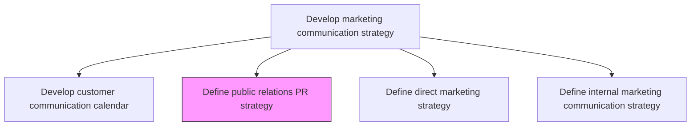
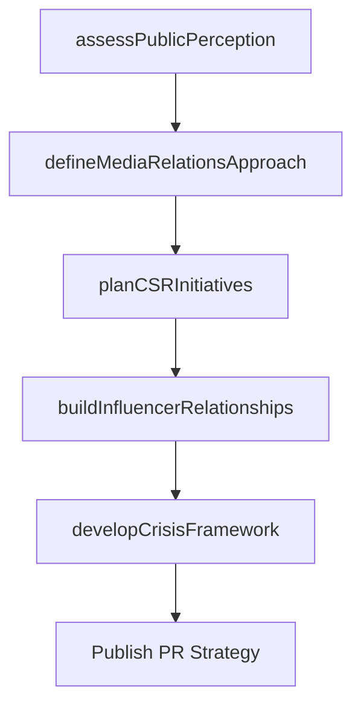

# Define public relations (PR) strategy

> Business-as-Code definition for public relations strategy formulation. Models the planning of earned media, reputation management, stakeholder communication, and corporate image programs.

## Overview

Deciding how to promote and maintain a favorable public image of the company in the eyes of its employees, customers, investors, suppliers, politicians or the general public. This may involve various means but is frequently conducted through publicity, education, corporate social responsibility, charitable causes or civic engagements.

## Process Hierarchy



## GraphDL

```yaml
define:
  object: Public Relations (PR) Strategy
  actor: PRDirector
  result: PRStrategyDocument
```

## Actions

| Action | Description |
|--------|-------------|
| assessPublicPerception | Evaluate current brand reputation and public sentiment across stakeholder groups |
| defineMediaRelationsApproach | Establish the strategy for earned media placements, press releases, and journalist engagement |
| planCSRInitiatives | Design corporate social responsibility programs that enhance brand reputation |
| developCrisisFramework | Create protocols for managing reputation-threatening events and negative publicity |
| buildInfluencerRelationships | Identify and cultivate relationships with industry thought leaders and media influencers |

## Events

| Event | Description |
|-------|-------------|
| publicPerceptionAssessed | Stakeholder perception audit completed |
| mediaRelationsApproachDefined | Media engagement strategy approved |
| csrInitiativesPlanned | Corporate social responsibility programs designed and budgeted |
| crisisFrameworkDeveloped | Crisis communication protocols established |
| influencerRelationshipsBuilt | Key influencer and media relationship pipeline established |

## Searches

| Search | Description |
|--------|-------------|
| getPRStrategy | Retrieve the current public relations strategy document |
| getMediaCoverage | Query earned media placements by publication, date, or topic |
| getReputationMetrics | Look up brand reputation scores across stakeholder groups |

## Process Flow



## RACI Matrix

| Activity | Responsible | Accountable | Consulted | Informed |
|----------|-------------|-------------|-----------|----------|
| assessPublicPerception | PRManager | PRDirector | MarketResearch | ExecutiveTeam |
| defineMediaRelationsApproach | PRManager | PRDirector | Marketing | Legal |
| developCrisisFramework | PRDirector | CMO | Legal | ExecutiveTeam |

## Related Processes

| Process | Relationship |
|---------|-------------|
| 3.2.6.1 Develop customer communication calendar | Parallel - PR activities integrated into communication calendar |
| 3.2.3 Develop and manage brands | Upstream - brand strategy informs PR positioning |
| 3.3.6 Develop and manage crisis communication plans | Downstream - PR strategy feeds crisis plan development |

## Related Departments

| Department | Role |
|-----------|------|
| Public Relations | Owns PR strategy and media relations |
| Corporate Communications | Aligns PR with corporate messaging |
| Marketing | Integrates PR with marketing campaigns |
| Legal | Reviews PR content for compliance and risk |

## Related Occupations

| Occupation | Involvement |
|-----------|-------------|
| PR Director | Leads strategy development and stakeholder engagement |
| PR Manager | Executes media relations and content programs |
| Corporate Communications Manager | Aligns PR with corporate narrative |

## KPIs

| KPI | Description | Unit |
|-----|-------------|------|
| Share of Voice | Organization's media mentions relative to competitors | % |
| Media Sentiment Score | Ratio of positive to negative earned media coverage | Ratio |
| PR Reach | Total audience reached through earned media placements | Impressions |
| Crisis Response Time | Average time from negative event to first public response | Hours |

## Usage

```typescript
import { definePublicRelationsPrStrategy } from '@headlessly/define-public-relations-pr-strategy'

const pr = definePublicRelationsPrStrategy()

// Assess current public perception
const perception = await pr.assessPublicPerception({
  stakeholderGroups: ['customers', 'investors', 'employees', 'media'],
  sources: ['surveys', 'social-listening', 'media-coverage']
})

// Build influencer relationship pipeline
const influencers = await pr.buildInfluencerRelationships({
  industry: 'Enterprise Technology',
  tiers: ['analyst', 'journalist', 'thought-leader'],
  targetCount: 50
})
```
