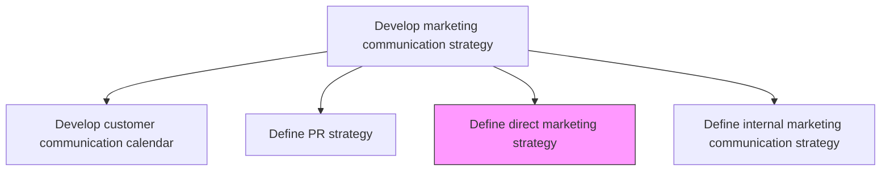
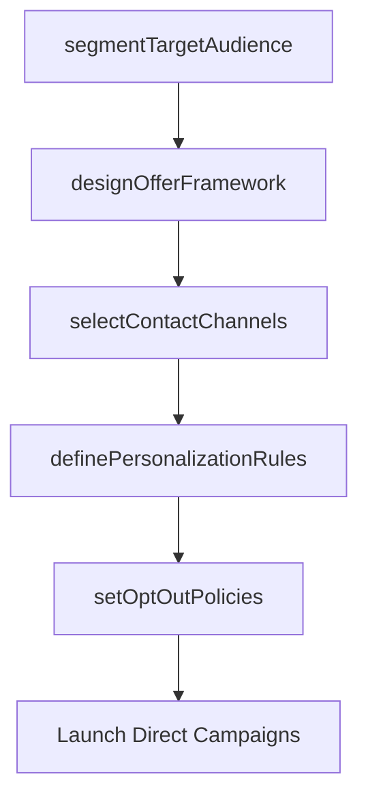

# Define direct marketing strategy

> Business-as-Code definition for direct marketing strategy formulation. Models the planning of one-to-one customer outreach including audience selection, offer personalization, and channel optimization.

## Overview

Devising a master plan how to select potential customers or qualified clients for customized offers, and contact them on one-to-one basis through chat, phone, email or regular mail. The strategy would need to take into account that personalizing offers and contacting customers individually is an effective but resource-intensive marketing technique, and that ill-targeted offers risk at angering and alienating the contactees.

## Process Hierarchy



## GraphDL

```yaml
define:
  object: Direct Marketing Strategy
  actor: DirectMarketingManager
  result: DirectMarketingStrategyDocument
```

## Actions

| Action | Description |
|--------|-------------|
| segmentTargetAudience | Identify and qualify customer segments for personalized outreach |
| designOfferFramework | Create the structure for personalized offers, including value propositions and call-to-actions |
| selectContactChannels | Choose optimal outreach channels per segment including email, phone, chat, and mail |
| definePersonalizationRules | Establish rules for tailoring messages and offers to individual customer attributes |
| setOptOutPolicies | Define compliance-aligned opt-out mechanisms and preference management |

## Events

| Event | Description |
|-------|-------------|
| targetAudienceSegmented | Direct marketing audience segments identified and qualified |
| offerFrameworkDesigned | Personalized offer templates and structures approved |
| contactChannelsSelected | Outreach channel mix defined per segment |
| personalizationRulesDefined | Message personalization logic documented |
| optOutPoliciesSet | Opt-out and preference management policies published |

## Searches

| Search | Description |
|--------|-------------|
| getDirectMarketingStrategy | Retrieve the current direct marketing strategy by segment or channel |
| getPersonalizationRules | Query personalization logic for specific audience segments |
| getOptOutRates | Look up opt-out and unsubscribe rates by channel and campaign |

## Process Flow



## RACI Matrix

| Activity | Responsible | Accountable | Consulted | Informed |
|----------|-------------|-------------|-----------|----------|
| segmentTargetAudience | MarketingAnalyst | DirectMarketingManager | Sales | CRM |
| designOfferFramework | DirectMarketingManager | VP Marketing | ProductMarketing | Creative |
| setOptOutPolicies | DirectMarketingManager | CMO | Legal | DataPrivacy |

## Related Processes

| Process | Relationship |
|---------|-------------|
| 3.2.6.1 Develop customer communication calendar | Downstream - direct campaigns scheduled in communication calendar |
| 3.1.1.4 Identify market segments | Upstream - segment data feeds audience selection |
| 3.4.4 Manage sales partners and alliances | Parallel - partner channels may execute direct outreach |

## Related Departments

| Department | Role |
|-----------|------|
| Direct Marketing | Leads strategy and campaign design |
| CRM | Provides customer data for targeting and personalization |
| Legal | Ensures compliance with privacy and anti-spam regulations |
| Sales | Provides lead qualification input |

## Related Occupations

| Occupation | Involvement |
|-----------|-------------|
| Direct Marketing Manager | Leads strategy design and execution planning |
| CRM Analyst | Provides customer data and segmentation support |
| Copywriter | Creates personalized message content |

## KPIs

| KPI | Description | Unit |
|-----|-------------|------|
| Direct Response Rate | Percentage of outreach recipients who respond to the offer | % |
| Cost Per Acquisition | Average cost to acquire a customer through direct marketing | Currency |
| Personalization Lift | Conversion rate increase from personalized versus generic messages | % |
| Opt-Out Rate | Percentage of recipients who unsubscribe after contact | % |

## Usage

```typescript
import { defineDirectMarketingStrategy } from '@headlessly/define-direct-marketing-strategy'

const direct = defineDirectMarketingStrategy()

// Segment target audience for direct outreach
const segments = await direct.segmentTargetAudience({
  criteria: ['purchase-history', 'engagement-score', 'lifecycle-stage'],
  minQualificationScore: 70
})

// Define personalization rules for offers
const rules = await direct.definePersonalizationRules({
  segment: 'high-value-prospects',
  variables: ['name', 'company', 'industry', 'last-interaction'],
  offerType: 'trial-extension'
})
```
