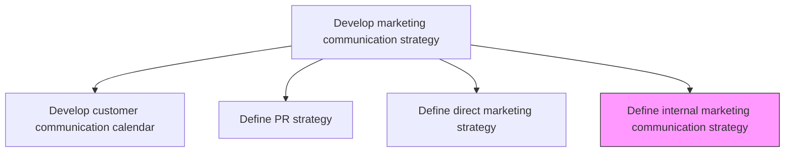
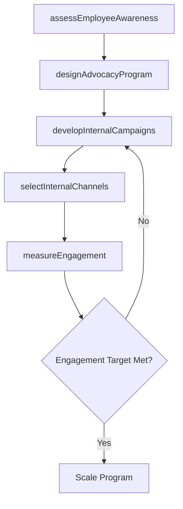

# Define internal marketing communication strategy

> Business-as-Code definition for internal marketing communication strategy. Models the planning of employee-facing brand programs that promote product awareness, build advocacy, and strengthen engagement.

## Overview

Developing a program to promote the objectives, values, products and services of the company to its employees by treating them as potential customers, in order to extend company client base, increase employee engagement or to foster brand advocacy.

## Process Hierarchy



## GraphDL

```yaml
define:
  object: Internal Marketing Communication Strategy
  actor: InternalCommunicationsManager
  result: InternalMarketingPlan
```

## Actions

| Action | Description |
|--------|-------------|
| assessEmployeeAwareness | Survey employees to gauge current product knowledge and brand perception |
| designAdvocacyProgram | Create programs that encourage employees to promote products and refer customers |
| developInternalCampaigns | Build internal marketing campaigns highlighting new products, wins, and company values |
| selectInternalChannels | Choose communication channels such as intranet, email, town halls, and Slack for internal messaging |
| measureEngagement | Track employee participation and engagement with internal marketing initiatives |

## Events

| Event | Description |
|-------|-------------|
| employeeAwarenessAssessed | Employee product knowledge survey completed |
| advocacyProgramDesigned | Employee brand advocacy program created and approved |
| internalCampaignsDeveloped | Internal marketing campaigns produced and scheduled |
| internalChannelsSelected | Internal communication channels chosen and configured |
| engagementMeasured | Employee engagement with internal marketing metrics reported |

## Searches

| Search | Description |
|--------|-------------|
| getInternalCampaigns | Retrieve internal marketing campaigns by topic, period, or channel |
| getAdvocacyMetrics | Query employee advocacy program participation and referral data |
| getEngagementScores | Look up employee engagement scores for internal marketing initiatives |

## Process Flow



## RACI Matrix

| Activity | Responsible | Accountable | Consulted | Informed |
|----------|-------------|-------------|-----------|----------|
| assessEmployeeAwareness | InternalCommsManager | VP Marketing | HR | ExecutiveTeam |
| designAdvocacyProgram | InternalCommsManager | CMO | Sales | HR |
| developInternalCampaigns | MarketingSpecialist | InternalCommsManager | Creative | ProductMarketing |

## Related Processes

| Process | Relationship |
|---------|-------------|
| 3.2.6.1 Develop customer communication calendar | Parallel - internal campaigns align with external calendar |
| 3.2.3 Develop and manage brands | Upstream - brand strategy informs internal messaging |
| 7.3.2 Develop employee communication plan | Related - HR communication supports internal marketing |

## Related Departments

| Department | Role |
|-----------|------|
| Internal Communications | Owns internal marketing strategy and execution |
| Human Resources | Supports employee engagement and advocacy programs |
| Marketing | Provides product content and brand materials |
| Sales | Benefits from employee referrals and advocacy |

## Related Occupations

| Occupation | Involvement |
|-----------|-------------|
| Internal Communications Manager | Leads strategy development and campaign execution |
| HR Business Partner | Supports employee engagement initiatives |
| Marketing Specialist | Creates internal campaign content |

## KPIs

| KPI | Description | Unit |
|-----|-------------|------|
| Employee Brand Awareness | Percentage of employees who can accurately describe key products | % |
| Advocacy Program Participation | Percentage of employees actively participating in advocacy programs | % |
| Employee Referral Rate | Number of customer referrals generated by employees per quarter | Count |
| Internal Campaign Reach | Percentage of employees who view internal marketing content | % |

## Usage

```typescript
import { defineInternalMarketingCommunicationStrategy } from '@headlessly/define-internal-marketing-communication-strategy'

const internal = defineInternalMarketingCommunicationStrategy()

// Assess employee product awareness
const awareness = await internal.assessEmployeeAwareness({
  surveyTopics: ['product-features', 'brand-values', 'competitive-positioning'],
  sampleSize: 500
})

// Design employee advocacy program
const advocacy = await internal.designAdvocacyProgram({
  incentives: ['referral-bonus', 'recognition', 'swag'],
  channels: ['linkedin', 'personal-networks'],
  targetParticipation: 0.30
})
```
