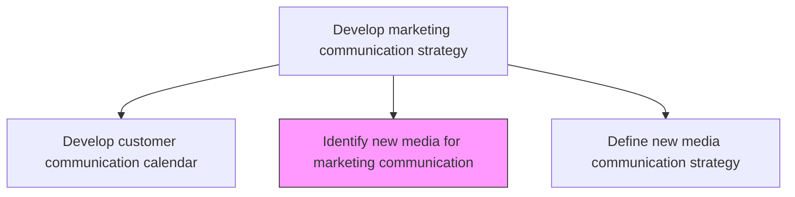
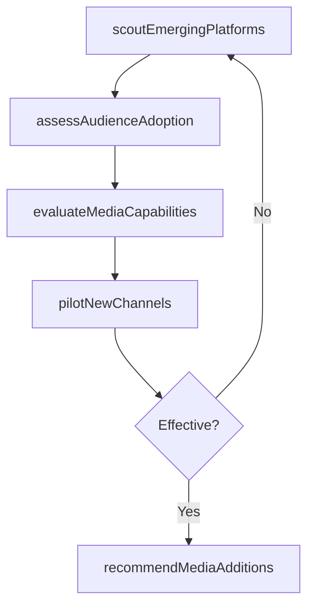

# Identify new media for marketing communication

> Business-as-Code definition for emerging media identification for marketing. Models the scouting, evaluation, and recommendation of new digital and technology-enabled communication channels.

## Overview

Finding emerging media based on digital or other technologies that would enable the company to increase the speed and volume of marketing communications, to make communications more interactive and to customize promotional messages more easily to the target audience, thus rendering them more effective.

## Process Hierarchy



## GraphDL

```yaml
identify:
  object: New Media For Marketing Communication
  actor: DigitalInnovationLead
  result: EmergingMediaAssessment
```

## Actions

| Action | Description |
|--------|-------------|
| scoutEmergingPlatforms | Research and catalog new digital platforms, technologies, and media formats |
| assessAudienceAdoption | Evaluate target audience adoption rates and engagement levels on emerging platforms |
| evaluateMediaCapabilities | Analyze personalization, interactivity, and scale capabilities of new media |
| pilotNewChannels | Run controlled experiments to test marketing effectiveness on emerging platforms |
| recommendMediaAdditions | Present findings and recommend new media channels for strategic adoption |

## Events

| Event | Description |
|-------|-------------|
| emergingPlatformsScouted | New media landscape scan completed with catalog of candidates |
| audienceAdoptionAssessed | Target audience presence on emerging platforms evaluated |
| mediaCapabilitiesEvaluated | New media feature and capability assessment finalized |
| newChannelsPiloted | Pilot campaigns on emerging platforms completed with results |
| mediaAdditionsRecommended | New media recommendations presented to leadership |

## Searches

| Search | Description |
|--------|-------------|
| getEmergingMedia | Retrieve emerging media assessments by technology type or audience segment |
| getPilotResults | Query pilot campaign results for new media channels |
| getAdoptionTrends | Look up audience adoption trends for emerging platforms |

## Process Flow



## RACI Matrix

| Activity | Responsible | Accountable | Consulted | Informed |
|----------|-------------|-------------|-----------|----------|
| scoutEmergingPlatforms | DigitalInnovationLead | VP DigitalMarketing | IT | Marketing |
| pilotNewChannels | DigitalMarketingManager | VP DigitalMarketing | Creative | Finance |
| recommendMediaAdditions | DigitalInnovationLead | CMO | Strategy | ExecutiveTeam |

## Related Processes

| Process | Relationship |
|---------|-------------|
| 3.2.6.6 Define new media communication strategy | Downstream - identified media feeds strategy development |
| 3.2.4.1 Determine channels to be supported | Consumer - new media may expand supported channel portfolio |
| 3.3.3 Design and execute brand and product marketing programs | Consumer - new media may be incorporated into campaigns |

## Related Departments

| Department | Role |
|-----------|------|
| Digital Marketing | Leads new media scouting and piloting |
| Innovation | Provides technology trend intelligence |
| Marketing Analytics | Measures pilot campaign effectiveness |
| IT | Assesses technical integration feasibility |

## Related Occupations

| Occupation | Involvement |
|-----------|-------------|
| Digital Innovation Lead | Scouts and evaluates emerging platforms |
| Digital Marketing Manager | Pilots campaigns on new channels |
| Marketing Analyst | Measures audience adoption and pilot results |

## KPIs

| KPI | Description | Unit |
|-----|-------------|------|
| New Media Discovery Rate | Number of emerging platforms identified and evaluated per quarter | Count |
| Pilot Success Rate | Percentage of new media pilots meeting or exceeding performance thresholds | % |
| Time to Adoption | Average months from identification to strategic adoption of a new channel | Months |
| Audience Reach on New Media | Total reachable audience on newly identified platforms | Count |

## Usage

```typescript
import { identifyNewMediaForMarketingCommunication } from '@headlessly/identify-new-media-for-marketing-communication'

const media = identifyNewMediaForMarketingCommunication()

// Scout emerging platforms
const platforms = await media.scoutEmergingPlatforms({
  categories: ['social', 'messaging', 'immersive', 'audio'],
  minAudience: 10000000,
  targetDemographic: 'B2B-decision-makers'
})

// Pilot a new channel with a test campaign
const pilot = await media.pilotNewChannels({
  platform: 'emerging-social-platform',
  budget: 10000,
  duration: 30,
  metrics: ['engagement', 'conversion', 'cpm']
})
```
