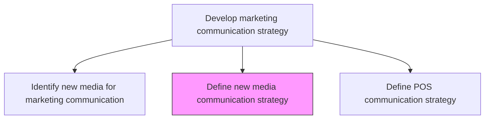
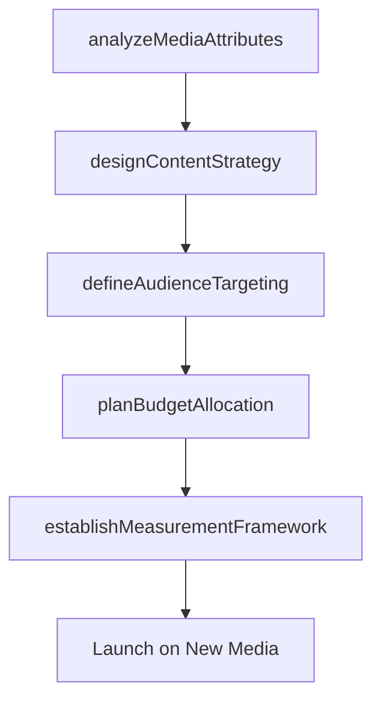

# Define new media communication strategy

> Business-as-Code definition for new media communication strategy development. Models the creation of marketing approaches optimized for emerging digital channels and their unique capabilities.

## Overview

Developing a marketing strategy that is maximally effective in a new or emerging media channel by capitalizing on its novel attributes and capabilities.

## Process Hierarchy



## GraphDL

```yaml
define:
  object: New Media Communication Strategy
  actor: DigitalStrategyManager
  result: NewMediaStrategyDocument
```

## Actions

| Action | Description |
|--------|-------------|
| analyzeMediaAttributes | Catalog the unique features, audience behaviors, and content formats of the new media channel |
| designContentStrategy | Create a content approach optimized for the new media's native format and engagement model |
| defineAudienceTargeting | Establish targeting parameters leveraging the platform's unique audience data capabilities |
| planBudgetAllocation | Determine investment levels and resource allocation for the new media channel |
| establishMeasurementFramework | Define success metrics and attribution models specific to the new media |

## Events

| Event | Description |
|-------|-------------|
| mediaAttributesAnalyzed | New media capabilities and audience behavior documented |
| contentStrategyDesigned | Native content approach for the new media approved |
| audienceTargetingDefined | Platform-specific targeting parameters established |
| budgetAllocationPlanned | New media investment budget approved |
| measurementFrameworkEstablished | Success metrics and attribution model published |

## Searches

| Search | Description |
|--------|-------------|
| getNewMediaStrategies | Retrieve new media strategies by platform or campaign |
| getContentPerformance | Query content performance metrics on new media channels |
| getTargetingParameters | Look up audience targeting configurations by platform |

## Process Flow



## RACI Matrix

| Activity | Responsible | Accountable | Consulted | Informed |
|----------|-------------|-------------|-----------|----------|
| analyzeMediaAttributes | DigitalStrategyManager | VP DigitalMarketing | Innovation | Marketing |
| designContentStrategy | ContentStrategist | DigitalStrategyManager | Creative | BrandManagement |
| planBudgetAllocation | DigitalStrategyManager | CMO | Finance | ExecutiveTeam |

## Related Processes

| Process | Relationship |
|---------|-------------|
| 3.2.6.5 Identify new media for marketing communication | Upstream - identified platforms feed strategy development |
| 3.2.6.1 Develop customer communication calendar | Consumer - new media campaigns scheduled in calendar |
| 3.3.3 Design and execute brand and product marketing programs | Downstream - strategy guides campaign execution on new media |

## Related Departments

| Department | Role |
|-----------|------|
| Digital Marketing | Leads new media strategy development |
| Creative Services | Produces native content for new media formats |
| Marketing Analytics | Establishes measurement and attribution frameworks |
| Finance | Approves new media investment budgets |

## Related Occupations

| Occupation | Involvement |
|-----------|-------------|
| Digital Strategy Manager | Leads strategy formulation for new media |
| Content Strategist | Designs native content approaches |
| Performance Marketing Analyst | Builds measurement frameworks |

## KPIs

| KPI | Description | Unit |
|-----|-------------|------|
| New Media Engagement Rate | Average engagement rate achieved on the new platform | % |
| Content Native Score | Degree to which content leverages platform-native features | Score (0-100) |
| New Media ROI | Return on investment from the new media channel | Ratio |
| Audience Growth Rate | Rate of audience growth on the new media platform | % Per Month |

## Usage

```typescript
import { defineNewMediaCommunicationStrategy } from '@headlessly/define-new-media-communication-strategy'

const newMedia = defineNewMediaCommunicationStrategy()

// Analyze attributes of an emerging media channel
const attributes = await newMedia.analyzeMediaAttributes({
  platform: 'short-form-video',
  dimensions: ['content-format', 'audience-demographics', 'engagement-model', 'targeting-capabilities']
})

// Design content strategy for the new channel
const content = await newMedia.designContentStrategy({
  platform: 'short-form-video',
  contentTypes: ['product-demos', 'thought-leadership', 'customer-stories'],
  publishingCadence: 'daily'
})
```
