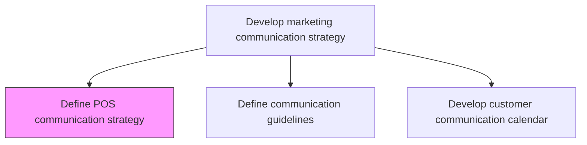
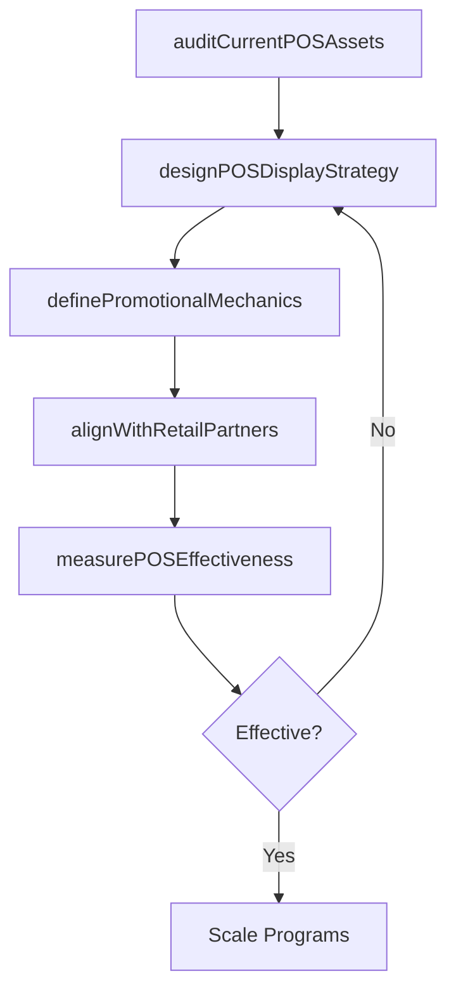

# Define point of sale (POS) communication strategy

> Business-as-Code definition for point-of-sale communication strategy. Models the planning of in-store and checkout-area marketing programs designed to influence purchase decisions at the moment of transaction.

## Overview

Establishing a framework for coordinated marketing to increase the profitability and increase brand awareness at the point of sale. This may include promotional posters on product shelves or island displays, advertisements in shopping carts, stickers on the floor that lead consumers to the promoted product, multi-buy promotions, coupons on sales receipts, etc.

## Process Hierarchy



## GraphDL

```yaml
define:
  object: Point Of Sale (POS) Communication Strategy
  actor: ShopperMarketingManager
  result: POSCommunicationPlan
```

## Actions

| Action | Description |
|--------|-------------|
| auditCurrentPOSAssets | Catalog existing point-of-sale displays, signage, and promotional materials |
| designPOSDisplayStrategy | Plan the visual merchandising and promotional display approach at retail locations |
| definePromotionalMechanics | Establish multi-buy offers, coupon structures, and receipt-based promotions |
| alignWithRetailPartners | Coordinate POS programs with retail partners for shelf placement and display space |
| measurePOSEffectiveness | Track incremental sales lift and brand awareness impact from POS programs |

## Events

| Event | Description |
|-------|-------------|
| currentPOSAssetsAudited | Existing POS material inventory completed |
| posDisplayStrategyDesigned | Visual merchandising and display approach approved |
| promotionalMechanicsDefined | POS promotional structures and offer mechanics published |
| retailPartnersAligned | POS program coordination with retail partners confirmed |
| posEffectivenessMeasured | POS program performance report delivered |

## Searches

| Search | Description |
|--------|-------------|
| getPOSPrograms | Retrieve active POS programs by retailer, product, or region |
| getPromotionalMechanics | Query current POS offer structures and promotional rules |
| getPOSPerformance | Look up sales lift and brand impact data from POS programs |

## Process Flow



## RACI Matrix

| Activity | Responsible | Accountable | Consulted | Informed |
|----------|-------------|-------------|-----------|----------|
| designPOSDisplayStrategy | ShopperMarketingManager | VP Marketing | Creative | RetailPartners |
| definePromotionalMechanics | TradeMarketingManager | ShopperMarketingManager | Finance | Sales |
| alignWithRetailPartners | AccountManager | ShopperMarketingManager | Sales | SupplyChain |

## Related Processes

| Process | Relationship |
|---------|-------------|
| 3.2.6.1 Develop customer communication calendar | Parallel - POS campaigns integrated into communication calendar |
| 3.3.3 Design and execute brand and product marketing programs | Consumer - POS strategy guides in-store campaign execution |
| 3.2.4 Define and manage channel strategy | Upstream - channel strategy includes retail POS channels |

## Related Departments

| Department | Role |
|-----------|------|
| Shopper Marketing | Leads POS strategy and display design |
| Trade Marketing | Manages promotional mechanics and retail coordination |
| Creative Services | Produces POS display materials and signage |
| Sales | Coordinates with retail partners on placement |

## Related Occupations

| Occupation | Involvement |
|-----------|-------------|
| Shopper Marketing Manager | Leads POS strategy development |
| Trade Marketing Manager | Designs promotional mechanics and retail programs |
| Visual Merchandiser | Creates in-store display concepts |

## KPIs

| KPI | Description | Unit |
|-----|-------------|------|
| POS Sales Lift | Incremental sales increase attributable to POS programs | % |
| Display Compliance Rate | Percentage of retail locations with correct POS display execution | % |
| Promotion Redemption Rate | Percentage of POS coupons or offers redeemed by customers | % |
| Cost Per Impression | Cost of POS materials per customer impression at point of sale | Currency |

## Usage

```typescript
import { definePointOfSalePosCommunicationStrategy } from '@headlessly/define-point-of-sale-pos-communication-strategy'

const pos = definePointOfSalePosCommunicationStrategy()

// Design POS display strategy for a product launch
const displays = await pos.designPOSDisplayStrategy({
  product: 'New Analytics Dashboard',
  retailPartners: ['TechRetail', 'CloudStore'],
  displayTypes: ['end-cap', 'shelf-talker', 'digital-signage']
})

// Define promotional mechanics for POS
const promotions = await pos.definePromotionalMechanics({
  offerTypes: ['multi-buy', 'receipt-coupon', 'bundle-discount'],
  targetLift: 0.15,
  duration: 30
})
```
