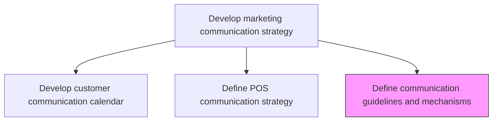
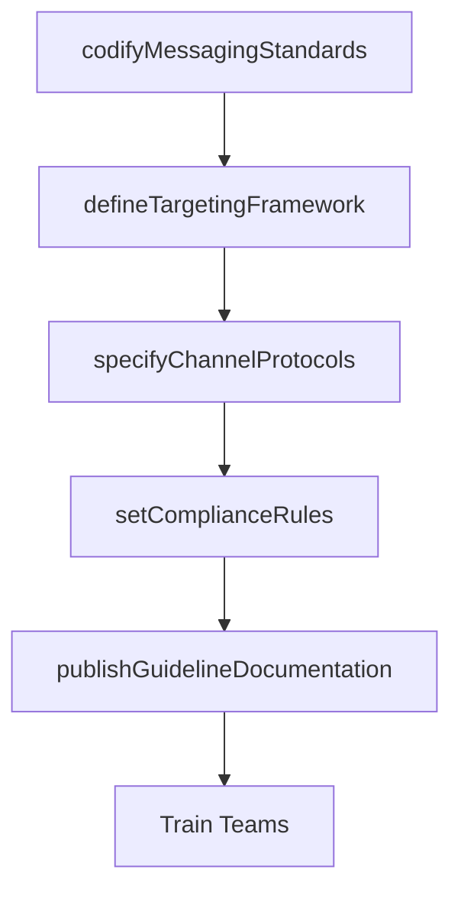

# Define communication guidelines and mechanisms

> Business-as-Code definition for communication guidelines and mechanisms. Models the establishment of standards governing marketing message creation, audience targeting, and channel selection.

## Overview

Establishing standardized procedures for effective communication that maximizes ROI, promotes brand awareness and respects customers. In its simplest form, it includes a message (what is to be said), a target (to whom the message is reaching) and a medium or a channel (where the message is to be said).

## Process Hierarchy



## GraphDL

```yaml
define:
  object: Communication Guidelines And Mechanisms
  actor: MarketingCommunicationsDirector
  result: CommunicationGuidelinesDocument
```

## Actions

| Action | Description |
|--------|-------------|
| codifyMessagingStandards | Document tone, voice, terminology, and formatting rules for all marketing communications |
| defineTargetingFramework | Establish rules for matching messages to audience segments and personas |
| specifyChannelProtocols | Define standard procedures for each communication channel including approval workflows |
| setComplianceRules | Establish regulatory compliance requirements for marketing communications |
| publishGuidelineDocumentation | Produce and distribute the formal communication guidelines to all marketing teams |

## Events

| Event | Description |
|-------|-------------|
| messagingStandardsCodified | Marketing communication voice and style standards documented |
| targetingFrameworkDefined | Audience-message matching rules published |
| channelProtocolsSpecified | Per-channel communication procedures documented |
| complianceRulesSet | Regulatory communication compliance requirements established |
| guidelineDocumentationPublished | Communication guidelines distributed to all teams |

## Searches

| Search | Description |
|--------|-------------|
| getCommunicationGuidelines | Retrieve current communication guidelines by channel or content type |
| getTargetingRules | Query audience targeting framework rules |
| getComplianceRequirements | Look up regulatory compliance rules for marketing communications |

## Process Flow



## RACI Matrix

| Activity | Responsible | Accountable | Consulted | Informed |
|----------|-------------|-------------|-----------|----------|
| codifyMessagingStandards | MarComManager | CMO | BrandManager | Creative |
| defineTargetingFramework | MarketingAnalyst | MarComManager | CRM | Sales |
| setComplianceRules | MarComManager | CMO | Legal | DataPrivacy |

## Related Processes

| Process | Relationship |
|---------|-------------|
| 3.2.6.1 Develop customer communication calendar | Consumer - guidelines constrain calendar content |
| 3.2.3 Develop and manage brands | Upstream - brand guidelines inform communication standards |
| 3.3.3 Design and execute brand and product marketing programs | Consumer - guidelines govern campaign execution |

## Related Departments

| Department | Role |
|-----------|------|
| Marketing Communications | Owns guideline development and enforcement |
| Brand Management | Provides brand voice and identity standards |
| Legal | Ensures regulatory compliance of communication rules |
| Creative Services | Applies guidelines to content production |

## Related Occupations

| Occupation | Involvement |
|-----------|-------------|
| Marketing Communications Director | Leads guideline creation and governance |
| Brand Manager | Ensures alignment with brand identity standards |
| Compliance Officer | Validates regulatory adherence |

## KPIs

| KPI | Description | Unit |
|-----|-------------|------|
| Guideline Adherence Rate | Percentage of communications conforming to published guidelines | % |
| Approval Workflow Efficiency | Average time from content creation to final approval | Hours |
| Compliance Incident Rate | Number of regulatory non-compliance incidents per quarter | Count |
| Guidelines Freshness | Time since last comprehensive guideline review and update | Months |

## Usage

```typescript
import { defineCommunicationGuidelinesAndMechanisms } from '@headlessly/define-communication-guidelines-and-mechanisms'

const guidelines = defineCommunicationGuidelinesAndMechanisms()

// Codify messaging standards
const standards = await guidelines.codifyMessagingStandards({
  brandVoice: 'professional-yet-approachable',
  toneByChannel: { email: 'formal', social: 'conversational', website: 'authoritative' },
  bannedTerms: ['revolutionary', 'guaranteed']
})

// Define targeting framework rules
const targeting = await guidelines.defineTargetingFramework({
  segments: ['enterprise', 'mid-market', 'SMB'],
  personaMapping: true,
  frequencyCaps: { email: 3, social: 5, directMail: 1 }
})
```
