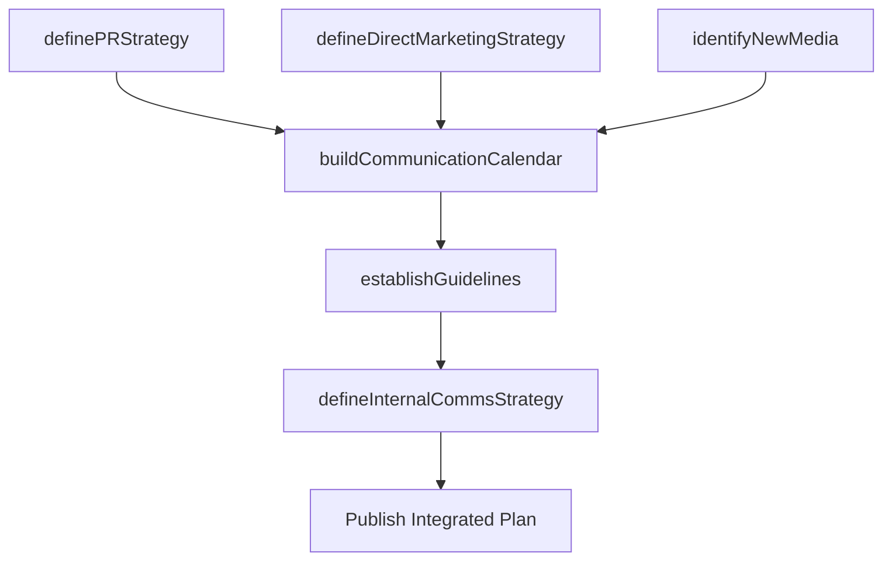

# Develop marketing communication strategy

> Business-as-Code definition for integrated marketing communications strategy. Models the planning and coordination of promotional messaging across PR, direct marketing, digital media, POS, and internal channels.

## Overview

Establishing marketing communications that deliver promotional messages, in a coordinated way, through multiple marketing channels, such as print, radio, television, direct mail, online or mobile advertising, email, social media or personal selling.

## Process Hierarchy

```mermaid
graph TD
    A[Develop marketing communication strategy]
    A --> B[Develop customer communication calendar]
    A --> C[Define public relations (PR) strategy]
    A --> D[Define direct marketing strategy]
    A --> E[Define internal marketing communication strategy]
    A --> F[Identify new media for marketing communication]
    A --> G[Define new media communication strategy]
    A --> H[Define point of sale (POS) communication strategy]
    A --> I[Define communication guidelines and mechanisms]
```

## GraphDL

```yaml
develop:
  object: Marketing Communication Strategy
  actor: MarketingCommunicationsDirector
  result: IntegratedCommunicationsPlan
```

## Actions

| Action | Description |
|--------|-------------|
| buildCommunicationCalendar | Schedule coordinated messaging cadence across all customer touchpoints |
| definePRStrategy | Establish public relations approach for brand reputation management |
| defineDirectMarketingStrategy | Design targeted direct marketing campaigns for qualified audiences |
| identifyNewMedia | Evaluate emerging digital and traditional media opportunities |
| establishGuidelines | Create standardized communication guidelines and approval mechanisms |
| defineInternalCommsStrategy | Develop internal marketing communication for employee alignment |

## Events

| Event | Description |
|-------|-------------|
| communicationCalendarBuilt | Annual customer communication calendar published |
| prStrategyDefined | Public relations strategy approved |
| directMarketingStrategyDefined | Direct marketing strategy finalized |
| newMediaIdentified | Emerging media channels evaluated and prioritized |
| guidelinesEstablished | Communication guidelines published to all teams |
| internalCommsStrategyDefined | Internal marketing communications plan approved |

## Searches

| Search | Description |
|--------|-------------|
| getCommunicationCalendar | Retrieve communication schedule by channel and period |
| getMediaMix | Query current media allocation and performance data |
| getCommunicationGuidelines | Access messaging guidelines and approval workflows |

## Process Flow



## RACI Matrix

| Activity | Responsible | Accountable | Consulted | Informed |
|----------|-------------|-------------|-----------|----------|
| buildCommunicationCalendar | MarketingCommunicationsManager | CMO | Sales | ProductMarketing |
| definePRStrategy | PRDirector | CMO | Legal | ExecutiveTeam |
| defineDirectMarketingStrategy | DirectMarketingManager | CMO | Sales | CustomerInsights |
| identifyNewMedia | DigitalMarketingManager | CMO | CreativeTeam | Sales |

## Sub-Processes

| ID | Name | Description |
|----|------|-------------|
| 3.2.6.1 | Develop customer communication calendar | Timing and scheduling the delivery of marketing messages to maximize their impact on customer purcha |
| 3.2.6.2 | Define public relations (PR) strategy | Deciding how to promote and maintain a favorable public image of the company in the eyes of its empl |
| 3.2.6.3 | Define direct marketing strategy | Devising a master plan how to select potential customers or qualified clients for customized offers, |
| 3.2.6.4 | Define internal marketing communication strategy | Developing a program to promote the objectives, values, products and services of the company to its  |
| 3.2.6.5 | Identify new media for marketing communication | Finding emerging media based on digital or other technologies that would enable the company to incre |
| 3.2.6.6 | Define new media communication strategy | Developing a marketing strategy that is maximally effective in a new or emerging media channel by ca |
| 3.2.6.7 | Define point of sale (POS) communication strategy | Establishing a framework for coordinated marketing to increase the profitability and increase brand  |
| 3.2.6.8 | Define communication guidelines and mechanisms | Establishing standardized procedures for effective communication that maximizes ROI, promotes brand  |

## Related Processes

| Process | Relationship |
|---------|-------------|
| 3.2.3 Develop and manage brands | Upstream - brand strategy guides communication messaging |
| 3.2.4 Define and manage channel strategy | Parallel - channel strategy determines communication channels |
| 3.3.3 Design and execute brand and product marketing programs | Downstream - communication strategy guides campaign execution |

## Related Departments

| Department | Role |
|-----------|------|
| Marketing Communications | Leads integrated communications planning |
| Public Relations | Manages external reputation and media relations |
| Digital Marketing | Owns digital and social media communication strategies |
| Creative Services | Produces communication assets and content |
| Internal Communications | Aligns employees with marketing messaging |

## Related Occupations

| Occupation | Involvement |
|-----------|-------------|
| Marketing Communications Director | Orchestrates integrated communications strategy |
| PR Manager | Designs public relations campaigns and crisis response |
| Content Strategist | Plans content across channels and formats |

## KPIs

| KPI | Description | Unit |
|-----|-------------|------|
| Message Reach | Total audience reached across all communication channels | Impressions |
| Engagement Rate | Percentage of audience engaging with communications | % |
| Share of Voice | Brand mentions as percentage of category conversation | % |
| Communication ROI | Return on marketing communication investment | Ratio |

## Usage

```typescript
import { developMarketingCommunicationStrategy } from '@headlessly/develop-marketing-communication-strategy'

const comms = developMarketingCommunicationStrategy()

// Build annual communication calendar
const calendar = await comms.buildCommunicationCalendar({
  year: 2026,
  channels: ['email', 'social', 'webinar', 'events', 'pr'],
  campaigns: ['product-launch', 'brand-awareness', 'thought-leadership']
})

// Define PR strategy
const pr = await comms.definePRStrategy({
  objectives: ['thought-leadership', 'product-launches', 'crisis-readiness'],
  targetMedia: ['industry-analysts', 'trade-press', 'business-media']
})
```
