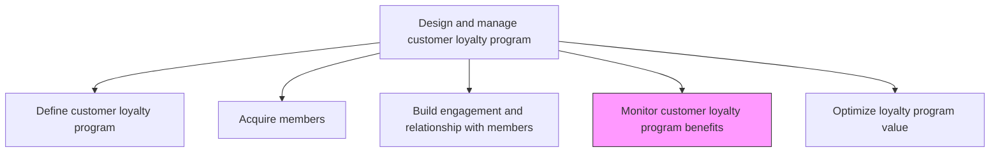
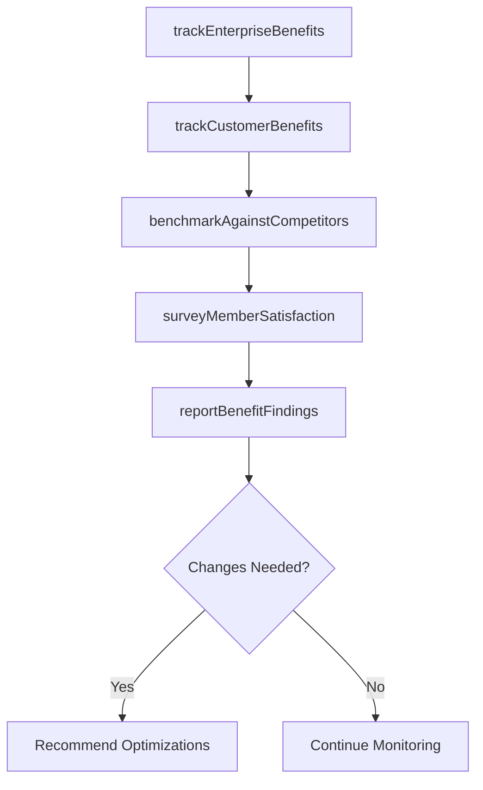

# Monitor customer loyalty program benefits to the enterprise and the customer

> Business-as-Code definition for loyalty program benefit monitoring. Models the tracking and evaluation of loyalty program value delivered to both the enterprise and enrolled customers.

## Overview

Surveying and tracking the benefits of customer loyalty programs both for the company and for customers. Compare with comparable loyalty programs instituted in competitor companies. Propose changes as needed to keep up with market trends.

## Process Hierarchy



## GraphDL

```yaml
monitor:
  object: Customer Loyalty Program Benefits To Enterprise And Customer
  actor: LoyaltyAnalyst
  result: LoyaltyBenefitReport
```

## Actions

| Action | Description |
|--------|-------------|
| trackEnterpriseBenefits | Measure revenue uplift, retention improvement, and data insights generated by the loyalty program |
| trackCustomerBenefits | Assess the value of rewards, savings, and exclusive experiences delivered to members |
| benchmarkAgainstCompetitors | Compare program benefits and structure against competitor loyalty offerings |
| surveyMemberSatisfaction | Collect member feedback on perceived program value and satisfaction |
| reportBenefitFindings | Produce periodic reports summarizing program benefits and improvement recommendations |

## Events

| Event | Description |
|-------|-------------|
| enterpriseBenefitsTracked | Enterprise loyalty program benefit analysis completed |
| customerBenefitsTracked | Member benefit delivery assessment finalized |
| competitorsBenchmarked | Competitive loyalty program comparison completed |
| memberSatisfactionSurveyed | Member satisfaction survey results compiled |
| benefitFindingsReported | Loyalty benefit monitoring report published |

## Searches

| Search | Description |
|--------|-------------|
| getBenefitReports | Retrieve loyalty benefit reports by period or metric category |
| getCompetitorBenchmarks | Query competitive loyalty program comparison data |
| getMemberSatisfactionData | Look up member satisfaction scores and feedback themes |

## Process Flow



## RACI Matrix

| Activity | Responsible | Accountable | Consulted | Informed |
|----------|-------------|-------------|-----------|----------|
| trackEnterpriseBenefits | LoyaltyAnalyst | LoyaltyProgramManager | Finance | ExecutiveTeam |
| benchmarkAgainstCompetitors | CompetitiveIntelligenceAnalyst | LoyaltyProgramManager | Marketing | Strategy |
| surveyMemberSatisfaction | MarketResearchAnalyst | LoyaltyProgramManager | CustomerService | CRM |

## Related Processes

| Process | Relationship |
|---------|-------------|
| 3.2.7.3 Build engagement and relationship with members | Upstream - engagement data feeds benefit analysis |
| 3.2.7.5 Optimize loyalty program value | Downstream - benefit findings drive optimization |
| 3.1.1.6 Analyze competing organizations | Upstream - competitive intelligence supports benchmarking |

## Related Departments

| Department | Role |
|-----------|------|
| Loyalty Program Management | Leads benefit monitoring and reporting |
| Finance | Validates enterprise financial benefit calculations |
| Market Research | Conducts member satisfaction surveys |
| Competitive Intelligence | Provides competitor program benchmarks |

## Related Occupations

| Occupation | Involvement |
|-----------|-------------|
| Loyalty Analyst | Tracks and analyzes program benefit metrics |
| Market Research Analyst | Conducts member satisfaction research |
| Financial Analyst | Calculates enterprise ROI of loyalty program |

## KPIs

| KPI | Description | Unit |
|-----|-------------|------|
| Program ROI | Return on investment from the loyalty program for the enterprise | Ratio |
| Member Satisfaction Score | Average satisfaction rating from loyalty program members | Score (1-10) |
| Competitive Parity Index | How program benefits compare to top competitor offerings | Score (0-100) |
| Member-Perceived Value | Average monetary value members attribute to program benefits | Currency |

## Usage

```typescript
import { monitorCustomerLoyaltyProgramBenefitsToEnterpriseAndCustomer } from '@headlessly/monitor-customer-loyalty-program-benefits-to-enterprise-and-customer'

const benefits = monitorCustomerLoyaltyProgramBenefitsToEnterpriseAndCustomer()

// Track enterprise benefits from the loyalty program
const enterprise = await benefits.trackEnterpriseBenefits({
  metrics: ['revenue-uplift', 'retention-rate', 'data-insights'],
  period: 'FY2024',
  comparisonBaseline: 'non-members'
})

// Survey member satisfaction with program benefits
const satisfaction = await benefits.surveyMemberSatisfaction({
  sampleSize: 2000,
  topics: ['reward-value', 'ease-of-use', 'exclusivity', 'personalization']
})
```
