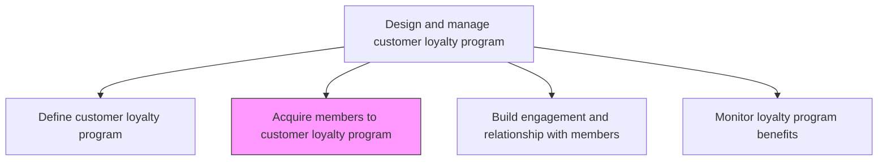
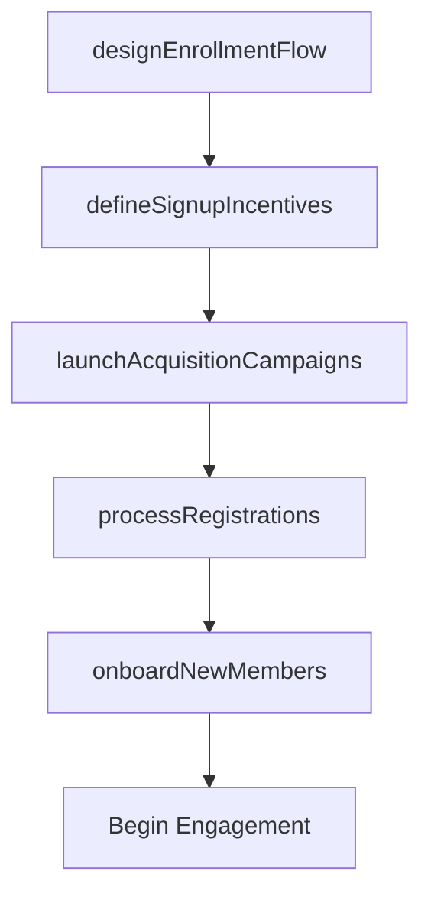

# Acquire members to customer loyalty program

> Business-as-Code definition for loyalty program member acquisition. Models the enrollment of customers into the loyalty program through registration, incentive offerings, and onboarding workflows.

## Overview

Convincing customers to register their personal information with the company and be assigned a unique identifier that they use when making purchases. The identifier makes it easier for the company to track customer purchases. Customers are rewarded by various incentives that encourage repeat business [20007].

## Process Hierarchy



## GraphDL

```yaml
acquire:
  object: Members To Customer Loyalty Program
  actor: LoyaltyProgramManager
  result: EnrolledMember
```

## Actions

| Action | Description |
|--------|-------------|
| designEnrollmentFlow | Create the registration journey across web, mobile, and in-store touchpoints |
| defineSignupIncentives | Establish welcome offers and joining bonuses that motivate enrollment |
| launchAcquisitionCampaigns | Execute marketing campaigns promoting loyalty program membership |
| processRegistrations | Validate customer data, assign unique identifiers, and activate accounts |
| onboardNewMembers | Send welcome communications explaining program benefits and earning rules |

## Events

| Event | Description |
|-------|-------------|
| enrollmentFlowDesigned | Loyalty program registration journey approved |
| signupIncentivesDefined | Welcome offers and joining bonuses published |
| acquisitionCampaignsLaunched | Loyalty member acquisition campaigns activated |
| registrationProcessed | New member registration validated and account activated |
| newMemberOnboarded | Welcome communications and program orientation delivered |

## Searches

| Search | Description |
|--------|-------------|
| getEnrollmentMetrics | Retrieve member acquisition metrics by channel, campaign, or period |
| findNewMembers | Query recently enrolled loyalty program members by join date or source |
| getSignupIncentives | Look up current signup offers and their redemption rates |

## Process Flow



## RACI Matrix

| Activity | Responsible | Accountable | Consulted | Informed |
|----------|-------------|-------------|-----------|----------|
| designEnrollmentFlow | LoyaltyProgramManager | VP Marketing | UXDesign | IT |
| defineSignupIncentives | LoyaltyProgramManager | CMO | Finance | Sales |
| launchAcquisitionCampaigns | CampaignManager | LoyaltyProgramManager | DigitalMarketing | ChannelPartners |

## Related Processes

| Process | Relationship |
|---------|-------------|
| 3.2.7.1 Define customer loyalty program | Upstream - program definition determines enrollment requirements |
| 3.2.7.3 Build engagement and relationship with members | Downstream - acquired members enter engagement programs |
| 3.5.1 Develop customer engagement plan | Consumer - loyalty enrollment feeds broader engagement strategy |

## Related Departments

| Department | Role |
|-----------|------|
| Loyalty Program Management | Leads member acquisition strategy and operations |
| Digital Marketing | Executes online enrollment campaigns |
| Customer Service | Supports enrollment inquiries and registration issues |
| IT | Maintains registration infrastructure and member databases |

## Related Occupations

| Occupation | Involvement |
|-----------|-------------|
| Loyalty Program Manager | Leads acquisition strategy and enrollment design |
| Campaign Manager | Executes member acquisition campaigns |
| CRM Analyst | Tracks enrollment data and member acquisition funnel |

## KPIs

| KPI | Description | Unit |
|-----|-------------|------|
| Member Acquisition Rate | Number of new loyalty program members enrolled per period | Count |
| Enrollment Conversion Rate | Percentage of targeted customers who complete enrollment | % |
| Cost Per Acquisition | Average marketing cost to acquire a new loyalty member | Currency |
| Onboarding Completion Rate | Percentage of new members completing the onboarding journey | % |

## Usage

```typescript
import { acquireMembersToCustomerLoyaltyProgram } from '@headlessly/acquire-members-to-customer-loyalty-program'

const acquisition = acquireMembersToCustomerLoyaltyProgram()

// Launch acquisition campaigns for loyalty program
const campaigns = await acquisition.launchAcquisitionCampaigns({
  channels: ['email', 'in-app', 'checkout-prompt'],
  signupIncentive: 'welcome-500-points',
  targetAudience: 'repeat-purchasers'
})

// Process a new member registration
const member = await acquisition.processRegistrations({
  customerId: 'CUST-001',
  channel: 'web',
  consentGiven: true
})
```
