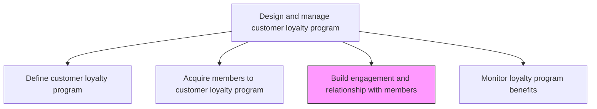
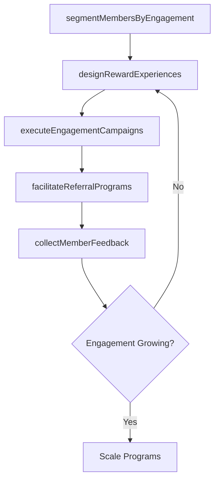

# Build engagement and relationship with members

> Business-as-Code definition for loyalty member engagement and relationship building. Models the programs and interactions that deepen customer-brand relationships, drive repeat purchases, and foster advocacy.

## Overview

Building deeper relationships between a customer and a brand in order to promote customer loyalty and derive repeat business. Besides making frequent purchases, highly engaged customers refer family, friends and colleagues to make purchases as well, consume and re-broadcast promotional materials, provide feedback to the purchases they make and do not support competing brands.

## Process Hierarchy



## GraphDL

```yaml
build:
  object: Engagement And Relationship With Members
  actor: CustomerEngagementManager
  result: MemberEngagementPlan
```

## Actions

| Action | Description |
|--------|-------------|
| segmentMembersByEngagement | Classify loyalty members by engagement level, purchase frequency, and advocacy potential |
| designRewardExperiences | Create compelling reward tiers, exclusive offers, and personalized experiences for members |
| executeEngagementCampaigns | Run targeted campaigns that encourage member interactions, purchases, and referrals |
| facilitateReferralPrograms | Enable and incentivize members to refer new customers to the brand |
| collectMemberFeedback | Gather and act on member satisfaction surveys and product feedback |

## Events

| Event | Description |
|-------|-------------|
| membersSegmentedByEngagement | Member engagement segmentation completed |
| rewardExperiencesDesigned | Loyalty reward tiers and exclusive offers published |
| engagementCampaignsExecuted | Member engagement campaigns activated |
| referralProgramsFacilitated | Referral program launched with incentive structure |
| memberFeedbackCollected | Member satisfaction survey results compiled |

## Searches

| Search | Description |
|--------|-------------|
| getMemberEngagementScores | Retrieve engagement scores by member, segment, or tier |
| getRewardRedemptions | Query reward redemption data by type, period, or member segment |
| getReferralMetrics | Look up referral program performance and member participation |

## Process Flow



## RACI Matrix

| Activity | Responsible | Accountable | Consulted | Informed |
|----------|-------------|-------------|-----------|----------|
| segmentMembersByEngagement | CRMAnalyst | LoyaltyProgramManager | DataScience | Marketing |
| designRewardExperiences | LoyaltyProgramManager | VP Marketing | Finance | ChannelPartners |
| executeEngagementCampaigns | CampaignManager | LoyaltyProgramManager | Creative | Sales |

## Related Processes

| Process | Relationship |
|---------|-------------|
| 3.2.7.2 Acquire members to customer loyalty program | Upstream - acquired members enter engagement programs |
| 3.2.7.4 Monitor customer loyalty program benefits | Downstream - engagement data feeds benefit monitoring |
| 3.5.1 Develop customer engagement plan | Parallel - loyalty engagement aligns with broader CX strategy |

## Related Departments

| Department | Role |
|-----------|------|
| Loyalty Program Management | Designs and manages engagement programs |
| CRM | Provides member data and segmentation analytics |
| Marketing | Executes engagement campaigns and communications |
| Customer Service | Handles member inquiries and reward issues |

## Related Occupations

| Occupation | Involvement |
|-----------|-------------|
| Customer Engagement Manager | Leads relationship-building programs |
| CRM Analyst | Segments members and tracks engagement metrics |
| Campaign Manager | Executes targeted engagement campaigns |

## KPIs

| KPI | Description | Unit |
|-----|-------------|------|
| Member Engagement Rate | Percentage of loyalty members actively transacting per period | % |
| Reward Redemption Rate | Percentage of earned rewards that are redeemed by members | % |
| Referral Conversion Rate | Percentage of member referrals that result in new customer acquisitions | % |
| Member Lifetime Value | Average lifetime revenue from loyalty program members versus non-members | Currency |

## Usage

```typescript
import { buildEngagementAndRelationshipWithMembers } from '@headlessly/build-engagement-and-relationship-with-members'

const engagement = buildEngagementAndRelationshipWithMembers()

// Segment members by engagement level
const segments = await engagement.segmentMembersByEngagement({
  dimensions: ['purchase-frequency', 'reward-redemption', 'referral-activity'],
  tiers: ['platinum', 'gold', 'silver', 'bronze']
})

// Design reward experiences for a member tier
const rewards = await engagement.designRewardExperiences({
  tier: 'platinum',
  rewardTypes: ['exclusive-access', 'bonus-points', 'personalized-offers'],
  targetRedemptionRate: 0.65
})
```
