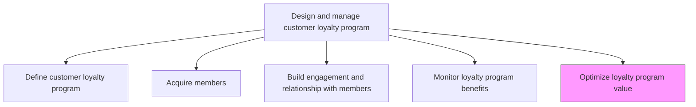
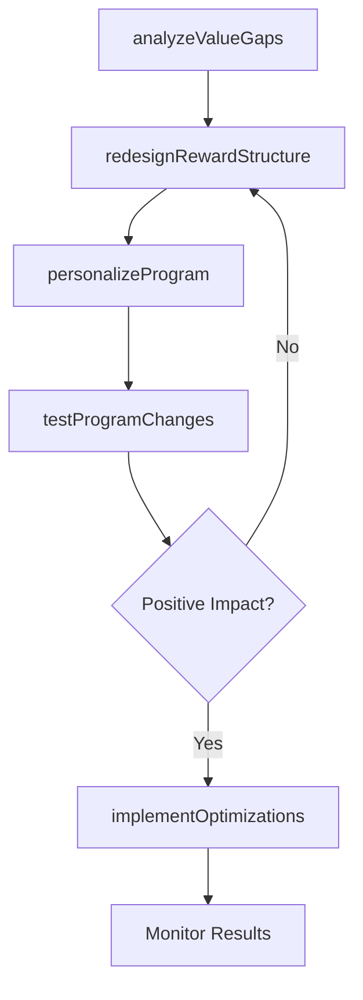

# Optimize loyalty program value to both the enterprise and the customer

> Business-as-Code definition for loyalty program value optimization. Models the continuous improvement of program design to maximize mutual value for the enterprise and enrolled customers.

## Overview

Enhancing the customer loyalty program so that it will yield maximum value both for the company and for the patrons enrolled in the program, increasing customer retention and continued engagement.

## Process Hierarchy



## GraphDL

```yaml
optimize:
  object: Loyalty Program Value To Both Enterprise And Customer
  actor: LoyaltyProgramManager
  result: OptimizedLoyaltyProgram
```

## Actions

| Action | Description |
|--------|-------------|
| analyzeValueGaps | Identify mismatches between program costs and delivered value for both enterprise and members |
| redesignRewardStructure | Restructure reward tiers, earning rates, and redemption options to improve value balance |
| personalizeProgram | Implement data-driven personalization of offers and rewards based on member behavior |
| testProgramChanges | Run A/B tests on proposed program modifications to validate impact before full rollout |
| implementOptimizations | Deploy approved program changes and communicate updates to members |

## Events

| Event | Description |
|-------|-------------|
| valueGapsAnalyzed | Enterprise and member value gap analysis completed |
| rewardStructureRedesigned | Updated reward tiers and redemption options approved |
| programPersonalized | Personalized offers and rewards deployed based on member data |
| programChangesTested | A/B test results for program modifications compiled |
| optimizationsImplemented | Program optimizations rolled out and communicated to members |

## Searches

| Search | Description |
|--------|-------------|
| getOptimizationHistory | Retrieve history of program changes and their measured impacts |
| getABTestResults | Query A/B test results for specific program modifications |
| getValueGapAnalysis | Look up the latest enterprise-member value gap assessment |

## Process Flow



## RACI Matrix

| Activity | Responsible | Accountable | Consulted | Informed |
|----------|-------------|-------------|-----------|----------|
| analyzeValueGaps | LoyaltyAnalyst | LoyaltyProgramManager | Finance | Marketing |
| redesignRewardStructure | LoyaltyProgramManager | VP Marketing | ProductManagement | ChannelPartners |
| testProgramChanges | DataScientist | LoyaltyProgramManager | CRM | IT |

## Related Processes

| Process | Relationship |
|---------|-------------|
| 3.2.7.4 Monitor customer loyalty program benefits | Upstream - benefit monitoring identifies optimization needs |
| 3.2.7.3 Build engagement and relationship with members | Consumer - optimized program enhances member engagement |
| 3.2.7.1 Define customer loyalty program | Consumer - optimization may trigger program redesign |

## Related Departments

| Department | Role |
|-----------|------|
| Loyalty Program Management | Leads optimization strategy and implementation |
| Data Science | Builds personalization models and runs A/B tests |
| Finance | Validates cost-benefit of program changes |
| CRM | Provides member data for personalization |

## Related Occupations

| Occupation | Involvement |
|-----------|-------------|
| Loyalty Program Manager | Leads optimization strategy and rollout |
| Data Scientist | Builds personalization and testing models |
| CRM Analyst | Provides member behavior data for optimization |

## KPIs

| KPI | Description | Unit |
|-----|-------------|------|
| Optimization Lift | Incremental improvement in key metrics after program changes | % |
| Value Balance Ratio | Ratio of enterprise value to member-perceived value from the program | Ratio |
| Personalization Adoption | Percentage of members receiving personalized offers | % |
| A/B Test Velocity | Number of program experiments completed per quarter | Count |

## Usage

```typescript
import { optimizeLoyaltyProgramValueToBothEnterpriseAndCustomer } from '@headlessly/optimize-loyalty-program-value-to-both-enterprise-and-customer'

const optimization = optimizeLoyaltyProgramValueToBothEnterpriseAndCustomer()

// Analyze value gaps between enterprise and member benefits
const gaps = await optimization.analyzeValueGaps({
  enterpriseMetrics: ['revenue-uplift', 'retention-improvement', 'data-value'],
  memberMetrics: ['reward-value', 'experience-quality', 'personalization'],
  period: 'last-12-months'
})

// Test proposed program changes with A/B experiment
const test = await optimization.testProgramChanges({
  change: 'increase-earning-rate',
  controlGroup: 0.5,
  testDuration: 30,
  successMetric: 'transaction-frequency'
})
```
