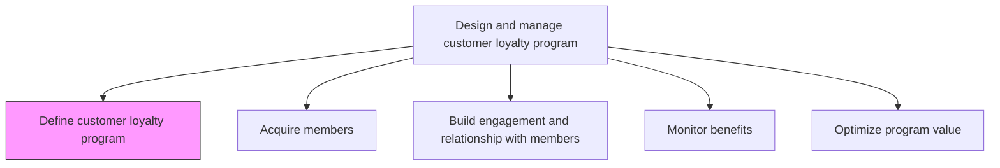
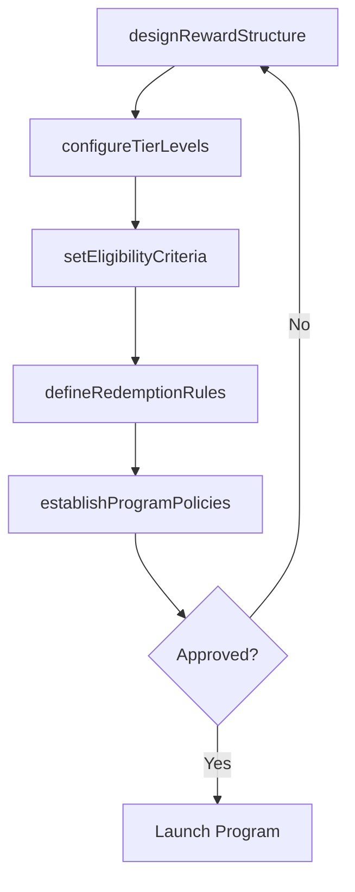

# Define customer loyalty program

> Business-as-Code definition for customer loyalty program design. Models the strategic design of reward structures, tier systems, and engagement mechanisms that drive customer retention and repeat purchases.

## Overview

Devising procedures and mechanisms to retain existing customers, promote repeat business and increase the likelihood that previous customers to continue to buy products or services from the company. This may be achieved by rewarding customers for repeat business by means of gifts, discounts, redeemable "points", or prioritized access to new products, events or services.

## Process Hierarchy



## GraphDL

```yaml
define:
  object: Customer Loyalty Program
  actor: LoyaltyProgramManager
  result: LoyaltyProgramDesign
```

## Actions

| Action | Description |
|--------|-------------|
| designRewardStructure | Define the points, discounts, gifts, and tiers that incentivize repeat purchases |
| setEligibilityCriteria | Establish rules for customer enrollment and tier qualification |
| defineRedemptionRules | Specify how and when members can redeem earned rewards |
| configureTierLevels | Create membership tiers with escalating benefits and thresholds |
| establishProgramPolicies | Document terms, conditions, expiration rules, and privacy policies |

## Events

| Event | Description |
|-------|-------------|
| rewardStructureDesigned | Loyalty reward structure approved and documented |
| eligibilityCriteriaSet | Enrollment and tier qualification rules finalized |
| redemptionRulesDefined | Reward redemption policies published |
| tierLevelsConfigured | Membership tier structure activated |
| programPoliciesEstablished | Terms, conditions, and privacy policies published |

## Searches

| Search | Description |
|--------|-------------|
| getProgramDesign | Retrieve the current loyalty program design and tier structure |
| getRewardCatalog | Query available rewards and redemption options |
| getTierRequirements | Access tier qualification thresholds and benefits |
| getProgramPolicies | Retrieve program terms, conditions, and expiration rules |

## Process Flow



## RACI Matrix

| Activity | Responsible | Accountable | Consulted | Informed |
|----------|-------------|-------------|-----------|----------|
| designRewardStructure | LoyaltyProgramManager | CMO | Finance | Sales |
| setEligibilityCriteria | LoyaltyProgramManager | CMO | Legal | CustomerService |
| configureTierLevels | LoyaltyProgramManager | CMO | DataAnalytics | Marketing |
| establishProgramPolicies | LoyaltyProgramManager | Legal | Compliance | Marketing |

## Related Processes

| Process | Relationship |
|---------|-------------|
| 3.2.7.2 Acquire members to customer loyalty program | Downstream - program design drives member acquisition |
| 3.2.7.4 Monitor customer loyalty program benefits | Downstream - design establishes metrics to monitor |
| 3.2.2 Define pricing strategy | Upstream - pricing strategy informs reward economics |

## Related Departments

| Department | Role |
|-----------|------|
| Marketing | Leads loyalty program design and strategic alignment |
| Finance | Validates reward cost structure and ROI projections |
| Legal | Reviews terms, conditions, and regulatory compliance |
| IT | Implements loyalty platform and data infrastructure |

## Related Occupations

| Occupation | Involvement |
|-----------|-------------|
| Loyalty Program Manager | Designs program structure and reward tiers |
| Financial Analyst | Models reward costs and lifetime value impact |
| CRM Specialist | Configures loyalty platform and member data flows |

## KPIs

| KPI | Description | Unit |
|-----|-------------|------|
| Program Design Approval Time | Time from initial design to executive approval | Days |
| Reward Cost Ratio | Cost of rewards as percentage of incremental revenue generated | % |
| Tier Distribution Target | Planned distribution of members across tiers | % per Tier |
| Projected Member Lifetime Value | Expected lifetime value increase for enrolled members | Currency |

## Usage

```typescript
import { defineCustomerLoyaltyProgram } from '@headlessly/define-customer-loyalty-program'

const program = defineCustomerLoyaltyProgram()

// Design reward structure for a new loyalty program
const rewards = await program.designRewardStructure({
  rewardTypes: ['points', 'discounts', 'early-access'],
  pointsPerDollar: 10,
  expirationMonths: 24
})

// Configure membership tiers
const tiers = await program.configureTierLevels({
  tiers: [
    { name: 'Silver', threshold: 0, multiplier: 1.0 },
    { name: 'Gold', threshold: 5000, multiplier: 1.5 },
    { name: 'Platinum', threshold: 15000, multiplier: 2.0 }
  ]
})
```
