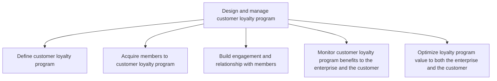
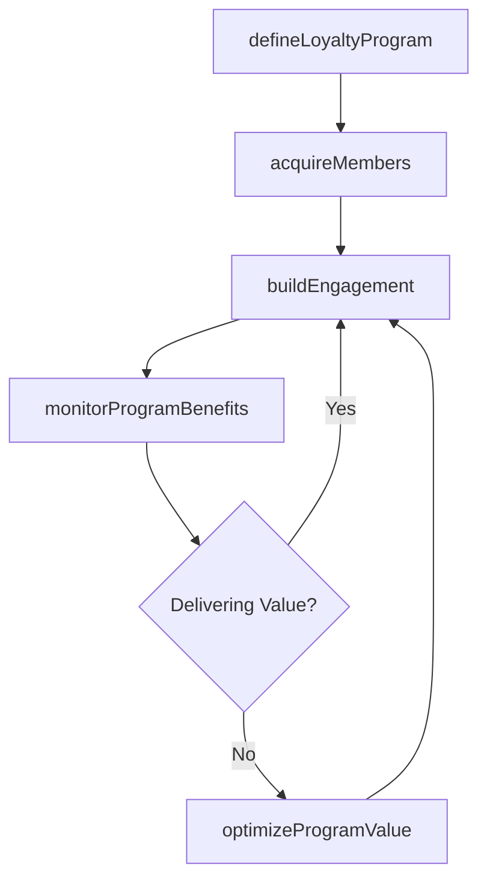

# Design and manage customer loyalty program

> Business-as-Code definition for customer loyalty program management. Models the design, member acquisition, engagement, monitoring, and optimization of loyalty programs that drive retention and lifetime value.

## Overview

Creating and managing a customer loyalty program. The loyalty program is a key part of marketing, with an elaborate strategy and process for acquiring, retaining, and engaging with members. Members are engaged and acquainted to the loyalty program, thus growing relationship and adding value through the program.

## Process Hierarchy



## GraphDL

```yaml
design:
  object: And Manage Customer Loyalty Program
  actor: LoyaltyProgramManager
  result: LoyaltyProgramPlan
```

## Actions

| Action | Description |
|--------|-------------|
| defineLoyaltyProgram | Design program structure, tiers, rewards, and earning mechanics |
| acquireMembers | Execute campaigns to enroll customers into the loyalty program |
| buildEngagement | Develop personalized interactions that deepen member relationships |
| monitorProgramBenefits | Track program value delivered to both enterprise and customers |
| optimizeProgramValue | Refine program mechanics to maximize retention and lifetime value |

## Events

| Event | Description |
|-------|-------------|
| loyaltyProgramDefined | Loyalty program structure and rules finalized |
| membersAcquired | Member enrollment campaign completed with results |
| engagementBuilt | Member engagement initiatives launched |
| programBenefitsMonitored | Program ROI and member value analysis delivered |
| programValueOptimized | Program optimizations implemented based on performance data |

## Searches

| Search | Description |
|--------|-------------|
| getProgramMetrics | Retrieve loyalty program performance metrics |
| getMemberProfiles | Query member data including tier, activity, and lifetime value |
| getProgramROI | Calculate program return on investment and member value |

## Process Flow



## RACI Matrix

| Activity | Responsible | Accountable | Consulted | Informed |
|----------|-------------|-------------|-----------|----------|
| defineLoyaltyProgram | LoyaltyProgramManager | CMO | Finance | Sales |
| acquireMembers | CampaignManager | LoyaltyProgramManager | Marketing | Sales |
| buildEngagement | CRMManager | LoyaltyProgramManager | CustomerSuccess | Marketing |
| monitorProgramBenefits | LoyaltyAnalyst | CMO | Finance | ExecutiveTeam |
| optimizeProgramValue | LoyaltyProgramManager | CMO | DataScience | Finance |

## Sub-Processes

| ID | Name | Description |
|----|------|-------------|
| 3.2.7.1 | Define customer loyalty program | Devising procedures and mechanisms to retain existing customers, promote repeat business and increas |
| 3.2.7.2 | Acquire members to customer loyalty program | Convincing customers to register their personal information with the company and be assigned a uniqu |
| 3.2.7.3 | Build engagement and relationship with members | Building deeper relationships between a customer and a brand in order to promote customer loyalty an |
| 3.2.7.4 | Monitor customer loyalty program benefits to the enterprise and the customer | Surveying and tracking the benefits of customer loyalty programs both for the company and for custom |
| 3.2.7.5 | Optimize loyalty program value to both the enterprise and the customer | Enhancing the customer loyalty program so that it will yield maximum value both for the company and  |

## Related Processes

| Process | Relationship |
|---------|-------------|
| 3.3.7 Track customer management measures | Parallel - loyalty data feeds customer measurement |
| 3.3.8 Analyze and respond to customer insight | Upstream - customer insights inform loyalty design |
| 5.0 Manage Customer Service | Parallel - service quality affects loyalty outcomes |

## Related Departments

| Department | Role |
|-----------|------|
| Loyalty Marketing | Designs and manages the loyalty program |
| CRM | Manages member data and personalization engine |
| Finance | Monitors program costs and ROI |
| Customer Success | Integrates loyalty with customer retention initiatives |

## Related Occupations

| Occupation | Involvement |
|-----------|-------------|
| Loyalty Program Manager | Designs program mechanics and oversees operations |
| CRM Analyst | Manages member segmentation and targeting |
| Data Scientist | Builds predictive models for churn and engagement |

## KPIs

| KPI | Description | Unit |
|-----|-------------|------|
| Member Enrollment Rate | Percentage of eligible customers enrolled in loyalty program | % |
| Active Member Rate | Percentage of members transacting within last 90 days | % |
| Program Retention Lift | Incremental retention rate for loyalty members vs non-members | Percentage Points |
| Customer Lifetime Value | Average CLV of loyalty members vs non-members | USD |
| Program ROI | Return on loyalty program investment | Ratio |

## Usage

```typescript
import { designAndManageCustomerLoyaltyProgram } from '@headlessly/design-and-manage-customer-loyalty-program'

const loyalty = designAndManageCustomerLoyaltyProgram()

// Define loyalty program structure
const program = await loyalty.defineLoyaltyProgram({
  tiers: ['Silver', 'Gold', 'Platinum'],
  earningMechanics: { pointsPerDollar: 10, bonusCategories: ['annual-renewal'] },
  redemptionOptions: ['discount', 'upgrade', 'partner-rewards']
})

// Monitor program benefits
const benefits = await loyalty.monitorProgramBenefits({
  period: 'last-12-months',
  metrics: ['retentionLift', 'revenuePerMember', 'programCost']
})
```
