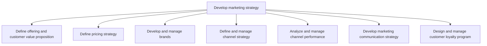
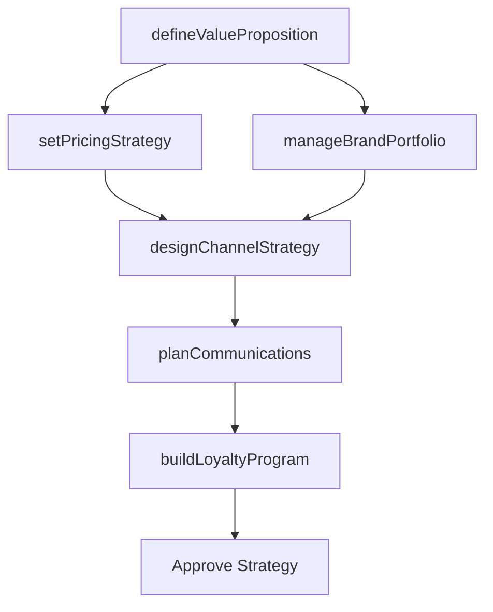

# Develop marketing strategy

> Business-as-Code definition for marketing strategy development. Models the formulation of value propositions, pricing frameworks, brand management, channel strategies, communications planning, and loyalty programs into a cohesive go-to-market plan.

## Overview

Charting a strategic course for marketing products/services. This will include defining the value proposition, creating a mechanism for pricing, and determining the right mix of marketing channels. Create a specific positioning and branding for the organization's offerings. Enlist marketing head to lead, with inputs from the business development and sales functions.

## Process Hierarchy



## GraphDL

```yaml
develop:
  object: Marketing Strategy
  actor: MarketingDirector
  result: MarketingStrategyPlan
```

## Actions

| Action | Description |
|--------|-------------|
| defineValueProposition | Articulate the unique value offered to each target segment |
| setPricingStrategy | Establish pricing frameworks aligned with positioning and margin goals |
| manageBrandPortfolio | Develop and maintain brand architecture and equity |
| designChannelStrategy | Select and optimize marketing and distribution channels |
| planCommunications | Design integrated marketing communications across all touchpoints |
| buildLoyaltyProgram | Create and manage customer retention and loyalty initiatives |

## Events

| Event | Description |
|-------|-------------|
| valuePropositionDefined | Value proposition approved for target segments |
| pricingStrategySet | Pricing framework and guidelines established |
| brandPortfolioManaged | Brand strategy and guidelines updated |
| channelStrategyDesigned | Channel strategy formalized and approved |
| communicationsPlanned | Marketing communications plan finalized |
| loyaltyProgramBuilt | Customer loyalty program launched or updated |

## Searches

| Search | Description |
|--------|-------------|
| getMarketingStrategy | Retrieve current marketing strategy by segment or product line |
| getPricingFramework | Query pricing strategies, guidelines, and discount policies |
| getChannelPerformance | Retrieve channel performance metrics and optimization data |
| getBrandGuidelines | Access current brand positioning and guidelines |

## Process Flow



## RACI Matrix

| Activity | Responsible | Accountable | Consulted | Informed |
|----------|-------------|-------------|-----------|----------|
| defineValueProposition | ProductMarketingManager | CMO | Sales | ProductManagement |
| setPricingStrategy | PricingManager | CMO | Finance | Sales |
| manageBrandPortfolio | BrandManager | CMO | Creative | Legal |
| designChannelStrategy | ChannelManager | CMO | Sales | Operations |
| planCommunications | MarketingCommunicationsManager | CMO | PR | Sales |

## Sub-Processes

| ID | Name | Description |
|----|------|-------------|
| 3.2.1 | Define offering and customer value proposition | Refining the attributes of organizational offerings to define their value proposition for the custom |
| 3.2.2 | Define pricing strategy | Creating a pricing strategy and mechanism that aligns with the benefits of the products/services, as |
| 3.2.3 | Develop and manage brands | Building, maintaining, and optimizing brand assets across the portfolio through sentiment analysis, s |
| 3.2.4 | Define and manage channel strategy | Establishing all the activities needed to identify the appropriate channels to market to different c |
| 3.2.5 | Analyze and manage channel performance | Monitoring marketing and distribution efforts of all channels individually and as a network. Re-dist |
| 3.2.6 | Develop marketing communication strategy | Establishing marketing communications that deliver promotional messages, in a coordinated way, throu |
| 3.2.7 | Design and manage customer loyalty program | Creating and managing a customer loyalty program. The loyalty program is a key part of marketing, wi |

## Related Processes

| Process | Relationship |
|---------|-------------|
| 3.1 Understand markets, customers, and capabilities | Upstream - market intelligence informs strategy formulation |
| 3.3 Develop and manage marketing plans | Downstream - strategy guides operational marketing planning |
| 3.4 Develop trade customer sales strategy | Parallel - marketing and sales strategies must align |
| 2.0 Develop and Manage Products and Services | Upstream - product capabilities shape marketing positioning |

## Related Departments

| Department | Role |
|-----------|------|
| Marketing | Leads strategy development across all marketing disciplines |
| Brand Management | Owns brand architecture, equity measurement, and guidelines |
| Pricing | Develops pricing frameworks and discount governance |
| Channel Management | Designs and optimizes go-to-market channels |
| Communications | Plans integrated marketing communications |

## Related Occupations

| Occupation | Involvement |
|-----------|-------------|
| Marketing Director | Orchestrates overall marketing strategy development |
| Brand Manager | Manages brand positioning and equity |
| Pricing Analyst | Develops pricing models and competitive pricing analysis |
| Channel Strategist | Designs multi-channel distribution strategies |

## KPIs

| KPI | Description | Unit |
|-----|-------------|------|
| Brand Awareness | Percentage of target market aware of the brand | % |
| Price Realization | Actual selling price as percentage of list price | % |
| Channel Coverage | Percentage of target segments reached through active channels | % |
| Customer Loyalty Rate | Percentage of customers enrolled in loyalty programs | % |
| Strategy Execution Score | Percentage of strategy initiatives executed on schedule | % |

## Usage

```typescript
import { developMarketingStrategy } from '@headlessly/develop-marketing-strategy'

const strategy = developMarketingStrategy()

// Define value proposition for a target segment
const proposition = await strategy.defineValueProposition({
  segment: 'Enterprise',
  differentiators: ['scalability', 'security', 'integration'],
  competitivePosition: 'premium'
})

// Design channel strategy
const channels = await strategy.designChannelStrategy({
  segments: ['Enterprise', 'Mid-Market'],
  channelTypes: ['direct', 'partner', 'digital'],
  optimizeFor: 'coverage'
})
```
