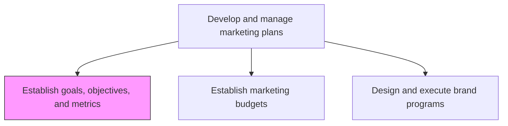
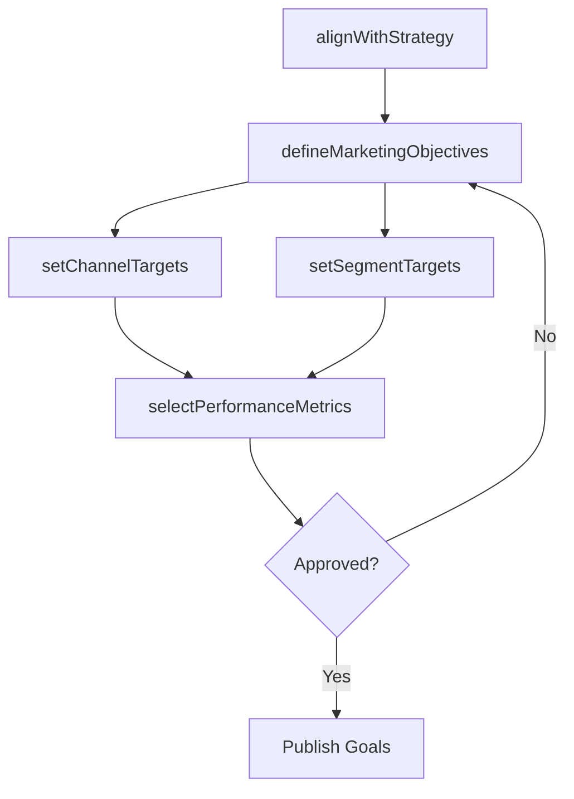

# Establish goals, objectives, and metrics for products/services by channel/segment

> Business-as-Code definition for marketing goal and metric establishment. Models the process of defining quantitative and qualitative performance targets for products and services across channels and customer segments.

## Overview

Determining what to achieve by marketing. Create qualitative and quantitative targets. Establish metrics to track performance (for individual Market segments [10109] and Channels for target segments [10129]). Enlist the head of marketing to determine marketing priorities and the related measures. (The decision in establishing these goals, objectives, and metrics is founded in Develop marketing strategy [10102] and takes cues from current priorities and organizational strategy.)

## Process Hierarchy



## GraphDL

```yaml
establish:
  object: Goals, Objectives, And Metrics For Products/services By Channel/segment
  actor: MarketingPlanningManager
  result: MarketingGoalsFramework
```

## Actions

| Action | Description |
|--------|-------------|
| defineMarketingObjectives | Set qualitative and quantitative marketing objectives aligned with business strategy |
| setChannelTargets | Establish performance targets for each marketing and distribution channel |
| setSegmentTargets | Define performance goals specific to each customer segment |
| selectPerformanceMetrics | Choose KPIs and tracking metrics for each goal and objective |
| alignWithStrategy | Validate that goals are consistent with overall marketing and business strategy |

## Events

| Event | Description |
|-------|-------------|
| marketingObjectivesDefined | Marketing objectives set and documented for the planning period |
| channelTargetsSet | Channel-specific performance targets established |
| segmentTargetsSet | Segment-specific performance goals finalized |
| performanceMetricsSelected | KPIs and tracking metrics chosen for all objectives |
| strategyAlignmentConfirmed | Goals validated against marketing and business strategy |

## Searches

| Search | Description |
|--------|-------------|
| getMarketingGoals | Retrieve marketing goals by channel, segment, or product |
| getPerformanceTargets | Query performance targets and current progress |
| getMetricDefinitions | Access metric definitions and measurement methodologies |
| getHistoricalPerformance | Retrieve past performance data to inform target setting |

## Process Flow



## RACI Matrix

| Activity | Responsible | Accountable | Consulted | Informed |
|----------|-------------|-------------|-----------|----------|
| defineMarketingObjectives | MarketingPlanningManager | CMO | Sales | Finance |
| setChannelTargets | ChannelManager | MarketingPlanningManager | Digital | Operations |
| setSegmentTargets | SegmentMarketingManager | MarketingPlanningManager | ProductMarketing | Sales |
| selectPerformanceMetrics | MarketingAnalyst | MarketingPlanningManager | Finance | ExecutiveTeam |

## Related Processes

| Process | Relationship |
|---------|-------------|
| 3.2 Develop marketing strategy | Upstream - strategy provides direction for goal setting |
| 3.3.2 Establish marketing budgets | Downstream - goals drive budget allocation |
| 3.3.7 Track customer management measures | Downstream - metrics are tracked against established goals |

## Related Departments

| Department | Role |
|-----------|------|
| Marketing | Leads goal definition and metric selection |
| Sales | Provides input on channel and segment targets |
| Finance | Validates financial targets and measurement methods |
| Executive Leadership | Approves strategic marketing objectives |

## Related Occupations

| Occupation | Involvement |
|-----------|-------------|
| Marketing Planning Manager | Defines goals, objectives, and metrics frameworks |
| Marketing Analyst | Selects metrics and establishes measurement baselines |
| Channel Manager | Sets channel-specific performance targets |

## KPIs

| KPI | Description | Unit |
|-----|-------------|------|
| Goal Coverage | Percentage of products and segments with defined goals | % |
| Target Achievement Rate | Percentage of marketing goals met within the period | % |
| Metric Tracking Adoption | Percentage of goals with active metric tracking | % |
| Goal-to-Strategy Alignment Score | Rating of goal alignment with strategic priorities | Score (1-10) |

## Usage

```typescript
import { establishGoalsObjectivesAndMetrics } from '@headlessly/establish-goals-objectives-and-metrics-for-products-services-by-channel-segment'

const goals = establishGoalsObjectivesAndMetrics()

// Define marketing objectives for the quarter
const objectives = await goals.defineMarketingObjectives({
  period: 'Q2-2026',
  objectives: [
    { type: 'lead-generation', target: 5000, segment: 'enterprise' },
    { type: 'brand-awareness', target: 0.35, segment: 'mid-market' }
  ]
})

// Set channel-specific targets
const channelTargets = await goals.setChannelTargets({
  channels: ['digital', 'partner', 'events'],
  metrics: ['leads', 'conversion-rate', 'cost-per-lead'],
  period: 'Q2-2026'
})
```
