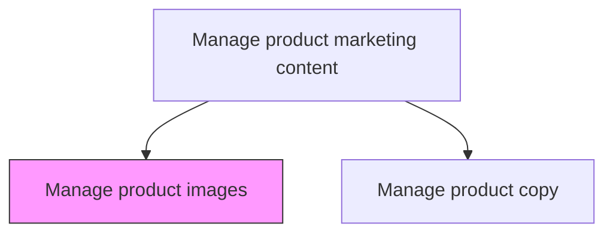
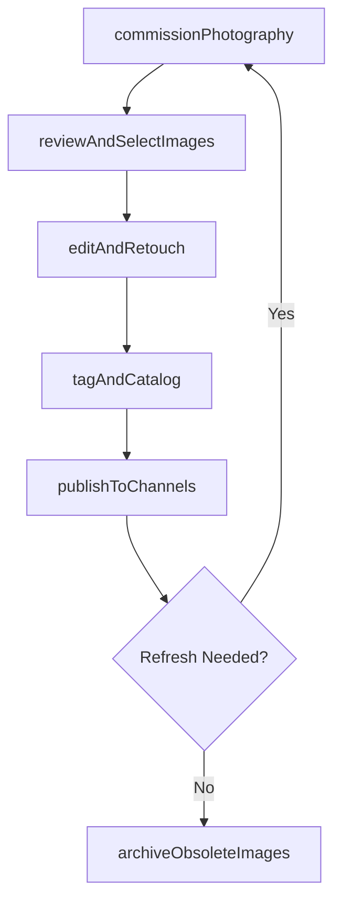

# Manage product images

> Business-as-Code definition for product image management. Models the creation, curation, and governance of visual assets used in product descriptions, advertisements, and digital storefronts.

## Overview

Producing or overseeing the creation or acquisition of photos, images and graphics for a product description, advertisement or a website. Like the copy [18131], product images are chosen and edited to enhance the product description and to convince consumers to purchase the product.

## Process Hierarchy



## GraphDL

```yaml
manage:
  object: Product Images
  actor: CreativeDirector
  result: ProductImageLibrary
```

## Actions

| Action | Description |
|--------|-------------|
| commissionPhotography | Brief and schedule product photography shoots or CGI rendering sessions |
| reviewAndSelectImages | Evaluate candidate images for brand alignment, quality, and conversion potential |
| editAndRetouch | Apply color correction, retouching, and formatting to meet channel specifications |
| tagAndCatalog | Apply metadata, alt-text, and taxonomy tags to enable search and reuse |
| publishToChannels | Distribute approved images to e-commerce, advertising, and print production systems |
| archiveObsoleteImages | Retire outdated or superseded product images and update references |

## Events

| Event | Description |
|-------|-------------|
| photographyCommissioned | Product photography or rendering session scheduled and briefed |
| imagesReviewedAndSelected | Candidate images evaluated and approved set finalized |
| imagesEditedAndRetouched | Post-production edits completed and quality-checked |
| imagesTaggedAndCataloged | Metadata and taxonomy tags applied to image assets |
| imagesPublishedToChannels | Approved images distributed to target channels |
| obsoleteImagesArchived | Outdated images retired and references updated |

## Searches

| Search | Description |
|--------|-------------|
| getProductImages | Retrieve images by product, SKU, or campaign |
| getImagesByChannel | Query images formatted for a specific distribution channel |
| getImageUsageHistory | Look up where and when a product image has been published |
| getPendingReviews | List images awaiting review or approval |

## Process Flow



## RACI Matrix

| Activity | Responsible | Accountable | Consulted | Informed |
|----------|-------------|-------------|-----------|----------|
| commissionPhotography | CreativeDirector | VP Marketing | ProductManagement | BrandManager |
| reviewAndSelectImages | ArtDirector | CreativeDirector | ProductMarketing | E-Commerce |
| editAndRetouch | GraphicDesigner | ArtDirector | BrandManager | WebDevelopment |
| publishToChannels | DigitalAssetManager | CreativeDirector | E-Commerce | Sales |

## Related Processes

| Process | Relationship |
|---------|-------------|
| 3.3.10.2 Manage product copy | Parallel - images and copy are coordinated for product marketing content |
| 3.3.3 Design and execute brand and product marketing programs | Consumer - images support campaign creative execution |
| 3.2.3 Develop and manage brands | Upstream - brand guidelines govern image style and quality |

## Related Departments

| Department | Role |
|-----------|------|
| Creative Services | Produces and retouches product imagery |
| Digital Asset Management | Catalogs, stores, and distributes image assets |
| E-Commerce | Publishes images to online storefronts and marketplaces |
| Brand Management | Ensures visual consistency with brand guidelines |

## Related Occupations

| Occupation | Involvement |
|-----------|-------------|
| Creative Director | Oversees image strategy and quality standards |
| Art Director | Directs photography and selects final images |
| Graphic Designer | Performs retouching, formatting, and production |

## KPIs

| KPI | Description | Unit |
|-----|-------------|------|
| Image Coverage Rate | Percentage of active SKUs with compliant product images | % |
| Time to Publish | Average days from photography to channel publication | Days |
| Image Reuse Rate | Percentage of images used across multiple channels or campaigns | % |
| Asset Freshness | Average age of active product images | Months |

## Usage

```typescript
import { manageProductImages } from '@headlessly/manage-product-images'

const images = manageProductImages()

// Commission product photography for a new collection
const shoot = await images.commissionPhotography({
  products: ['SKU-1001', 'SKU-1002', 'SKU-1003'],
  style: 'lifestyle',
  outputFormats: ['web-hero', 'thumbnail', 'print-catalog']
})

// Publish approved images to e-commerce channels
const published = await images.publishToChannels({
  imageIds: ['IMG-2001', 'IMG-2002'],
  channels: ['shopify', 'amazon', 'website'],
  autoResize: true
})
```
