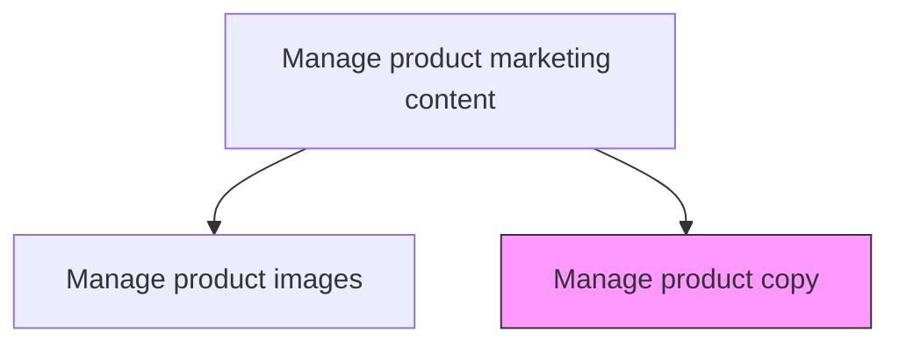
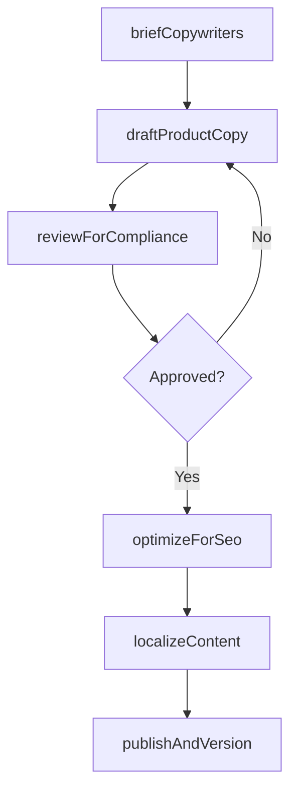

# Manage product copy

> Business-as-Code definition for product copy management. Models the authoring, editing, and governance of textual content used in product descriptions, advertisements, and web pages.

## Overview

Authoring or overseeing the creation of the textual portion of a product description, advertisement, or web page, including the headline, body, product attributes, and brand or advertiser information. A copy is designed to provide information about the product and to catch and hold the interest of prospective buyers long enough to persuade them to make a purchase. The copy of a website is called its content.

## Process Hierarchy



## GraphDL

```yaml
manage:
  object: Product Copy
  actor: ContentManager
  result: ProductCopyLibrary
```

## Actions

| Action | Description |
|--------|-------------|
| briefCopywriters | Define copy requirements including tone, length, audience, and key selling points |
| draftProductCopy | Author headline, body, attribute descriptions, and call-to-action text |
| reviewForCompliance | Verify copy meets legal, regulatory, and brand voice guidelines |
| localizeContent | Adapt product copy for regional markets, languages, and cultural nuances |
| optimizeForSeo | Incorporate target keywords, structured data, and search-friendly formatting |
| publishAndVersion | Release approved copy to channels and maintain version history |

## Events

| Event | Description |
|-------|-------------|
| copywritersBriefed | Copy requirements and creative brief distributed to writers |
| productCopyDrafted | Initial product copy authored and submitted for review |
| complianceReviewCompleted | Legal and brand compliance review finalized |
| contentLocalized | Product copy adapted for target regional markets |
| seoOptimized | Copy enhanced with keywords and structured formatting |
| copyPublishedAndVersioned | Approved copy released and version recorded |

## Searches

| Search | Description |
|--------|-------------|
| getProductCopy | Retrieve copy by product, SKU, or content type |
| getCopyByLocale | Query product copy for a specific language or region |
| getCopyVersionHistory | Look up revision history and change log for a product's copy |
| getPendingApprovals | List copy drafts awaiting compliance or editorial review |

## Process Flow



## RACI Matrix

| Activity | Responsible | Accountable | Consulted | Informed |
|----------|-------------|-------------|-----------|----------|
| draftProductCopy | Copywriter | ContentManager | ProductMarketing | BrandManager |
| reviewForCompliance | ContentManager | VP Marketing | Legal | RegulatoryAffairs |
| optimizeForSeo | SEOSpecialist | ContentManager | DigitalMarketing | WebDevelopment |
| localizeContent | LocalizationManager | ContentManager | RegionalMarketing | Translation |

## Related Processes

| Process | Relationship |
|---------|-------------|
| 3.3.10.1 Manage product images | Parallel - copy and images are coordinated for product marketing content |
| 3.2.6.8 Define communication guidelines and mechanisms | Upstream - communication guidelines govern copy standards |
| 3.3.3 Design and execute brand and product marketing programs | Consumer - copy supports campaign and advertising creative |

## Related Departments

| Department | Role |
|-----------|------|
| Content Marketing | Authors and manages product copy |
| Brand Management | Ensures copy adheres to brand voice and messaging standards |
| Legal | Reviews copy for regulatory and compliance requirements |
| SEO / Digital Marketing | Optimizes copy for search visibility |

## Related Occupations

| Occupation | Involvement |
|-----------|-------------|
| Content Manager | Leads copy strategy, briefs writers, and manages approvals |
| Copywriter | Authors product descriptions, headlines, and marketing text |
| SEO Specialist | Optimizes copy for search engine performance |

## KPIs

| KPI | Description | Unit |
|-----|-------------|------|
| Copy Coverage Rate | Percentage of active SKUs with compliant product copy | % |
| Time to Publish | Average days from brief to published copy | Days |
| SEO Keyword Ranking | Average search rank position for target product keywords | Position |
| Localization Coverage | Percentage of products with copy in all target languages | % |

## Usage

```typescript
import { manageProductCopy } from '@headlessly/manage-product-copy'

const copy = manageProductCopy()

// Draft product copy for a new product launch
const draft = await copy.draftProductCopy({
  productId: 'SKU-1001',
  contentTypes: ['headline', 'short-description', 'full-description', 'features'],
  tone: 'professional-yet-approachable',
  targetAudience: 'enterprise-buyers'
})

// Optimize existing copy for SEO
const optimized = await copy.optimizeForSeo({
  productId: 'SKU-1001',
  targetKeywords: ['enterprise SaaS platform', 'headless commerce'],
  maxKeywordDensity: 0.02
})
```
