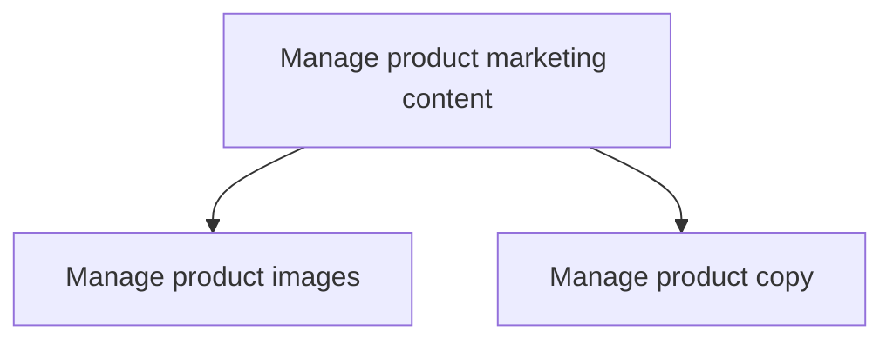
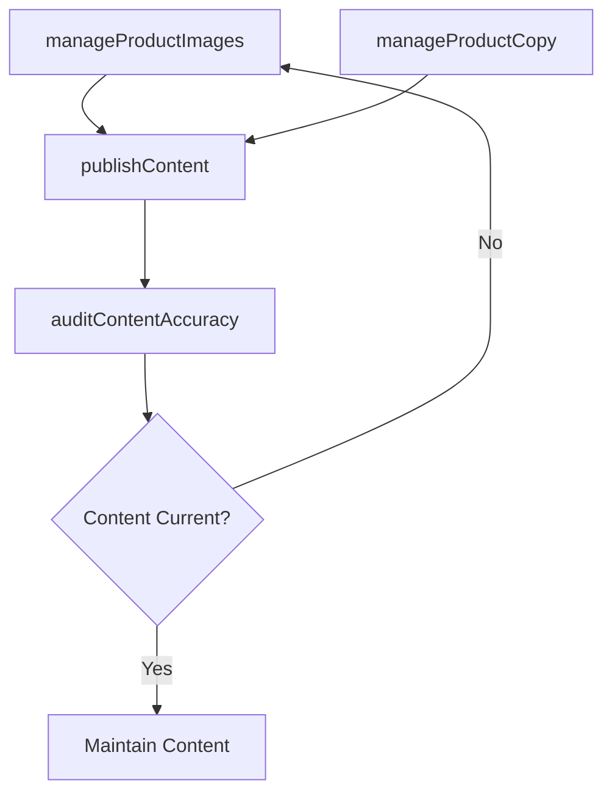

# Manage product marketing content

> Business-as-Code definition for product marketing content management. Models the creation, governance, and distribution of product descriptions, images, and promotional copy across all customer-facing channels.

## Overview

Creating descriptions of products that are promotional and informative in content in order to initiate and increase sales. Marketing content consists of text, and optionally, images.

## Process Hierarchy



## GraphDL

```yaml
manage:
  object: Product Marketing Content
  actor: ContentMarketingManager
  result: ProductContentLibrary
```

## Actions

| Action | Description |
|--------|-------------|
| manageProductImages | Create, organize, and maintain product photography and visual assets |
| manageProductCopy | Author, review, and publish product descriptions and marketing text |
| publishContent | Distribute approved content across websites, catalogs, and sales channels |
| auditContentAccuracy | Review existing content for accuracy, freshness, and brand compliance |

## Events

| Event | Description |
|-------|-------------|
| productImagesManaged | Product image library updated with new or revised assets |
| productCopyManaged | Product descriptions and marketing text approved and published |
| contentPublished | Marketing content distributed to customer-facing channels |
| contentAccuracyAudited | Content audit completed with compliance report |

## Searches

| Search | Description |
|--------|-------------|
| getProductContent | Retrieve product marketing content by SKU, category, or channel |
| getContentAssets | Access product images and creative assets by product or campaign |
| getContentAuditResults | Query content audit findings and compliance status |

## Process Flow



## RACI Matrix

| Activity | Responsible | Accountable | Consulted | Informed |
|----------|-------------|-------------|-----------|----------|
| manageProductImages | VisualContentSpecialist | ContentMarketingManager | BrandManager | ProductManagement |
| manageProductCopy | Copywriter | ContentMarketingManager | ProductMarketing | Legal |
| publishContent | ContentMarketingManager | VP Marketing | WebDevelopment | Sales |
| auditContentAccuracy | ContentMarketingManager | VP Marketing | Legal | ProductManagement |

## Sub-Processes

| ID | Name | Description |
|----|------|-------------|
| 3.3.10.1 | Manage product images | Producing or overseeing the creation or acquisition of photos, images and graphics for a product des |
| 3.3.10.2 | Manage product copy | Authoring or overseeing the creation of the textual portion of a product description, advertisement, |

## Related Processes

| Process | Relationship |
|---------|-------------|
| 3.2.3 Develop and manage brands | Upstream - brand guidelines govern content standards |
| 3.3.9 Develop and manage packaging strategy | Upstream - packaging defines content requirements |
| 3.3.3 Design and execute brand and product marketing programs | Parallel - campaigns consume product content |
| 3.2.6 Develop marketing communication strategy | Upstream - communication strategy guides content approach |

## Related Departments

| Department | Role |
|-----------|------|
| Content Marketing | Creates and manages product marketing content |
| Creative Services | Produces product photography and visual assets |
| Product Marketing | Provides product positioning and messaging frameworks |
| Web Development | Publishes content to digital channels |
| Sales Enablement | Distributes content to sales teams and partners |

## Related Occupations

| Occupation | Involvement |
|-----------|-------------|
| Content Marketing Manager | Oversees content creation and governance |
| Copywriter | Authors product descriptions and marketing text |
| Visual Content Specialist | Produces product images and multimedia |
| Product Marketing Manager | Defines product messaging and positioning |

## KPIs

| KPI | Description | Unit |
|-----|-------------|------|
| Content Coverage | Percentage of products with complete marketing content | % |
| Content Freshness | Average age of product content since last update | Days |
| Content Compliance Rate | Percentage of content meeting brand and legal guidelines | % |
| Content Engagement Rate | Average engagement with product content across channels | % |

## Usage

```typescript
import { manageProductMarketingContent } from '@headlessly/manage-product-marketing-content'

const content = manageProductMarketingContent()

// Manage product copy for a product line
const copy = await content.manageProductCopy({
  productLine: 'platform',
  contentTypes: ['short-description', 'long-description', 'features-list'],
  targetChannels: ['website', 'marketplace', 'sales-deck']
})

// Audit content for accuracy and compliance
const audit = await content.auditContentAccuracy({
  scope: 'all-products',
  checkBrandCompliance: true,
  checkPricingAccuracy: true
})
```
