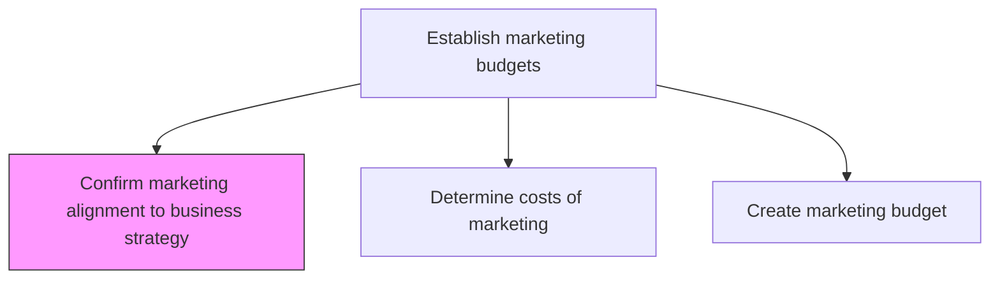
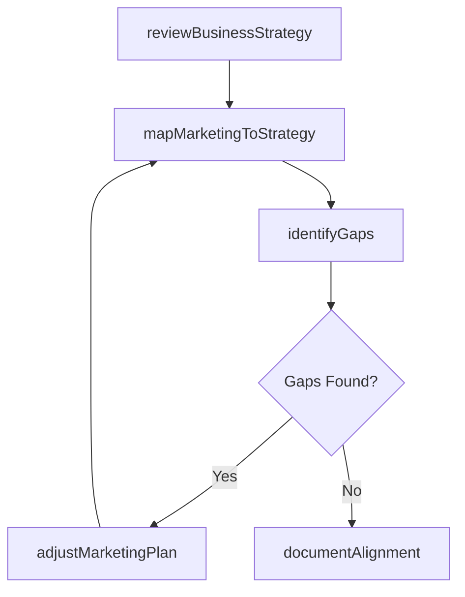

# Confirm marketing alignment to business strategy

> Business-as-Code definition for marketing-to-business strategy alignment verification. Models the validation process ensuring marketing plans support and align with overall organizational strategic objectives.

## Overview

Ensuring corroboration of the marketing strategy and the organizational strategy. Ensure the organization's marketing strategy/plan aligns with the overall business strategy. Fine-tune the marketing plan according to the organizational strategy.

## Process Hierarchy



## GraphDL

```yaml
confirm:
  object: Marketing Alignment To Business Strategy
  actor: MarketingPlanningManager
  result: AlignmentAssessmentReport
```

## Actions

| Action | Description |
|--------|-------------|
| reviewBusinessStrategy | Examine current organizational strategy, vision, and priorities |
| mapMarketingToStrategy | Match each marketing initiative to specific business objectives |
| identifyGaps | Detect areas where marketing plans diverge from business strategy |
| adjustMarketingPlan | Modify marketing activities to close alignment gaps |
| documentAlignment | Record the confirmed alignment between marketing and business strategy |

## Events

| Event | Description |
|-------|-------------|
| businessStrategyReviewed | Current business strategy review completed |
| marketingMappedToStrategy | Marketing initiatives mapped to business objectives |
| gapsIdentified | Alignment gaps between marketing and business strategy detected |
| marketingPlanAdjusted | Marketing plan modified to improve strategic alignment |
| alignmentDocumented | Marketing-to-strategy alignment confirmed and recorded |

## Searches

| Search | Description |
|--------|-------------|
| getAlignmentReport | Retrieve marketing-to-strategy alignment assessment |
| getStrategyMapping | Query marketing initiative to business objective mappings |
| getAlignmentGaps | Access identified gaps between marketing and business strategy |

## Process Flow



## RACI Matrix

| Activity | Responsible | Accountable | Consulted | Informed |
|----------|-------------|-------------|-----------|----------|
| reviewBusinessStrategy | MarketingPlanningManager | CMO | StrategyOffice | ExecutiveTeam |
| mapMarketingToStrategy | MarketingPlanningManager | CMO | Finance | Sales |
| identifyGaps | MarketingAnalyst | CMO | StrategyOffice | ProductMarketing |
| adjustMarketingPlan | MarketingPlanningManager | CMO | Sales | Finance |

## Related Processes

| Process | Relationship |
|---------|-------------|
| 3.2 Develop marketing strategy | Upstream - strategy must be confirmed before budgeting |
| 3.3.2.2 Determine costs of marketing | Downstream - alignment confirmation precedes cost determination |
| 1.1 Define the business concept and long-term vision | Upstream - business vision sets the alignment target |

## Related Departments

| Department | Role |
|-----------|------|
| Marketing | Leads alignment review and adjustment process |
| Strategy Office | Provides business strategy context and priorities |
| Finance | Validates financial alignment of marketing plans |
| Executive Leadership | Approves confirmed alignment |

## Related Occupations

| Occupation | Involvement |
|-----------|-------------|
| Marketing Planning Manager | Conducts alignment review and adjustments |
| Strategy Analyst | Provides business strategy context for alignment |
| CMO | Approves final alignment confirmation |

## KPIs

| KPI | Description | Unit |
|-----|-------------|------|
| Alignment Score | Degree of marketing plan alignment with business strategy | Score (1-10) |
| Gap Count | Number of identified misalignments between marketing and strategy | Count |
| Alignment Review Cycle Time | Time required to complete an alignment review | Days |
| Initiative Coverage | Percentage of business objectives supported by marketing initiatives | % |

## Usage

```typescript
import { confirmMarketingAlignmentToBusinessStrategy } from '@headlessly/confirm-marketing-alignment-to-business-strategy'

const alignment = confirmMarketingAlignmentToBusinessStrategy()

// Map marketing initiatives to business strategy
const mapping = await alignment.mapMarketingToStrategy({
  marketingPlan: 'Q2-2026',
  businessObjectives: ['revenue-growth', 'market-expansion', 'customer-retention']
})

// Identify gaps in strategic alignment
const gaps = await alignment.identifyGaps({
  planId: mapping.id,
  threshold: 'critical'
})
```
