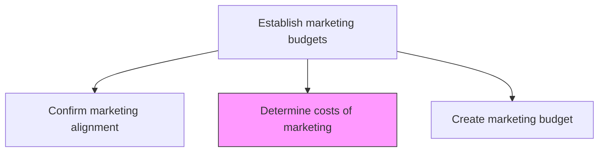
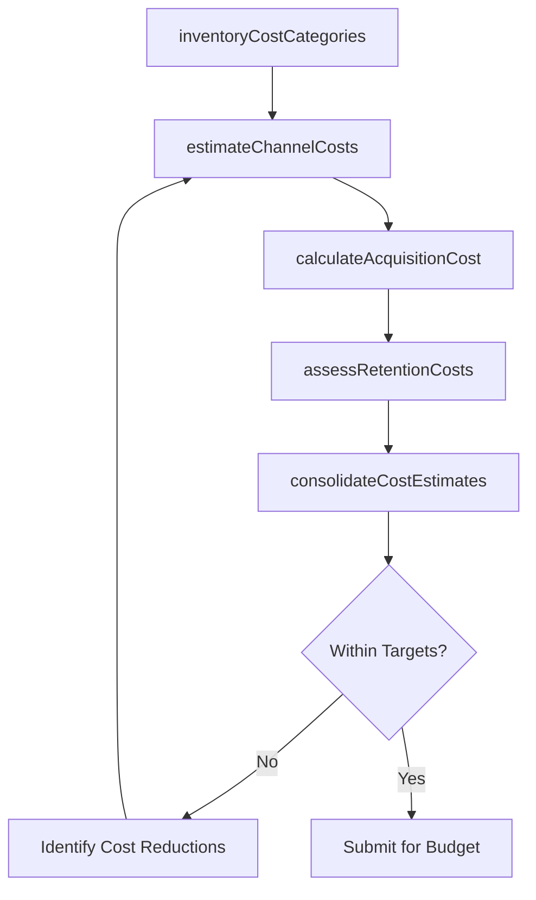

# Determine costs of marketing

> Business-as-Code definition for marketing cost analysis. Models the calculation and categorization of all costs associated with promoting, selling, and delivering products and services to customers.

## Overview

Calculating the total cost of marketing the organization's portfolio of products/services. Calculate the total outlay needed for promoting, selling, and delivering the organization's products/services to customers. Account for all costs to acquire customers and sustain a relationship with them. Include the expenses needed for promotional actives, warehousing, transactional costs, and distribution of the organization's offering.

## Process Hierarchy



## GraphDL

```yaml
determine:
  object: Costs Of Marketing
  actor: MarketingFinanceAnalyst
  result: MarketingCostAnalysis
```

## Actions

| Action | Description |
|--------|-------------|
| inventoryCostCategories | Identify all cost categories including promotion, distribution, warehousing, and transactions |
| estimateChannelCosts | Calculate costs for each marketing and distribution channel |
| calculateAcquisitionCost | Determine the cost to acquire new customers across all channels |
| assessRetentionCosts | Estimate costs to maintain existing customer relationships |
| consolidateCostEstimates | Aggregate all cost estimates into a comprehensive marketing cost analysis |

## Events

| Event | Description |
|-------|-------------|
| costCategoriesInventoried | All marketing cost categories identified and cataloged |
| channelCostsEstimated | Per-channel marketing cost estimates completed |
| acquisitionCostCalculated | Customer acquisition cost analysis finalized |
| retentionCostsAssessed | Customer retention cost estimates produced |
| costEstimatesConsolidated | Total marketing cost analysis compiled and documented |

## Searches

| Search | Description |
|--------|-------------|
| getCostBreakdown | Retrieve marketing cost breakdown by category or channel |
| getAcquisitionCosts | Query customer acquisition costs by segment or channel |
| getHistoricalSpend | Access historical marketing spend data for trend analysis |

## Process Flow



## RACI Matrix

| Activity | Responsible | Accountable | Consulted | Informed |
|----------|-------------|-------------|-----------|----------|
| inventoryCostCategories | MarketingFinanceAnalyst | MarketingPlanningManager | Finance | Operations |
| estimateChannelCosts | MarketingFinanceAnalyst | MarketingPlanningManager | ChannelManagers | Procurement |
| calculateAcquisitionCost | MarketingAnalyst | MarketingPlanningManager | Sales | Finance |
| consolidateCostEstimates | MarketingFinanceAnalyst | CMO | Finance | ExecutiveTeam |

## Related Processes

| Process | Relationship |
|---------|-------------|
| 3.3.2.1 Confirm marketing alignment to business strategy | Upstream - alignment drives cost prioritization |
| 3.3.2.3 Create marketing budget | Downstream - cost analysis feeds budget creation |
| 3.3.2.4 Determine projected ROI for marketing investment | Parallel - costs used to calculate ROI projections |

## Related Departments

| Department | Role |
|-----------|------|
| Marketing | Provides activity plans and cost estimates |
| Finance | Validates cost calculations and provides historical benchmarks |
| Procurement | Supplies vendor and agency cost data |
| Operations | Provides distribution and fulfillment cost inputs |

## Related Occupations

| Occupation | Involvement |
|-----------|-------------|
| Marketing Finance Analyst | Leads cost calculation and consolidation |
| Marketing Planning Manager | Prioritizes cost categories and validates estimates |
| Procurement Specialist | Provides vendor pricing and contract data |

## KPIs

| KPI | Description | Unit |
|-----|-------------|------|
| Cost Estimation Accuracy | Variance between estimated and actual marketing costs | % |
| Cost per Acquisition | Average cost to acquire a new customer | Currency |
| Marketing Cost as Revenue Percentage | Total marketing spend as a percentage of revenue | % |
| Cost Category Coverage | Percentage of known cost categories included in analysis | % |

## Usage

```typescript
import { determineCostsOfMarketing } from '@headlessly/determine-costs-of-marketing'

const costs = determineCostsOfMarketing()

// Estimate costs by marketing channel
const channelCosts = await costs.estimateChannelCosts({
  channels: ['digital-advertising', 'content-marketing', 'events', 'partner'],
  period: 'FY2026',
  includeOverhead: true
})

// Calculate customer acquisition cost
const cac = await costs.calculateAcquisitionCost({
  segments: ['enterprise', 'mid-market', 'smb'],
  includeChannels: ['paid-search', 'social', 'direct-sales']
})
```
