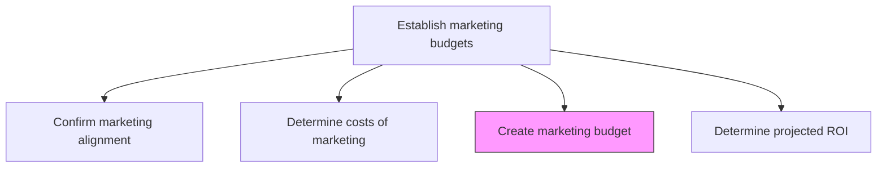
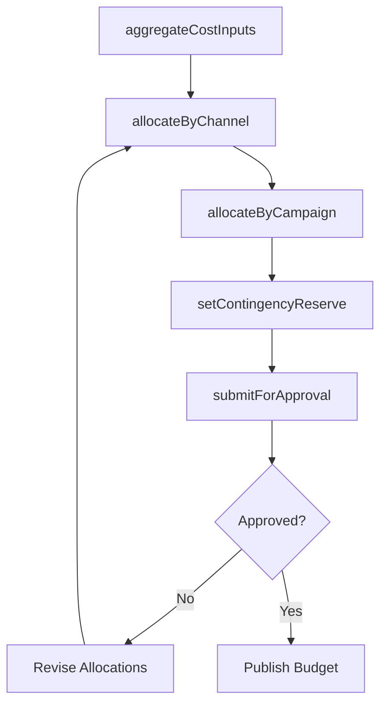

# Create marketing budget

> Business-as-Code definition for marketing budget creation. Models the assembly, allocation, and approval of the marketing budget across campaigns, channels, personnel, and operational expenses.

## Overview

Estimating the outlay required for promoting, selling, and distributing the products/services of the organization. Add up the expenses of all activities necessitated in marketing, such as promotional campaigns, advertising, marketing communications, PR campaigns, employing skilled personnel, and office space.

## Process Hierarchy



## GraphDL

```yaml
create:
  object: Marketing Budget
  actor: MarketingPlanningManager
  result: ApprovedMarketingBudget
```

## Actions

| Action | Description |
|--------|-------------|
| aggregateCostInputs | Compile cost estimates from all marketing functions and channels |
| allocateByChannel | Distribute budget across advertising, digital, events, and other channels |
| allocateByCampaign | Assign budget to individual campaigns and programs |
| setContingencyReserve | Establish a budget reserve for unplanned opportunities or cost overruns |
| submitForApproval | Present the consolidated marketing budget for executive review and approval |

## Events

| Event | Description |
|-------|-------------|
| costInputsAggregated | All marketing cost inputs compiled into draft budget |
| channelAllocationCompleted | Budget distributed across marketing channels |
| campaignAllocationCompleted | Budget assigned to individual campaigns |
| contingencyReserveSet | Budget reserve amount established |
| budgetApproved | Marketing budget reviewed and approved by leadership |

## Searches

| Search | Description |
|--------|-------------|
| getBudgetSummary | Retrieve marketing budget totals and allocation breakdowns |
| getBudgetByChannel | Query budget allocation for a specific channel |
| getBudgetVsActual | Access budget versus actual spend data |
| getApprovalStatus | Check the approval status of the current marketing budget |

## Process Flow



## RACI Matrix

| Activity | Responsible | Accountable | Consulted | Informed |
|----------|-------------|-------------|-----------|----------|
| aggregateCostInputs | MarketingFinanceAnalyst | MarketingPlanningManager | ChannelManagers | CMO |
| allocateByChannel | MarketingPlanningManager | CMO | ChannelManagers | Finance |
| allocateByCampaign | CampaignManager | MarketingPlanningManager | Creative | Sales |
| submitForApproval | MarketingPlanningManager | CMO | CFO | ExecutiveTeam |

## Related Processes

| Process | Relationship |
|---------|-------------|
| 3.3.2.2 Determine costs of marketing | Upstream - cost analysis feeds budget creation |
| 3.3.2.4 Determine projected ROI for marketing investment | Parallel - ROI projections validate budget allocations |
| 3.3.3 Design and execute brand and product marketing programs | Downstream - budget funds campaign execution |

## Related Departments

| Department | Role |
|-----------|------|
| Marketing | Leads budget creation and allocation |
| Finance | Reviews financial feasibility and approves funding |
| Executive Leadership | Provides final budget approval |
| Procurement | Supports vendor cost negotiations |

## Related Occupations

| Occupation | Involvement |
|-----------|-------------|
| Marketing Planning Manager | Assembles and presents the marketing budget |
| Marketing Finance Analyst | Consolidates cost inputs and tracks allocations |
| CFO | Approves marketing budget within overall financial plan |

## KPIs

| KPI | Description | Unit |
|-----|-------------|------|
| Budget Accuracy | Variance between budgeted and actual marketing spend | % |
| Allocation Efficiency | Percentage of budget allocated to revenue-generating activities | % |
| Budget Approval Cycle Time | Time from initial draft to final approval | Days |
| Contingency Utilization | Percentage of contingency reserve actually used | % |

## Usage

```typescript
import { createMarketingBudget } from '@headlessly/create-marketing-budget'

const budget = createMarketingBudget()

// Allocate budget across channels
const allocation = await budget.allocateByChannel({
  totalBudget: 5000000,
  channels: {
    digitalAdvertising: 0.35,
    contentMarketing: 0.20,
    events: 0.15,
    partnerMarketing: 0.15,
    brandAwareness: 0.10,
    contingency: 0.05
  }
})

// Submit budget for executive approval
const submission = await budget.submitForApproval({
  budgetId: allocation.id,
  approvers: ['cmo', 'cfo'],
  effectivePeriod: 'FY2026'
})
```
