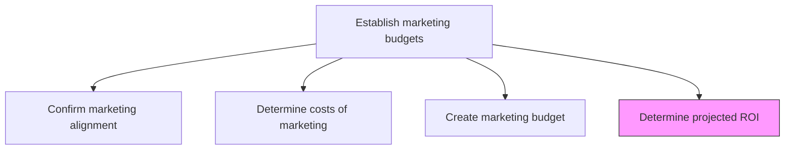
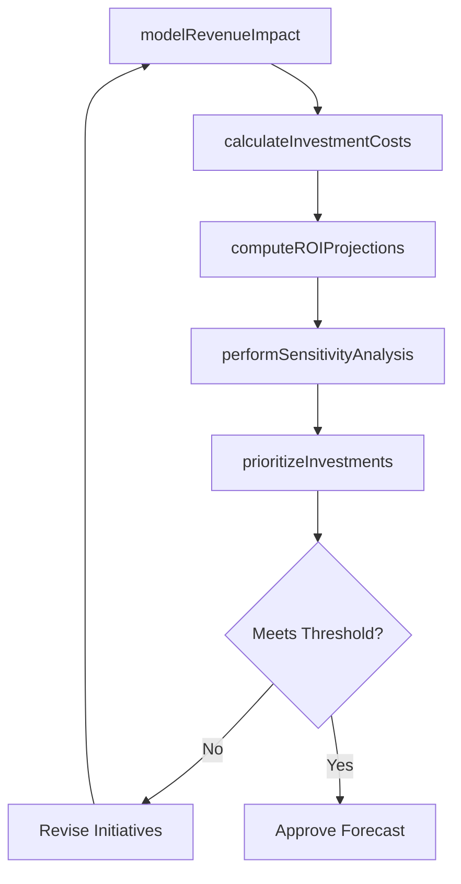

# Determine projected ROI for marketing investment

> Business-as-Code definition for marketing ROI forecasting. Models the projection of financial returns from marketing investments to validate budget allocations and optimize spending efficiency.

## Overview

Estimating how much profit the company would generate for its expenses on marketing . Forecasted return on investment, used as a metric to gauge the efficiency of marketing, is beneficial in revising marketing budgets and adjusting costs to improve the overall yield.

## Process Hierarchy



## GraphDL

```yaml
determine:
  object: Projected ROI For Marketing Investment
  actor: MarketingAnalyst
  result: MarketingROIForecast
```

## Actions

| Action | Description |
|--------|-------------|
| modelRevenueImpact | Forecast revenue gains attributable to each marketing initiative |
| calculateInvestmentCosts | Compile total costs including media, production, technology, and personnel |
| computeROIProjections | Calculate projected return on investment for each initiative and overall budget |
| performSensitivityAnalysis | Test ROI projections under varying market and performance assumptions |
| prioritizeInvestments | Rank marketing initiatives by projected ROI to guide budget allocation |

## Events

| Event | Description |
|-------|-------------|
| revenueImpactModeled | Revenue forecasts per marketing initiative completed |
| investmentCostsCalculated | Total marketing investment costs compiled |
| roiProjectionsComputed | Projected ROI calculated for all initiatives |
| sensitivityAnalysisPerformed | ROI sensitivity analysis under multiple scenarios completed |
| investmentsPrioritized | Marketing initiatives ranked by projected return |

## Searches

| Search | Description |
|--------|-------------|
| getROIProjections | Retrieve projected ROI by initiative, channel, or period |
| getHistoricalROI | Access past marketing ROI data for benchmarking |
| getSensitivityScenarios | Query scenario analysis results and assumptions |

## Process Flow



## RACI Matrix

| Activity | Responsible | Accountable | Consulted | Informed |
|----------|-------------|-------------|-----------|----------|
| modelRevenueImpact | MarketingAnalyst | MarketingPlanningManager | Sales | Finance |
| computeROIProjections | MarketingAnalyst | CMO | Finance | ExecutiveTeam |
| performSensitivityAnalysis | MarketingAnalyst | MarketingPlanningManager | DataScience | Finance |
| prioritizeInvestments | MarketingPlanningManager | CMO | Finance | CampaignManagers |

## Related Processes

| Process | Relationship |
|---------|-------------|
| 3.3.2.2 Determine costs of marketing | Upstream - cost data feeds ROI calculations |
| 3.3.2.3 Create marketing budget | Parallel - ROI projections validate budget allocations |
| 3.3.7 Track customer management measures | Downstream - actual metrics validate projected ROI |

## Related Departments

| Department | Role |
|-----------|------|
| Marketing | Provides initiative plans and expected outcomes |
| Finance | Validates financial models and return calculations |
| Data Science | Supports predictive modeling and scenario analysis |
| Sales | Provides revenue attribution data and forecasts |

## Related Occupations

| Occupation | Involvement |
|-----------|-------------|
| Marketing Analyst | Builds ROI models and conducts scenario analysis |
| Financial Analyst | Validates financial assumptions and return calculations |
| Marketing Planning Manager | Uses ROI projections to prioritize investments |

## KPIs

| KPI | Description | Unit |
|-----|-------------|------|
| Projected Marketing ROI | Forecasted return per dollar of marketing investment | Ratio |
| ROI Forecast Accuracy | Variance between projected and actual marketing ROI | % |
| Investment Prioritization Coverage | Percentage of initiatives with ROI projections | % |
| Payback Period | Estimated time to recoup marketing investment | Months |

## Usage

```typescript
import { determineProjectedRoiForMarketingInvestment } from '@headlessly/determine-projected-roi-for-marketing-investment'

const roi = determineProjectedRoiForMarketingInvestment()

// Compute ROI projections for Q2 campaigns
const projections = await roi.computeROIProjections({
  initiatives: ['brand-campaign', 'product-launch', 'demand-gen'],
  period: 'Q2-2026',
  revenueModel: 'attribution-based'
})

// Perform sensitivity analysis
const scenarios = await roi.performSensitivityAnalysis({
  baseProjection: projections.id,
  variables: ['conversion-rate', 'average-deal-size', 'media-costs'],
  range: { min: -20, max: 20 }
})
```
