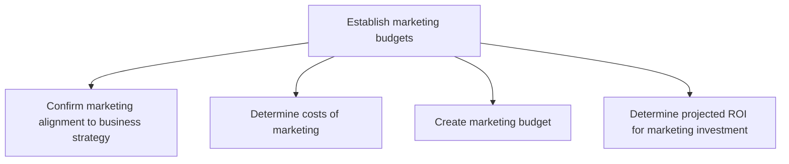
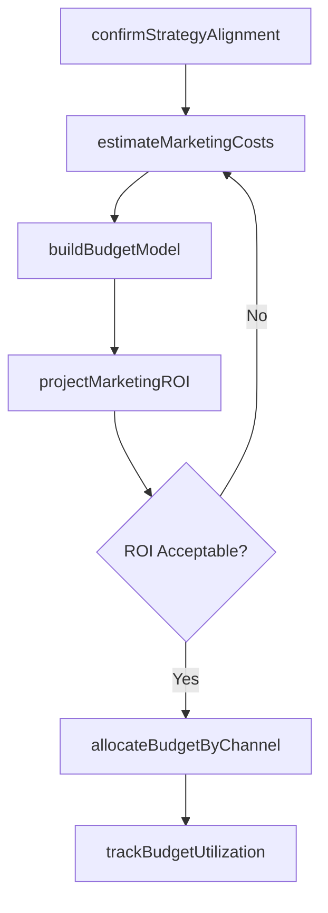

# Establish marketing budgets

> Business-as-Code definition for marketing budget planning and allocation. Models the end-to-end process of aligning marketing spend with business strategy, estimating costs, creating budgets, and projecting return on investment across all marketing activities.

## Overview

Creating a budget for the organization's marketing efforts, in line with the business-wide strategic outlook. Create a plan to distribute resources for achieving the marketing strategy in light of the overall business strategy. Make cost assumptions; calculate the estimated total revenue from the marketing activities against the costs/expenses of these activities. Forecast the return on investment. Attribute costs to the appropriate marketing activities such as promotional campaigns, advertising, marketing communications, PR campaigns, personnel, and office space. Enlist the financial and marketing functions.

## Process Hierarchy



## GraphDL

```yaml
establish:
  object: Marketing Budgets
  actor: MarketingFinanceManager
  result: ApprovedMarketingBudget
```

## Actions

| Action | Description |
|--------|-------------|
| confirmStrategyAlignment | Validate that marketing plans align with overall business strategy and priorities |
| estimateMarketingCosts | Calculate total costs for campaigns, advertising, personnel, and operations |
| buildBudgetModel | Create detailed budget allocation across marketing activities and channels |
| projectMarketingROI | Forecast expected return on marketing investment by activity |
| allocateBudgetByChannel | Distribute approved budget across marketing channels and programs |
| trackBudgetUtilization | Monitor actual spend against budget allocations in real time |

## Events

| Event | Description |
|-------|-------------|
| strategyAlignmentConfirmed | Marketing plans validated against business strategy |
| marketingCostsEstimated | Total marketing cost projections completed |
| budgetModelBuilt | Detailed marketing budget created and submitted for approval |
| marketingROIProjected | Return on marketing investment forecast delivered |
| budgetAllocatedByChannel | Budget distributed across channels and programs |
| budgetUtilizationTracked | Actual spend versus budget variance reported |

## Searches

| Search | Description |
|--------|-------------|
| getBudgetAllocation | Retrieve budget allocations by channel, campaign, or department |
| getBudgetVsActual | Compare planned budget to actual spend for a given period |
| getROIProjections | Access projected ROI by marketing activity or campaign |
| getHistoricalSpend | Query historical marketing spend data for trend analysis |

## Process Flow



## RACI Matrix

| Activity | Responsible | Accountable | Consulted | Informed |
|----------|-------------|-------------|-----------|----------|
| confirmStrategyAlignment | MarketingDirector | CMO | VP Strategy | ExecutiveTeam |
| estimateMarketingCosts | MarketingFinanceManager | CMO | Finance | MarketingTeam |
| buildBudgetModel | MarketingFinanceManager | CFO | CMO | DepartmentHeads |
| projectMarketingROI | MarketingAnalyst | CMO | Finance | ExecutiveTeam |
| allocateBudgetByChannel | MarketingDirector | CMO | ChannelManagers | Sales |

## Sub-Processes

| ID | Name | Description |
|----|------|-------------|
| 3.3.2.1 | Confirm marketing alignment to business strategy | Ensuring corroboration of the marketing strategy and the organizational strategy. Ensure the organiz |
| 3.3.2.2 | Determine costs of marketing | Calculating the total cost of marketing the organization's portfolio of products/services. Calculate |
| 3.3.2.3 | Create marketing budget | Estimating the outlay required for promoting, selling, and distributing the products/services of the |
| 3.3.2.4 | Determine projected ROI for marketing investment | Estimating how much profit the company would generate for its expenses on marketing . Forecasted ret |

## Related Processes

| Process | Relationship |
|---------|-------------|
| 3.3.1 Establish goals, objectives, and metrics for products/services by channel/segment | Upstream - goals drive budget requirements |
| 3.2 Develop marketing strategy | Upstream - strategy informs budget priorities |
| 3.3.3 Design and execute brand and product marketing programs | Downstream - budget funds campaign execution |
| 3.4.4 Establish overall sales budgets | Parallel - marketing and sales budgets must align |

## Related Departments

| Department | Role |
|-----------|------|
| Marketing | Develops budget requests and manages allocated spend |
| Finance | Reviews, approves, and monitors marketing budget compliance |
| Sales | Coordinates on shared demand generation budget items |
| Executive Management | Approves final marketing budget allocation |

## Related Occupations

| Occupation | Involvement |
|-----------|-------------|
| Marketing Finance Manager | Builds budget models and tracks utilization |
| Marketing Director | Defines budget priorities and allocation strategy |
| Financial Analyst | Validates cost assumptions and ROI projections |
| CMO | Approves final budget and accountable for ROI |

## KPIs

| KPI | Description | Unit |
|-----|-------------|------|
| Budget Utilization Rate | Percentage of marketing budget actually spent | % |
| Marketing ROI | Revenue generated per dollar of marketing spend | Ratio |
| Budget Variance | Deviation between planned and actual marketing spend | % |
| Cost Per Lead | Average marketing cost to generate one qualified lead | USD |
| Budget Approval Cycle Time | Average days from budget submission to approval | Days |

## Usage

```typescript
import { establishMarketingBudgets } from '@headlessly/establish-marketing-budgets'

const budgets = establishMarketingBudgets()

// Estimate costs for next quarter campaigns
const costs = await budgets.estimateMarketingCosts({
  period: 'Q2-2026',
  categories: ['digital-advertising', 'events', 'content', 'pr'],
  includePersonnel: true
})

// Build and submit budget model
const budget = await budgets.buildBudgetModel({
  costEstimateId: costs.id,
  revenueTarget: 5000000,
  marginTarget: 0.65
})
```
