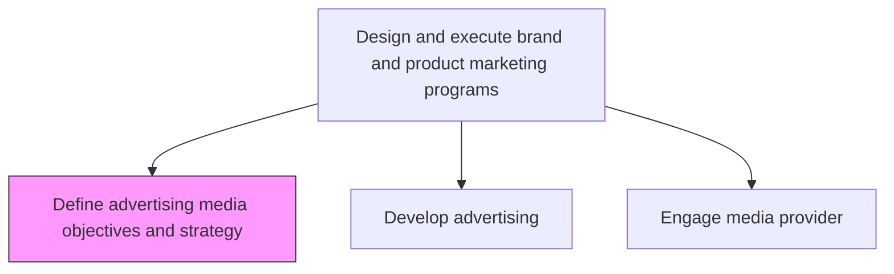
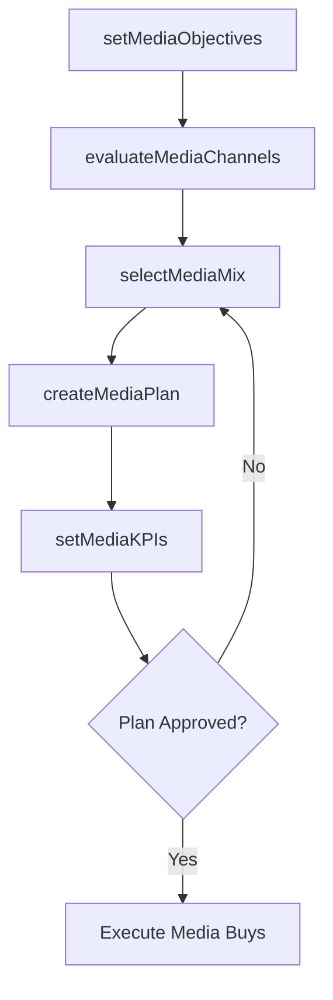

# Define advertising media objectives and strategy

> Business-as-Code definition for advertising media planning. Models the establishment of media objectives, channel selection, and strategic media planning to maximize reach and frequency for marketing campaigns.

## Overview

Creating a set of general objectives that the organization aims to achieve through the use of various media vehicles, for its marketing efforts. Outline the intention and purpose in using certain media channels for the marketing and promotion of its products/services. Create a media plan with specific goals for media channels.

## Process Hierarchy



## GraphDL

```yaml
define:
  object: Advertising Media Objectives And Strategy
  actor: MediaPlanningManager
  result: MediaStrategyPlan
```

## Actions

| Action | Description |
|--------|-------------|
| setMediaObjectives | Define reach, frequency, and awareness goals for advertising media |
| evaluateMediaChannels | Assess effectiveness and cost-efficiency of available media vehicles |
| selectMediaMix | Choose the optimal combination of media channels for target audiences |
| createMediaPlan | Develop detailed media plan with schedules, placements, and budgets |
| setMediaKPIs | Define performance metrics for each media channel and campaign |

## Events

| Event | Description |
|-------|-------------|
| mediaObjectivesSet | Advertising media objectives documented and approved |
| mediaChannelsEvaluated | Media channel assessment completed |
| mediaMixSelected | Optimal media mix chosen for target segments |
| mediaPlanCreated | Detailed media plan with schedules and budgets finalized |
| mediaKPIsSet | Media performance metrics defined |

## Searches

| Search | Description |
|--------|-------------|
| getMediaPlan | Retrieve current media plan by campaign or channel |
| getMediaPerformance | Query historical media performance data by channel |
| getMediaRates | Access current media pricing and availability data |

## Process Flow



## RACI Matrix

| Activity | Responsible | Accountable | Consulted | Informed |
|----------|-------------|-------------|-----------|----------|
| setMediaObjectives | MediaPlanningManager | CMO | BrandManager | Sales |
| evaluateMediaChannels | MediaPlanner | MediaPlanningManager | AdAgency | Digital |
| selectMediaMix | MediaPlanningManager | CMO | Finance | Creative |
| createMediaPlan | MediaPlanner | MediaPlanningManager | Procurement | CampaignManager |

## Related Processes

| Process | Relationship |
|---------|-------------|
| 3.3.3.2 Develop advertising | Downstream - media strategy guides ad development |
| 3.3.3.8 Plan preliminary media buys | Downstream - media objectives drive buy planning |
| 3.2.6 Develop marketing communication strategy | Upstream - communication strategy informs media selection |

## Related Departments

| Department | Role |
|-----------|------|
| Media Planning | Leads media strategy and plan development |
| Marketing | Provides campaign objectives and target audience data |
| Finance | Approves media budget allocations |
| Digital Marketing | Manages digital media channel strategies |

## Related Occupations

| Occupation | Involvement |
|-----------|-------------|
| Media Planning Manager | Sets media objectives and leads strategy development |
| Media Planner | Evaluates channels and creates detailed media plans |
| Digital Media Specialist | Manages digital and programmatic media strategies |

## KPIs

| KPI | Description | Unit |
|-----|-------------|------|
| Reach | Percentage of target audience exposed to advertising | % |
| Frequency | Average number of times target audience sees the ad | Count |
| Cost per Thousand Impressions | Cost efficiency of media placements | Currency |
| Media Plan Adherence | Percentage of media plan executed as planned | % |

## Usage

```typescript
import { defineAdvertisingMediaObjectivesAndStrategy } from '@headlessly/define-advertising-media-objectives-and-strategy'

const media = defineAdvertisingMediaObjectivesAndStrategy()

// Set media objectives for a product launch
const objectives = await media.setMediaObjectives({
  campaign: 'product-launch-2026',
  targetReach: 0.70,
  targetFrequency: 4,
  audience: 'decision-makers-25-55'
})

// Select optimal media mix
const mix = await media.selectMediaMix({
  objectives: objectives.id,
  channels: ['programmatic-display', 'social', 'search', 'connected-tv'],
  budget: 2000000
})
```
