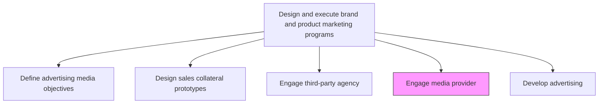
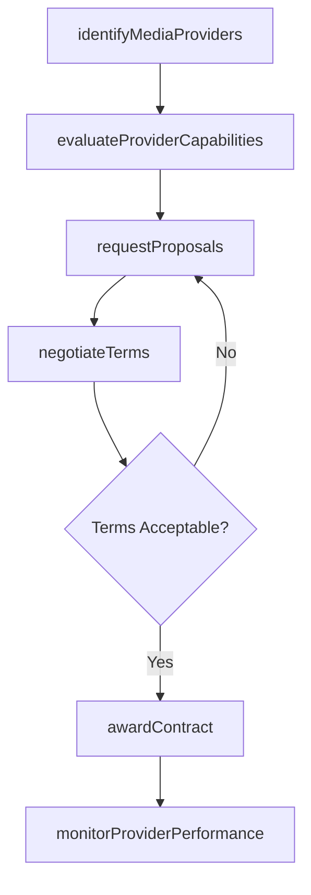

# Engage media provider

> Business-as-Code definition for media provider engagement. Models the evaluation, selection, and contracting of media vendors whose channels reach target audiences effectively.

## Overview

Enrolling the services of certain media providers, who employ marketing channels that are appropriate for target audience. Analyze vendors over several criteria, including channels appropriate for these populations, price points, turnaround time, reliability, quality of deliverables, etc.

## Process Hierarchy



## GraphDL

```yaml
engage:
  object: Media Provider
  actor: MediaBuyingManager
  result: MediaProviderContract
```

## Actions

| Action | Description |
|--------|-------------|
| identifyMediaProviders | Research and shortlist media vendors with channels reaching target audiences |
| evaluateProviderCapabilities | Assess providers on reach, audience match, pricing, reliability, and deliverable quality |
| requestProposals | Issue RFPs to shortlisted providers with campaign objectives and specifications |
| negotiateTerms | Negotiate pricing, placement guarantees, reporting requirements, and contract terms |
| awardContract | Select and onboard the media provider with signed agreements and schedules |
| monitorProviderPerformance | Track delivery against contracted terms and campaign performance benchmarks |

## Events

| Event | Description |
|-------|-------------|
| mediaProvidersIdentified | Shortlist of qualified media providers compiled |
| providerCapabilitiesEvaluated | Provider assessment completed with scoring and ranking |
| proposalsReceived | Media provider proposals collected and reviewed |
| termsNegotiated | Contract terms, pricing, and SLAs agreed upon |
| contractAwarded | Media provider selected and contract executed |
| providerPerformanceMonitored | Ongoing delivery and performance metrics reviewed |

## Searches

| Search | Description |
|--------|-------------|
| getMediaProviders | Retrieve media provider directory filtered by channel type or audience reach |
| getProviderProposals | Query received proposals by provider, channel, or budget range |
| getContractStatus | Look up active media provider contracts and their terms |
| getProviderPerformance | Access delivery and performance metrics for contracted providers |

## Process Flow



## RACI Matrix

| Activity | Responsible | Accountable | Consulted | Informed |
|----------|-------------|-------------|-----------|----------|
| evaluateProviderCapabilities | MediaBuyingManager | VP Marketing | ChannelManagers | Procurement |
| negotiateTerms | MediaBuyingManager | CMO | Legal | Finance |
| awardContract | MediaBuyingManager | CMO | Procurement | CampaignManagers |
| monitorProviderPerformance | MediaPlanningAnalyst | MediaBuyingManager | CampaignManagers | Finance |

## Related Processes

| Process | Relationship |
|---------|-------------|
| 3.3.3.1 Define advertising media objectives and strategy | Upstream - media objectives determine provider requirements |
| 3.3.3.4 Engage third-party advertising agency | Parallel - agencies may recommend or coordinate with media providers |
| 3.3.3.9 Develop and execute advertising | Downstream - contracted providers deliver advertising placements |

## Related Departments

| Department | Role |
|-----------|------|
| Media Buying | Leads provider evaluation, negotiation, and contracting |
| Procurement | Supports contract negotiation and vendor management |
| Finance | Approves media spend commitments and tracks invoicing |
| Legal | Reviews contract terms and ensures compliance |

## Related Occupations

| Occupation | Involvement |
|-----------|-------------|
| Media Buying Manager | Leads provider selection, negotiation, and relationship management |
| Media Planning Analyst | Evaluates provider audience data and performance metrics |
| Procurement Specialist | Supports vendor negotiation and contract administration |

## KPIs

| KPI | Description | Unit |
|-----|-------------|------|
| Provider Evaluation Cycle Time | Time from RFP issuance to contract award | Days |
| Cost Per Thousand Impressions | Negotiated CPM across media providers | Currency |
| Provider Delivery Rate | Percentage of contracted placements delivered on time and in spec | % |
| Media Spend Efficiency | Revenue generated per dollar of media provider spend | Ratio |

## Usage

```typescript
import { engageMediaProvider } from '@headlessly/engage-media-provider'

const media = engageMediaProvider()

// Evaluate media providers for a campaign
const evaluation = await media.evaluateProviderCapabilities({
  channels: ['programmatic-display', 'connected-tv', 'podcast'],
  targetAudience: 'enterprise-decision-makers',
  criteria: ['reach', 'pricing', 'reporting-quality', 'brand-safety']
})

// Award contract to selected provider
const contract = await media.awardContract({
  providerId: evaluation.topRanked.id,
  budget: 500000,
  duration: '6-months',
  performanceGuarantees: true
})
```
