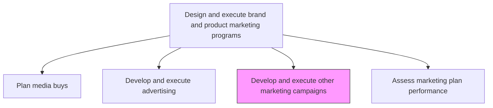
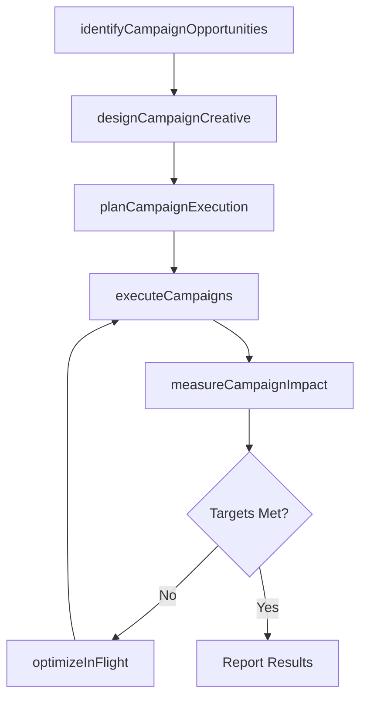

# Develop and execute other marketing campaigns/programs

> Business-as-Code definition for non-advertising marketing campaign execution. Models the design and delivery of marketing programs such as sponsorships, content marketing, viral campaigns, thought-leadership, and social media initiatives.

## Overview

Designing and executing additional marketing campaigns, besides advertising, including undercover marketing, relationship marketing, sponsorships, viral marketing, social media marketing, thought-leadership, and content marketing.

## Process Hierarchy



## GraphDL

```yaml
develop:
  object: And Execute Other Marketing Campaigns/programs
  actor: CampaignManager
  result: ExecutedMarketingCampaign
```

## Actions

| Action | Description |
|--------|-------------|
| identifyCampaignOpportunities | Evaluate sponsorship, content, social, and experiential marketing opportunities aligned with brand goals |
| designCampaignCreative | Develop messaging, content assets, and engagement mechanics for the campaign |
| planCampaignExecution | Define timelines, channel mix, budgets, and resource assignments for each campaign |
| executeCampaigns | Launch campaigns across selected channels and manage day-to-day delivery |
| measureCampaignImpact | Track engagement, leads, conversions, and brand metrics against campaign objectives |
| optimizeInFlight | Adjust creative, targeting, and spend allocation based on real-time performance data |

## Events

| Event | Description |
|-------|-------------|
| campaignOpportunitiesIdentified | Viable non-advertising campaign opportunities shortlisted |
| campaignCreativeDesigned | Campaign messaging and content assets approved |
| campaignExecutionPlanned | Campaign timeline, channels, and budgets finalized |
| campaignsExecuted | Campaigns launched and actively running |
| campaignImpactMeasured | Post-campaign performance metrics collected and analyzed |
| inFlightOptimizationsApplied | Real-time adjustments made to active campaigns |

## Searches

| Search | Description |
|--------|-------------|
| getCampaigns | Retrieve marketing campaigns by type, status, or period |
| getCampaignPerformance | Query campaign performance metrics by channel or objective |
| getSponsorshipOpportunities | Look up available sponsorship and partnership opportunities |
| getContentCalendar | Access the content marketing publication schedule |

## Process Flow



## RACI Matrix

| Activity | Responsible | Accountable | Consulted | Informed |
|----------|-------------|-------------|-----------|----------|
| identifyCampaignOpportunities | CampaignManager | VP Marketing | BrandManager | Sales |
| designCampaignCreative | CreativeDirector | CampaignManager | ContentMarketing | BrandManager |
| executeCampaigns | CampaignManager | VP Marketing | DigitalMarketing | ChannelPartners |
| measureCampaignImpact | MarketingAnalyst | CampaignManager | DataScience | Finance |

## Related Processes

| Process | Relationship |
|---------|-------------|
| 3.3.3.9 Develop and execute advertising | Parallel - advertising and non-advertising campaigns coordinate for unified messaging |
| 3.3.3.11 Assess brand/product marketing plan performance | Downstream - campaign results feed overall marketing assessment |
| 3.3.5 Develop and manage promotional activities | Parallel - promotional campaigns may overlap with sponsorship and content programs |

## Related Departments

| Department | Role |
|-----------|------|
| Marketing | Designs and executes campaign programs |
| Content Marketing | Produces thought-leadership and content assets |
| Social Media | Manages social and viral campaign execution |
| Partnerships | Coordinates sponsorship and co-marketing programs |

## Related Occupations

| Occupation | Involvement |
|-----------|-------------|
| Campaign Manager | Plans and orchestrates non-advertising marketing programs |
| Content Marketing Manager | Leads thought-leadership and content campaign execution |
| Social Media Manager | Executes social and viral marketing initiatives |

## KPIs

| KPI | Description | Unit |
|-----|-------------|------|
| Campaign Engagement Rate | Average engagement rate across non-advertising campaigns | % |
| Campaign ROI | Return on investment for non-advertising marketing programs | Ratio |
| Lead Generation Volume | Number of qualified leads generated by campaigns | Count |
| Brand Mention Growth | Increase in brand mentions attributable to campaign activity | % |

## Usage

```typescript
import { developAndExecuteOtherMarketingCampaignsPrograms } from '@headlessly/develop-and-execute-other-marketing-campaigns-programs'

const campaigns = developAndExecuteOtherMarketingCampaignsPrograms()

// Plan a content marketing campaign
const plan = await campaigns.planCampaignExecution({
  type: 'thought-leadership',
  channels: ['blog', 'linkedin', 'webinar', 'podcast'],
  duration: '3-months',
  budget: 150000,
  objectives: ['brand-awareness', 'lead-generation']
})

// Measure campaign impact
const results = await campaigns.measureCampaignImpact({
  campaignId: plan.id,
  metrics: ['engagement-rate', 'leads-generated', 'brand-mentions', 'pipeline-influenced']
})
```
